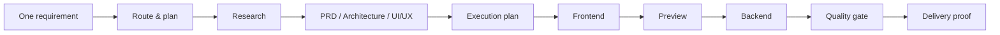
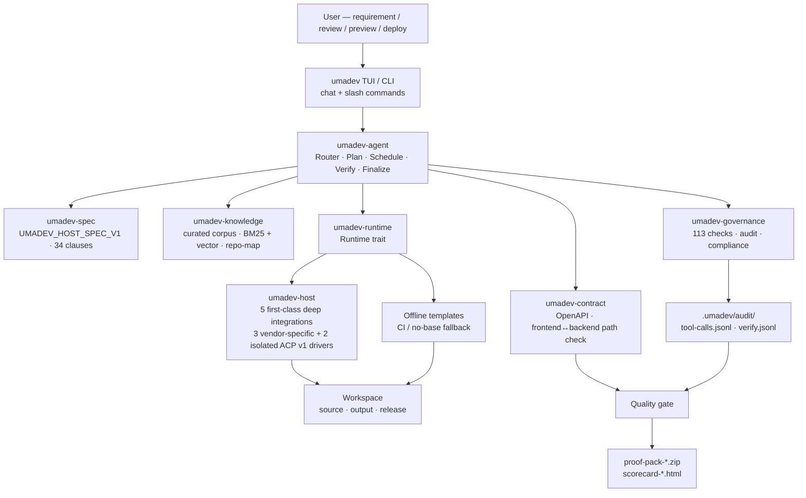
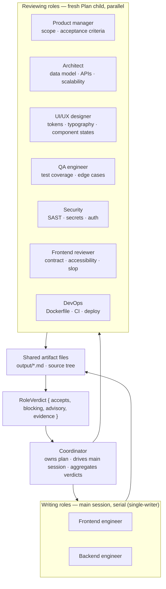
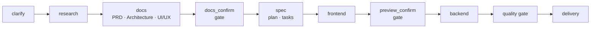
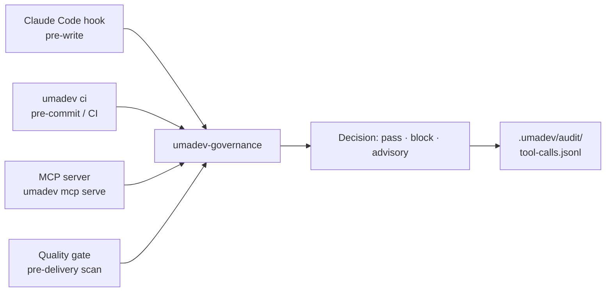
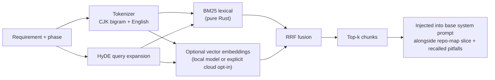
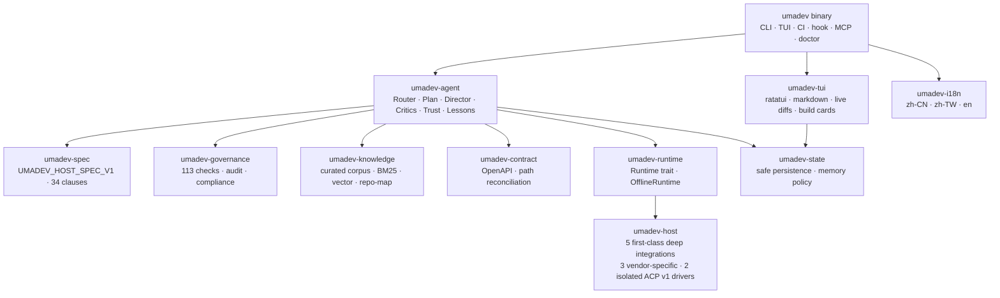

# umadev

<div align="center">


### UmaDev: A coding agent that works like a real dev team, commanding one of five AI coding CLIs you already use.

[](LICENSE)
[](https://www.rust-lang.org/)
[](spec/UMADEV_HOST_SPEC_V1.md)
[](CHANGELOG.md)

English | [简体中文](README.zh-CN.md) | [繁體中文](README.zh-TW.md)

</div>

---

umadev is **a coding agent that works like a real dev team**. It drives one of five first-class AI coding CLIs you already have — Claude Code, Codex, OpenCode, Grok Build, or Kimi Code — and owns no model endpoint of its own: the model your selected base is connected to is the brain.

What you get is **role-based team orchestration** over that borrowed brain. For work whose depth warrants it, bounded sessions take product, architecture, UI/UX, frontend, backend, QA, security, and DevOps assignments; a small edit stays a small edit. These roles are not independent people and their verdicts are advisory. UmaDev owns the plan and deterministic acceptance floor, produces depth-appropriate artifacts/evidence, and reports failed or incomplete work honestly rather than promising that every request becomes shippable software.

A ninth seat, the **coordinator**, routes the request, owns a visible plan for deliberate work, schedules the selected roles, evaluates gates, and leaves the audit trail. It doesn't generate code; the base CLI does. Roles exchange bounded blackboard artifacts and structured verdicts rather than free-form cross-talk.

It's a single Rust binary. npm is just the delivery shell.

---

## Table of Contents

- [Install](#install)
- [Quickstart](#quickstart)
- [Project Origin](#project-origin)
- [What Problem It Solves](#what-problem-it-solves)
- [Features](#features)
- [How It Works](#how-it-works)
- [The Team](#the-team)
- [Why You Can Trust the Output](#why-you-can-trust-the-output)
- [Runtime Modes](#runtime-modes)
- [The Full Delivery Flow](#the-full-delivery-flow)
- [Quality Gate](#quality-gate)
- [Governance](#governance)
- [Knowledge Base](#knowledge-base)
- [Deliverables](#deliverables)
- [Commands](#commands)
- [Configuration](#configuration)
- [Rust Architecture](#rust-architecture)
- [Development](#development)
- [License](#license)

---

## Install

```bash
npm install -g umadev
```

**On Linux, don't reach for `sudo`.** The default npm prefix (`/usr/local`) is root-owned, so `npm i -g` there fails with `EACCES` — and `sudo npm i -g` "fixes" it by writing a **root-owned** tree into the npm prefix, which then breaks every *later* non-root npm command on that prefix (`npm update -g`, `npm i -g <anything>`) with `EACCES`. npm aborts the whole transaction, so your **other** global packages — including your base CLI (`@anthropic-ai/claude-code`, `@openai/codex`) — can no longer be updated either. Use a prefix you own instead:

```bash
npm config set prefix ~/.npm-global
export PATH="$HOME/.npm-global/bin:$PATH"   # add to ~/.zshrc or ~/.bashrc
npm install -g umadev
```

Or skip the global install entirely — no prefix, no sudo, nothing on PATH:

```bash
npx umadev                 # run it straight from the registry
npm i umadev && npx umadev # or as a project-local dependency
```

(`npm i umadev` without `-g` installs fine, but npm deliberately does **not** put a local command on PATH — bare `umadev` will say "command not found". That's npm, not a broken install: run it as `npx umadev`.)

Already hit the sudo trap? `umadev doctor` detects a root-owned install or npm cache and prints the exact repair (`sudo chown -R $(whoami) ~/.npm`, then reinstall under a user-owned prefix).

The npm package is a distribution shim. The actual program is a Rust binary. Prebuilt binaries ship for macOS (Apple Silicon and Intel), Linux (x86_64 and ARM64, glibc ≥ 2.31 — musl/Alpine needs a source build), and Windows (x86_64).

The Rust binary and curated corpus need no cloud knowledge service. Real coding still requires an installed, authenticated base CLI. The optional local embedding model (`multilingual-e5-small`, f16, ~224 MB) is **not** inside the npm tarball: the npm launcher fetches the version-matched, checksummed release asset on the first command that needs retrieval and stores it in `~/.umadev/embed-model`. Later local inference needs no API key or network. If the fetch is unavailable, retrieval continues as BM25-only and a later eligible launch retries; a corrupt cache is rejected and re-fetched.

Build from source:

```bash
git clone https://github.com/umacloud/umadev.git
cd umadev && cargo build --release --features vector-local
./target/release/umadev --version
```

> **Building from source?** The embedding model is not in the repository. A plain `cargo build --release` supports BM25 and the explicitly opted-in remote vector backend, but does not compile the local candle backend. Local vectors require `--features vector-local` **and** a compatible `config.json`, `tokenizer.json`, and `model.safetensors` on disk. Point `UMADEV_EMBED_MODEL_DIR` at that directory, or place it at `~/.umadev/embed-model`. The npm launcher provisions version-matched, verified release assets automatically; a source-built binary does not download them. Without a usable vector backend, `engine = "hybrid"` safely executes as BM25-only.

You also need one AI coding CLI installed and logged in — that's the brain umadev drives:

| Pipeline base (`umadev run/quick --backend`) | Install | Authenticate |
|---|---|---|
| Claude Code (`claude-code`) | `npm i -g @anthropic-ai/claude-code` | `claude auth login` |
| Codex (`codex`) | `npm i -g @openai/codex` | `codex login` |
| OpenCode (`opencode`) | `npm i -g opencode-ai` | `opencode auth login` |
| Grok Build (`grok-build`) | `curl -fsSL https://x.ai/cli/install.sh \| bash` | `grok login`, or set `XAI_API_KEY` for non-browser/headless use |
| Kimi Code (`kimi-code`) | `npm i -g @moonshot-ai/kimi-code@0.26.0` (Node.js >= 22.19) | `kimi login` |

The `curl | bash/sh` entries are the Unix install hints understood by the current driver. On Windows, use each vendor's official Windows installation instructions; do not paste those Unix commands into PowerShell.

UmaDev itself needs no additional model API key. You still install and authenticate the selected base, and that base keeps ownership of its account, subscription, credentials, model, and any third-party/local-model routing. UmaDev does not run login flows or open an authentication browser for you. It sends the task and governance context, but never stores or silently replaces the base's credentials or model endpoint. `umadev doctor` confirms authentication where a reliable probe exists; for Grok Build, only a successfully opened real session proves readiness — “installed” does not mean “logged in.”

---

## Quickstart

```bash
umadev                       # launch the chat UI; first run lets you pick a base
```

Tell it what you want built:

```text
> add CSV export to the reports page
> build me a todo app with a Postgres backend
> /goal ship a working SaaS landing page       # keep working until the goal is met
```

Or run a build non-interactively:

```bash
umadev run "add CSV export to the reports page" --backend claude-code
```

umadev sizes the work to the request — you don't have to select an intent class. A request classified as Build enters the same owned Director contract whether it came from chat or `umadev run`; the plan, simulated role reviews, checks, and delivery artifacts remain proportional to its depth. On a clean Git worktree UmaDev can create a derived `umadev/<slug>` isolation branch. A non-Git or already-dirty worktree reports why isolation was skipped and preserves pre-existing changes. UmaDev never merges or pushes on its own.

### A full worked example

Suppose you run:

```bash
umadev init
umadev
```

Then type:

```text
Build a course-booking mini app. Users can browse courses, pick a time, book,
cancel. Admins can manage courses and bookings.
```

umadev will:

1. **Route the request.** The base's own model judges this: a full build, not a quick edit. You see an intent card — "full build, entering the delivery flow" — before any code is written.
2. **Clarify.** Fill in sensible defaults for target platform, payment scope, and admin complexity. Auto mode self-resolves; manual mode lets you confirm each.
3. **Research.** When the base has web access, search competing booking apps — features, pricing, design trends, real user reviews — and merge that with built-in knowledge about booking systems, admin CRUD, permissions, and form validation. Everything lands in `output/<slug>-research.md`.
4. **Draft three core documents.** PRD (roles, scope, EARS acceptance criteria), architecture (data model, APIs, auth, deployment), UI/UX (design direction, tokens, typography, component states, icon library). Pause for your review.
5. **Build an execution plan.** A dependency plan (`plan.json`) rendered as a live checklist. Each task links back to its FR id.
6. **Implement the frontend.** The coordinator schedules each task, the base writes the code, each file is governance-checked as it lands.
7. **Pause for preview.** You see the running app before backend work starts.
8. **Implement the backend and integration.**
9. **Run the full quality gate.** Build, test, lint, contract check, runtime probe, governance scan.
10. **Produce the delivery pack.** Scorecard, proof pack, compliance mapping — on disk and ready to hand to a teammate, client, or reviewer.

You end up with real files on disk — the research note, the three docs, source, a quality report, and a proof pack.

---

## Project Origin

umadev evolved from the original [shangyankeji/super-dev](https://github.com/shangyankeji/super-dev) project.

Early `super-dev` was closer to an AI coding governance tool. It focused on what AI-generated code must not contain: emoji icons, hardcoded colors, unsafe patterns.

umadev has grown that into a coding agent that works like a real dev team:

- **From single-point governance to whole-pipeline governance.** It no longer only checks code; every phase from requirement to delivery is brought under the process and its gates.
- **From loose scripts to a spec-driven system.** The source of truth is [UMADEV_HOST_SPEC_V1](spec/UMADEV_HOST_SPEC_V1.md), 34 normative clauses, backed by 113 governance content checks.
- **Rewritten in Rust.** One binary, fast startup, low dependency surface, cross-platform distribution.
- **From blocking bad output to delivering like a team.** Your selected base is the brain and hands; umadev is the coding agent that works like a real dev team, with governance as the safety net underneath.

> `super-dev` asked: "how do we stop AI from writing bad code?" umadev asks: "how do we make AI deliver a complete, shippable, auditable project — the way a real software team would?"

---

## What Problem It Solves

Most people hit the same problems when they use AI coding tools at scale:

- The AI starts coding immediately, without a PRD, architecture, or acceptance criteria.
- The frontend is built, but backend API paths do not match.
- The UI looks generic: random colors, random fonts, template-like composition.
- The AI leaves placeholders, fake data, and TODOs — and still says "done."
- After one requirement change, context drifts and earlier decisions are forgotten.
- Code exists, but there is no quality report or delivery evidence.
- Your team has standards and internal knowledge, but you copy them manually into prompts.

umadev turns those problems into a structured workflow:



---

## Features

- **Deeply integrates the base you already use.** All five are equal, first-class, deeply adapted bases. Claude Code, Codex, and OpenCode keep their vendor-specific protocol drivers; Grok Build and Kimi Code use their official ACP v1 interfaces through a hardened core and isolated vendor profiles. This implementation detail is not a support tier: every base presents the same UmaDev interaction contract while retaining its own launch, authentication, permission, resume, and capability boundaries. UmaDev needs no additional model API key; the selected base still uses its own login and model configuration.
- **Role-based team orchestration.** For work whose depth warrants it, eight specialist roles — product manager, architect, UI/UX designer, frontend engineer, backend engineer, QA, security, and DevOps — receive bounded assignments and return typed artifacts or advisory verdicts. They are isolated base sessions coordinated over a shared blackboard, not independent people or a claim that every small edit convenes every role.
- **Plans the work and shows it.** A build becomes a dependency plan (`.umadev/plan.json`) rendered as a live checklist you can steer with `/plan`. Steps are driven step by step; the coordinator owns the plan, not the base.
- **One governed Build contract.** A Build routed from chat and one started with `umadev run` both enter the owned Director path; planning, role scheduling, checks, and artifacts scale with depth and observed evidence.
- **Produces delivery evidence when the floor passes.** A clean, sufficiently deep delivery can include PRD, architecture, UI/UX, a scorecard, and a proof pack. A small edit gets targeted verification, while a failed or incomplete plan is reported as such rather than receiving a completion certificate.
- **Local-first, fail-soft retrieval.** A curated corpus and project repo map are available locally. BM25 is always the lexical floor; deliberate Full-tier work can additionally use local candle vectors when the shipped feature and verified model are present, then fuse the channels with RRF and optional HyDE expansion. Cloud embedding stays off unless both `OPENAI_EMBED_KEY` and `UMADEV_ALLOW_CLOUD_EMBED=1` are set; a generic `OPENAI_API_KEY` never authorizes an upload. Any unavailable or inconsistent vector path degrades to BM25.
- **Auditable learning from real failures.** Concrete incidents are recorded locally; two independent matches form a pending rule, and only the same verifier passing after an exact repair attempt validates it. Recalled evidence reduces repeated mistakes without claiming that a probabilistic base can never repeat one; passive general-knowledge recall remains outcome-neutral until exact turn-level attribution is available.
- **Remembers evidence-backed project facts.** After meaningful work, a bounded read-only extraction can record stable facts such as the JDK path or real build/test/lint commands in `.umadev/memory/facts.jsonl`. Safe, non-stale facts are recalled on later work-class turns, which can reduce rediscovery after transcript trimming; Chat does not receive this store and recall is not a correctness guarantee.
- **Surfaces supported base questions.** When the active driver exposes a structured user-question event, umadev renders its prompt/options inline and correlates the answer to that live session. Question and approval event richness is vendor- and capability-specific; an unsupported surface is reported rather than simulated.
- **Your app's runtime model is yours to pick.** The base you borrow to *write* the code and the model your *built* AI app calls at runtime are kept separate: umadev treats the app's runtime provider, model id, and key as user-configurable env, instead of silently hardcoding the dev base's vendor into the generated product.
- **A real terminal UI.** Markdown, syntax-highlighted code, live diff cards as files change (word-level highlighting), folding tool rows, a build-completion card with a clickable preview URL, slash commands throughout, and `/logs` to surface the base's live build output for long-running commands.
- **Governance you can audit.** A trust dial (`plan` / `guarded` / `auto`), irreversible actions always confirm on every tier — including a fail-closed boundary for obfuscated commands — plus an MCP server (`umadev mcp serve`) that exposes the governor to other tools, and compliance mapping (SOC 2 / ISO 27001 / EU AI Act).
- **Goal-until-met builds.** `/goal <objective>` has the same product entry on all five bases. Claude Code, Codex, and OpenCode expose vendor-specific persistent-goal capability; the ACP bases keep the goal alive through UmaDev's coordinator because ACP v1 defines no common goal mode. `UMADEV_NO_GOAL_MODE=1` opts out.

---

## How It Works

A turn flows through up to five layers. Retrieval, governance helpers, and advisory critics have bounded safe degradation. Authentication, transport, hard-gate, and verification failures are surfaced honestly as degraded, blocked, incompatible, or failed work; they are never converted into success just to keep the flow moving.



The five layers in plain English:

1. **Route.** Before any writer acts, the selected base model judges the complete current request on a fresh Plan-profile child: Chat, Explain, QuickEdit, Debug, or Build, plus depth, write authorization, scope, confidence, and clarification. A valid model decision can scale work in either direction; deterministic matching is only the conservative fallback when the typed consult is unavailable or invalid. Explicit no-write intent, the single-writer rule, and irreversible-action safeguards remain hard ceilings. Clarification happens before the writer lock or branch is created. Plan is mapped to each vendor's real permission surface; it is not advertised as the same hard sandbox on every base.
2. **Plan.** A real build is broken into a dependency plan that umadev owns and renders as a live checklist. The plan is stored in `.umadev/plan.json` and is steerable with `/plan`.
3. **Schedule.** umadev walks the plan step by step. Writing roles (frontend / backend engineer) drive the main session serially — single-writer. Reviewing roles (product manager, architect, designer, QA, security, frontend, backend, DevOps) each get a fresh independent Plan-profile child and review in parallel, returning structured verdicts. The child sees typed blackboard artifacts, not the writer transcript. Roles communicate only through shared artifact files and their verdicts.
4. **Verify and self-correct.** Each step is checked against its acceptance criteria on a deterministic floor — coverage, contract, build/test, hard gates — not by the model self-assessing "good enough." Blocking findings are classified as build, contract, coverage, behavior, or craft and return with raw evidence plus a classifier-owned repair playbook. Stable fingerprints and source-tree snapshots prevent identical no-progress repairs from spinning: strategy changes on the second unchanged observation and the third settles as an evidence-bearing failure.
5. **Finalize.** Once the applicable floor is clean, umadev produces the depth-appropriate delivery artifacts. Eligible incidents and exact repair/verifier outcomes may update evidence-gated learned memory; an arbitrary episode does not automatically become a lesson.

While a writer run is active, only an explicit correction to that current task is steered into it. Questions and future or ambiguous tasks stay queued as ordinary model-routed turns until the run settles; a question at a gate is never silently converted into a revision.

Firmware is proportional to the route: Chat gets only stable identity/language, Explain adds bounded read context, QuickEdit/Debug add engineering craft, and a deliberate Build adds the relevant knowledge slice, recalled pitfalls, project facts, repo map, and team doctrine. The stable identity layer remains byte-stable so the base's prompt cache stays warm without forcing every conversation through build machinery.

The stable identity layer is pre-loaded when the resident session opens; the bounded route overlay is composed per turn. This preserves a warm base session without making an ordinary question inherit build plans or stale TODOs.

---

## The Team

umadev convenes a nine-seat team — eight specialists plus a coordinator — and each role is a real job function with a real deliverable. Each role owns something concrete on the shared blackboard:

| Role | What it owns (deliverable on the shared blackboard) |
|---|---|
| Product manager | Scope, user stories, EARS acceptance criteria — `*-prd.md` |
| Architect | Layering, data model, API contract — `*-architecture.md` + `openapi.*` |
| UI/UX designer | Design system: tokens, typography, component states, page skeleton — `*-uiux.md` |
| Frontend engineer | Components and pages that import the tokens and call the contract URLs |
| Backend engineer | Data model, endpoints, and business logic aligned to the contract |
| QA engineer | Tests + a runtime probe — `runtime-proof.json` |
| Security engineer | Threat model + SAST scan: auth, injection, secrets |
| DevOps | Build, CI, and deploy evidence — `deploy-proof.json` |
| Coordinator (technical lead) | Routes intent, owns the plan, schedules the team, enforces each gate, keeps the audit trail |



How the team ships without stepping on itself:

- **Doer roles** drive the main session serially to produce their deliverable. Only one writer touches source at a time (single-writer).
- **Reviewing roles** each run on a fresh independent Plan-profile child, in parallel, and return a `RoleVerdict` — `accepts`, `blocking` findings with evidence, and `advisory` notes. Read-only enforcement is vendor-specific; see the runtime matrix below.
- **The coordinator aggregates deterministically.** The deterministic floor governs loop control; critic opinions are advisory only. Blocking findings are folded into one rework directive injected back into the main session, along with the evidence.
- **Roles never chat to each other.** The shared blackboard is the output artifact files and the source tree. The only communication channel between roles is the verdict.
- **The team scales with the task.** A bugfix convenes no team. A greenfield build convenes the full roster. Complexity determines the seats.

---

## Why You Can Trust the Output

Trust in the output comes from four things that happen on every build:

**1. The deterministic floor runs regardless of what the model thinks**

Build, lint, typecheck, and test results are checked directly. The acceptance floor checks spec coverage and contract alignment — the model doesn't self-report "it passed."

**2. The frontend↔backend contract is verified mechanically**

`umadev-contract` parses the architecture doc's API table into a typed spec, renders `openapi.json` to `.umadev/contracts/`, extracts every `fetch`/`axios` call in the frontend source, and cross-validates the paths. A mismatch is a blocking finding.

**3. Every important action leaves evidence**

Tool calls, verification runs, and critic verdicts are written to `.umadev/audit/` as JSONL. The proof pack includes the evidence chain.

**4. Governance runs on every file write**

113 content checks cover emoji-as-icons, hardcoded colors, leaked secrets, AI-slop UI patterns, and unsafe code constructs. They run as a pre-write hook into Claude Code, as a pre-commit hook in git, and as part of the quality gate. At write time only the irreversible floor (leaked secrets / credentials, sensitive-path writes, destructive shell) is hard-blocked; craft and quality findings (emoji, color, AI-slop) are flagged and repaired by the post-write QC loop rather than pinning the base's hands mid-file. All rules are configurable in `.umadev/rules.toml` and are fail-open — a bug in the governor never blocks your work.

---

## Runtime Modes

### Drive a local AI coding CLI (the product)

All five integrations expose a logical continuous, bidirectional product surface.
Users stay in the UmaDev TUI; follow-up turns and only the questions, approvals,
and tool events actually exposed or negotiated by that base travel through its
driver. Missing capabilities are reported, not simulated. “Headless” or
“non-interactive” describes the background machine-protocol child process, not
the UmaDev product's interaction model.

| Backend ID | Session transport | Plan / approval mapping | Resume behavior |
|---|---|---|---|
| `claude-code` | Vendor-specific stream-json | Claude permission mode | Exact `--resume` |
| `codex` | Vendor-specific `codex app-server` JSON-RPC | Codex sandbox + approval policy | Exact `thread/resume` |
| `opencode` | Vendor-specific `opencode serve` HTTP/SSE | OpenCode permission rules | Exact persisted session id |
| `grok-build` | ACP v1 over stdio | Plan adds a read-only sandbox, no subagents, and a read-only tool allowlist | Fresh-session handoff today; persistent load stays disabled until effective-sandbox attestation and native preflight are both provable |
| `kimi-code` | Official `kimi acp` v1 over stdio | Plan=`plan`; Guarded/Auto retain Kimi `default`, with UmaDev's approval policy and irreversible floor authoritative | Standard `session/resume`, with advertised `session/load` fallback; workspace/profile identity must match |

All five rows above are first-class integrations. ACP is an official machine-protocol path for both Grok Build and Kimi Code, not a lower support tier. Grok's installed binary may negotiate `session/resume` or advertise `session/load`, but capability presence alone does not prove that the newly launched process applied the same sandbox or completed Grok's native pre-start resume check. UmaDev therefore starts a fresh Grok session and hands over bounded durable project context until both facts are attested. Kimi Code is separately source-pinned, revalidates its on-disk login without launching a browser, and uses its advertised standard resume/load methods. Review critics always start fresh Plan-profile sessions rather than loading the writable main line.

Attachments use ordered structured input, never a hidden `@path` fallback. Claude Code and Codex deliver images natively and require an explicit bounded UTF-8 materialization choice for generic files; OpenCode delivers image/file parts natively; Grok Build and Kimi Code accept image/resource blocks only when their live ACP handshake advertises them. The TUI reports how every block was actually delivered. Codex is the only base currently advertised with proven same-turn `turn/steer`; the other four queue or reject active-turn input according to their real session capability instead of pretending parity.

### The base brings its own model — umadev has none

umadev connects to no model API and stores no base credentials of its own. The selected base uses its own configured model — your logged-in subscription, or whatever third-party/local model routing that base supports. Configure model selection in the base itself. `/model` is informational and never silently changes the base.

umadev reads and surfaces the base's model and reasoning effort where the base exposes them. The three vendor-specific protocol drivers can inspect their documented local configuration or session metadata; each ACP driver exposes only what its installed CLI negotiates or emits. Kimi's model, thinking, and exact configured context are read from Kimi's own config/options rather than guessed. A missing value remains unknown — UmaDev never guesses a context window from a model-name table.

Wider model coverage behind any of these five bases remains the base's job. Adding another model id does not require UmaDev to own a provider endpoint.

### Offline templates (internal fallback, not a product mode)

Offline mode (`/offline`) makes no model calls and no network requests. It is an internal deterministic fallback for demos, smoke tests, and CI — not a mode you choose for real work. The first-run picker lists the five first-class bases, not Offline. Offline output is templates with `TODO` placeholders, not real code.

---

## The Full Delivery Flow

For a heavyweight greenfield build, the coordinator expands the plan into the full nine-phase chain — the most complete delivery path. Most requests route to something shorter.



Small tasks have a lightweight path — the router classifies the request and routes to the right depth, and the plan expands or trims to fit. A bugfix convenes no team; a greeting stays chat; only a full product requirement expands into the chain above. Force the light path for a trivial change with `/quick`.

### Phase outputs

| Phase | What it produces |
|---|---|
| `clarify` | `output/<slug>-clarify.md`, `output/<slug>-clarify-answers.md` |
| `research` | `output/<slug>-research.md` — web research + knowledge base hits merged |
| `docs` | `output/<slug>-prd.md`, `output/<slug>-architecture.md`, `output/<slug>-uiux.md` |
| `docs_confirm` | Gate — pause for review before any code is written |
| `spec` | `output/<slug>-execution-plan.md`, `.umadev/plan.json`, `.umadev/changes/<id>/tasks.md` |
| `frontend` | Source code + `output/<slug>-frontend-notes.md` |
| `preview_confirm` | Gate — running app in the browser before backend work begins |
| `backend` | Source code + `output/<slug>-backend-notes.md` |
| `quality` | `output/<slug>-quality-gate.json`, `output/<slug>-quality-gate.md`, `runtime-proof.json` |
| `delivery` | `output/<slug>-delivery-notes.md`, `release/proof-pack-*.zip`, `release/scorecard-*.html` |

---

## Quality Gate

The quality gate is a pre-delivery review that runs independently of the model.

It checks:

- PRD goal, scope, and acceptance criteria completeness.
- Architecture APIs, data model, error handling, and authentication.
- UI/UX tokens, typography, icon library, component states, and dark mode.
- Frontend API calls cross-validated against the backend contract.
- Emoji icons, hardcoded colors, and generic AI-template UI patterns.
- Build, test, lint, and typecheck results.
- Dockerfile, CI config, migrations, and `.env.example`.
- Leaked API keys, passwords, and connection strings.
- Audit logs and compliance mapping.

The runtime probe (`umadev verify --runtime`) boots the app and hits its routes, writing `runtime-proof.json` — evidence that the app actually starts and responds.

Outputs:

```text
output/<slug>-quality-gate.json
output/<slug>-quality-gate.md
runtime-proof.json
```

Default threshold:

```toml
[quality]
threshold = 90
skip_checks = []
```

---

## Governance

umadev started as a governance tool and that remains a core capability.

The spec layer has 34 normative clauses. The implementation includes 113 governance content checks across UI quality, security, frontend architecture, backend engineering, and language-specific hazards. Every check is configurable in `.umadev/rules.toml` — each rule can be disabled, path-excluded, or tuned. They exist to backstop the base's output, not to make the final engineering call for you.

Governance entry points:



Every governance function is fail-open: an error path returns `pass`, never a block. A bug in the governor never stops your work.

Project policy:

```toml
[disabled]
clauses = []

[exclusions]
paths = ["src/legacy/**", "**/*.test.ts"]

[extra]
blocked_domains = ["internal-bad-proxy.corp"]
```

The compliance mapping (`umadev report`) maps the evidence chain to SOC 2 / ISO 27001 / EU AI Act controls.

---

## Knowledge Base

umadev ships with a curated markdown knowledge corpus bundled directly into the binary and auto-extracted to `~/.umadev/knowledge` on first launch. It is not generic documentation — it is a set of commercial-grade engineering standards formatted for injection into an AI coding CLI. The count is intentionally not a product invariant: the corpus can grow without making this document stale.

The corpus covers: product design, PRD methodology, system architecture, frontend engineering, backend engineering, database design, security, testing, CI/CD, operations, mobile, desktop, mini programs, HarmonyOS, cross-platform development, domain verticals, UI/UX, design systems, and engineering playbooks.

Retrieval is route-proportional. A deliberate Full-tier Build/Debug turn receives the most relevant knowledge and pitfall chunks for the current requirement and phase; work routes can also receive bounded facts and a repo-map slice. Chat remains lightweight, and QuickEdit/Fast Debug use a smaller craft overlay rather than paying for the full corpus path.

Retrieval flow:



**Configured hybrid, observed channels.** `engine = "hybrid"` requests lexical BM25 plus a dense vector channel fused with Reciprocal Rank Fusion; HyDE-style expansion can widen recall. Official release binaries compile the local candle backend, and the npm launcher downloads and verifies the version-matched `multilingual-e5-small` f16 assets on first eligible use. Plain source builds need `vector-local` plus a compatible model. If local vectors are unavailable, remote vectors remain disabled unless both `OPENAI_EMBED_KEY` and `UMADEV_ALLOW_CLOUD_EMBED=1` are set. A generic `OPENAI_API_KEY` never authorizes upload. Missing, failed, empty, or dimension-incompatible vectors all fall back to BM25 rather than being reported as hybrid evidence.

**It learns conservatively from verified incidents.** A concrete failure is recorded locally, an independent recurrence can form a pending corrective rule, and the rule becomes validated only when the original verifier is rerun and passes after the exact repair attempt. This evidence is recalled to reduce repeat mistakes; it is not a promise that the base can never repeat one. Passive general lessons are deliberately not rewarded or punished until umadev can attribute the exact memory IDs sent to a host turn.

The stores have different scopes and evidence boundaries:

| Asset | Scope and purpose | Admission / use boundary |
|---|---|---|
| `/pitfalls` | Project incident ledger in `.umadev/learned/_raw/dev-errors.jsonl` | Independent episodes count; repeated stderr lines do not. Generic/unclassified rows are quarantined. |
| `/lessons` | Reusable corrective rules and safe projections | Recurrence may create a pending candidate; validation requires an exact repair attempt followed by the same verifier passing. |
| Learned skills | Project-local procedural candidates in `.umadev/memory/learned-skills/skills.jsonl` | Only non-trivial, clean deliveries can graduate; exact prompt delivery plus deterministic pass/fail/unknown evidence settles later use. The old `.umadev/skills/` ledger is migration input, not the current write target. |
| Recipes | Project-local prior solutions in `.umadev/memory/recipes/recipes.jsonl` | Strict stack/kind/shape matching; one candidate at most, advisory only, with exact-use receipts before outcomes affect it. |
| Facts | Project-local stable environment/project facts | Extracted after meaningful work, bounded and secret-filtered; stale or contradictory facts are demoted/tombstoned. |
| Run notes | Current-run working memory in `.umadev/run-notes.md` | UmaDev writes one bounded note only after a plan step makes progress and passes deterministic acceptance. Failures, blocked steps, and empty reviews do not write; the base cannot write notes directly. |
| Open decisions | Project-visible `docs/decisions/OPEN-DECISIONS.md` register | Unresolved items may enter a bounded, untrusted prompt block; recall-off suppresses only that block, not the committed register or its counts/report. |

Run notes are untrusted bounded history for later plan steps in the same run, not a transcript, global memory, current authorization, or proof of completion. Installed `umadev skill` packages are separately managed knowledge/rule/prompt packs; they are not the same store as learned procedural skills. Retrieval can combine the bundled corpus, project `.umadev/learned/` sediments, and privacy-reviewed family-safe projections under `~/.umadev/learned/`; raw project incidents, facts, recipes, and learned procedural skills do not silently become cross-project memory.

`umadev memory inventory --scope all` reports every leaf store's locations, footprint, and effective policy without printing its content. Automatic capture and prompt recall are independently controllable, for example `umadev memory capture off --scope project --store facts` and `umadev memory recall off --scope project --store recipes`. A toggle never deletes data or hides it from inventory/reporting, and it does not suspend lifecycle bookkeeping such as an already-sent recipe/pitfall receipt settling, trust/invalidation hygiene, or run-note rotation. Facts, recipes, and recurring-pitfall reflections check capture policy before their optional read-only base consult, so capture-off spends no extraction/distillation/reflection call. A missing policy uses the documented defaults; an unreadable or malformed policy conservatively disables automatic capture and prompt recall until repaired.

Add your own knowledge:

```bash
umadev knowledge-manage add ./team-docs --name team-docs
umadev knowledge-manage search "payment webhook idempotency"
```

---

## Deliverables

After a full run:

```text
your-project/
  output/
    app-clarify.md
    app-research.md
    app-prd.md
    app-architecture.md
    app-uiux.md
    app-execution-plan.md
    app-frontend-notes.md
    app-backend-notes.md
    app-quality-gate.json
    app-quality-gate.md
    app-compliance-mapping.json
    app-delivery-notes.md

  .umadev/
    plan.json
    workflow-state.json
    contracts/
      openapi.json
      openapi.yaml
    audit/
      tool-calls.jsonl
      frontend-api-calls.jsonl
      verify.jsonl

  release/
    proof-pack-app-20260620090000.zip
    proof-pack-app-20260620090000.manifest.txt
    scorecard-app-20260620090000.html
    runtime-proof.json
```

The proof pack and scorecard are what you hand to a teammate, client, or reviewer. Everything else is intermediate work.

---

## Commands

umadev has two entry points that mirror each other:

- **TUI slash commands** — type inside the `umadev` chat UI (recommended for daily use).
- **Terminal CLI subcommands** — for scripts and CI, no TUI needed.

Typing `/` in the TUI opens a command palette — `Tab` to autocomplete, `↑`/`↓` to cycle. `/help` (or F1) lists every command and keybinding.

### TUI slash commands

**Pick the base and model**

| Command | What it does |
|---|---|
| `/claude` · `/codex` · `/opencode` · `/grok` · `/kimi` | Switch among the five first-class bases (saved to `~/.umadev/config.toml`; aliases: `/grok-build`, `/kimi-code`) |
| `/offline` | Switch to deterministic offline templates (demo / CI, no network) |
| `/status` | Active base, its model, and reasoning effort where the base exposes them (read-only; UmaDev never sets a model) |
| `/sandbox [tier]` | View / change the Codex base's launch sandbox (`read-only` · `workspace-write` · `danger-full-access`) |

**Drive the flow**

| Command | What it does |
|---|---|
| just type | Routes to the right path; a build typed here gets the same systems as `/run` |
| `/run [slug] <req>` | Start a full build explicitly |
| `/goal <objective>` | Keep working until the objective is met (same entry on all five; vendor-specific goal capability where exposed, coordinator persistence over ACP; `UMADEV_NO_GOAL_MODE=1` opts out) |
| `/quick <task>` | Force the light path for a trivial one-off change |
| `/plan [skip\|add\|veto\|up\|down <id>]` | View or steer the live dependency plan |
| `/continue` (or `c` at a gate) | Approve the current gate and advance |
| `/revise <feedback>` | Stay at the gate, redo the current phase with feedback |
| `/redo [phase]` | Re-run a phase block |
| `/mode <plan\|guarded\|auto>` | Set the trust / autonomy tier |
| `/manual` · `/auto` | Per-gate confirmation vs. fully automatic (`shift+Tab` also toggles) |
| `/cancel` · `/abort` | Abort the current run (on-disk state kept, resumable later) |
| `/tasks [stop\|resume]` | List / manage background runs |
| `/processes [stop <id>]` | Fetch / stop native background processes owned by the current base session (where negotiated) |
| `/adopt` | Onboard an existing (brownfield) repo: detect stack, index source, derive the contract |
| `/init` | Write the `umadev.yaml` manifest |
| `/diff [artifact]` | Show an artifact (`prd` · `architecture` · `uiux` · …) |

**Preview and delivery**

| Command | What it does |
|---|---|
| `/preview` | Start the frontend dev server and open the browser |
| `/stop-preview` | Stop the preview server |
| `/deploy` | Detect the target and preview the deploy command (the deploy itself runs via `umadev deploy --run`) |
| `/pr [create]` | Dry-run the PR (review report + proof-pack as the body); `/pr create` opens it |
| `/export` | Export the current session |

**Checkpoints and rewind** (shadow git — never touches your `.git`)

| Command | What it does |
|---|---|
| `/checkpoint [label]` | Snapshot the workspace files |
| `/rewind [id]` | List / roll back to a file checkpoint |

**Inspect artifacts and state**

| Command | What it does |
|---|---|
| `/spec` | Print the full `UMADEV_HOST_SPEC_V1` spec |
| `/verify` | Workspace conformance report and evidence chain |
| `/doctor` | Self-test (binary / manifest / probes) |
| `/status` | Current phase, gate, and run state |
| `/team` · `/constitution` | The live team roster · the team's operating charter |
| `/pitfalls` | Concrete incident ledger: signature, independent occurrence count, lifecycle, and first/recent/verified time |
| `/lessons` | Reusable rules distilled from repeated incidents or mechanically verified outcomes; shows pending/validated/needs-revision status and evidence |
| `/knowledge` | Knowledge-base hits for this run |
| `/usage` | Token and usage statistics |
| `/history` · `/runs` | Past gate snapshots · past runs |
| `/sessions` · `/resume <id>` · `/compact` | List · reopen · compress the persisted chat |
| `/skill` · `/mcp` | Installed Skills / MCP servers |
| `/config` | Effective configuration |
| `/version` · `/changelog` | Build version · release notes |

**Design and project**

| Command | What it does |
|---|---|
| `/design <direction>` | Lock the design-system direction (`modern-minimal` · `editorial-clean` · …) |
| `/template <name>` | Pick a scaffold template |

**General and UI**

| Command | What it does |
|---|---|
| `/help` (or F1) | Help overlay with all keybindings |
| `/lang [zh-CN\|zh-TW\|en]` | Switch the UI language |
| `/setup` | Re-run the first-launch base picker |
| `/logs` | Toggle visibility of the base's live process output (off by default) |
| `/mouse` · `/animations` · `/redraw` | Toggle mouse capture · animations · force a repaint |
| `/bug` | Open a pre-filled bug report |
| `/clear` | Clear the chat |
| `/quit` (or Esc) | Exit (workflow state is saved, resumable) |

### Terminal CLI subcommands

**Workspace lifecycle**

| Command | What it does |
|---|---|
| `umadev init` | Scaffold the workspace (`umadev.yaml` + design system / knowledge seeds) |
| `umadev adopt [path]` | Onboard an existing repo: detect stack, index source, reverse-derive the API contract |
| `umadev` | Launch the chat TUI |
| `umadev doctor` | Self-test |
| `umadev verify` | Workspace conformance and evidence chain; `--runtime` boots the app and hits its routes |
| `umadev report` | Compliance mapping (SOC 2 / ISO 27001 / EU AI Act); `--review` writes a PR-ready review report + runs the pre-PR security scan |
| `umadev usage` | Per-run / per-phase token usage + a rough cost estimate |
| `umadev lessons` | Curated reusable rules distilled from incidents and verified outcomes (the concrete incident ledger remains in TUI `/pitfalls`) |
| `umadev history` | List rollback snapshots |
| `umadev rollback latest` | Roll back to a snapshot |
| `umadev update` | Upgrade umadev via npm |
| `umadev uninstall` | Full uninstall: removes `~/.umadev`, governance hooks, and the binary (`--base <id>` for hook-only) |

**Script / CI run (non-interactive outer command)**

| Command | What it does |
|---|---|
| `umadev run "<requirement>" --backend <id>` | Run a pipeline, pausing at the `docs_confirm` gate (`--mode plan\|guarded\|auto` sets the trust tier) |
| `umadev quick "<task>" --backend <id>` | Lean fast track for a trivial change (skips the heavy phases + gates) |
| `umadev continue [--backend <id>]` | Approve the current gate |
| `umadev revise "<feedback>"` | Stay at the gate, record a revision, rerun the block |
| `umadev redo <phase> [--backend <id>]` | Re-run one phase, reusing the prior run's context |
| `umadev spec [--clauses]` | Print the spec (`--clauses` for the clause table) |

**Delivery and PR**

| Command | What it does |
|---|---|
| `umadev deploy [--run]` | Detect the deploy target and print the command; `--run` deploys + writes `deploy-proof.json` |
| `umadev pr [--create]` | Dry-run the PR (review report + proof-pack body); `--create` commits on a feature branch, pushes, and opens it |

**Governance / CI**

| Command | What it does |
|---|---|
| `umadev ci [--changed-only] [--report-only]` | Run governance over every source file (CI mode) |
| `umadev install --base <claude-code\|kimi-code\|pre-commit>` | Install native project-scoped pre/post-tool governance where supported, or the git fallback |

**Platform extensions**

| Command | What it does |
|---|---|
| `umadev mcp serve` | Run as an MCP server — exposes `govern_file` / `govern_command` to compatible MCP clients |
| `umadev mcp-manage <install\|list\|remove>` | Manage the base CLI's MCP servers |
| `umadev skill <install\|list\|remove>` | Manage Skills (knowledge + rules + prompt packs) |
| `umadev knowledge-manage <add\|list\|search\|remove>` | Manage custom knowledge-base docs |

**Help**

| Command | What it does |
|---|---|
| `umadev examples` | Command cheat-sheet |
| `umadev guide` | 60-second walkthrough |

### Common environment variables

| Variable | What it does | Default |
|---|---|---|
| `UMADEV_CLAUDE_BIN` / `UMADEV_CODEX_BIN` / `UMADEV_OPENCODE_BIN` | Override the Claude Code / Codex / OpenCode executables | `claude` / `codex` / `opencode` |
| `UMADEV_GROK_BIN` | Override the Grok Build executable | `grok` |
| `UMADEV_WORKER_TIMEOUT` | Per-call worker timeout in seconds | `300` |
| `UMADEV_VERIFY_TIMEOUT_SECS` | Verify-loop per-call timeout in seconds | `120` |
| `UMADEV_NO_GOAL_MODE` | Disable `/goal` mode if set to `1` | — |
| `UMADEV_SHOW_PROCESS_LOGS` | Seed the base's live process-log visibility (also toggled in-app with `/logs`) | off |
| `UMADEV_CONTINUOUS` | Set to `0` (or `UMADEV_LEGACY_RUN=1`) to opt out of the continuous single-session path | on |
| `UMADEV_THEME` | Force terminal palette to `dark` or `light` when automatic detection is unavailable | automatic |
| `OPENAI_EMBED_KEY` | Dedicated key for remote embeddings; inert without the explicit opt-in below | — |
| `UMADEV_ALLOW_CLOUD_EMBED` | Set to `1` to allow remote embedding when `OPENAI_EMBED_KEY` is also set | off |
| `OPENAI_EMBED_BASE` | Remote embedding service base; consulted only after the two-part cloud opt-in | `https://api.openai.com` |
| `UMADEV_EMBED_MODEL_DIR` | Directory containing a compatible local `config.json`, `tokenizer.json`, and `model.safetensors` | `~/.umadev/embed-model` |
| `XDG_CONFIG_HOME` | Base directory for `config.toml` | `$HOME` |

---

## Configuration

User config:

```toml
# ~/.umadev/config.toml
backend = "claude-code"
lang = "en"
# umadev owns no model — the base runs on its own configured model.
# To change the model, change it in the base's own config (not here).
```

Project config:

```toml
# .umadevrc
[quality]
threshold = 90
skip_checks = []

[pipeline]
skip_phases = []
max_review_rounds = 3
auto_approve_gates = true

[knowledge]
enabled = true
engine = "hybrid"
top_k = 6
```

For `umadev run` and `umadev quick`, the CLI `--mode` default is `guarded`. The TUI also maps `.umadevrc` `pipeline.auto_approve_gates = true` to its Auto gate behavior (the currently generated default), or `false` to Guarded; `/mode` can change the live tier. This legacy gate setting never removes the irreversible-action confirmation floor. Git merge/reset, deletes, deploys, and network pushes always require confirmation on every tier.

---

## Rust Architecture

umadev is an eleven-crate Rust workspace.



| Crate | Role |
|---|---|
| `umadev` | Binary entry point. CLI verbs, TUI launch, CI runner, pre-write hook, MCP/Skill/Knowledge management, doctor. |
| `umadev-spec` | `UMADEV_HOST_SPEC_V1` as Rust data — clauses, phases, gates, runtime kinds. Normative prose mirror: `spec/`. |
| `umadev-governance` | Fail-open enforcement kernel. 113 content checks across UI quality, security, frontend, backend, and language hazards. Policy, audit (JSONL), compliance mapping (SOC 2 / ISO 27001 / EU AI Act). |
| `umadev-agent` | The team engine — a coordinator seat scheduling the role team. Router (typed `RoutePlan`, base-model intent triage), plan state (owned `Plan`/`PlanStep` DAG → `.umadev/plan.json`), proportional firmware builder, director loop (step drive, verify, bounded self-correct, finalize), fresh read-only critic sessions with structured `RoleVerdict`, trust tiers, and evidence-gated project memory. |
| `umadev-runtime` | `Runtime` trait + `BaseSession` + `OfflineRuntime` + `RuntimeKind`. All five host bases implement the common contracts; umadev owns no model endpoint. |
| `umadev-host` | Subprocess drivers for exactly five first-class, deeply adapted bases. Claude Code / Codex / OpenCode use vendor-specific protocol drivers; Grok Build and Kimi Code use official ACP v1 interfaces through a hardened core and isolated profiles. `BACKEND_IDS` is the authoritative ID list, locked at length 5 by tests. |
| `umadev-process` | Narrow cross-platform process-lifetime primitives. It owns the audited Windows Job Object FFI seam so host drivers can terminate and reap the complete base process tree without allowing unsafe code in `umadev-host`. |
| `umadev-knowledge` | Structured retrieval over the bundled knowledge corpus. Markdown-aware chunker, pure-Rust BM25 + CJK-bigram tokenizer, optional local vectors when `vector-local` and a verified on-disk model are available, or remote vectors only after the two-part cloud opt-in; HyDE expansion, RRF fusion, and an mtime-cached BM25 index. Also `repomap`: per-language symbol scan, degree-centrality ranking, intent personalization, token budgeting, and mtime caching. |
| `umadev-contract` | Machine-verifiable frontend↔backend API contract. Parses the architecture doc's API table into a typed `ApiSpec`, renders `openapi.{json,yaml}`, extracts frontend `fetch`/`axios` calls, cross-validates. Self-contained OpenAPI subset. |
| `umadev-tui` | ratatui terminal app over the engine event stream. Markdown rendering, syntax-highlighted code, live word-level diff cards, folding tool rows, build-completion card with clickable preview URL. |
| `umadev-i18n` | Trilingual (zh-CN / zh-TW / en) string catalogs and system-locale detection for all user-facing text. |
| `umadev-state` | Shared safe-persistence primitives plus the user-controlled leaf-store capture, recall, and retention-policy schema used by the agent and TUI. |

---

## Development

Requirements:

- Rust 1.88+
- Cargo
- Node.js 18+ only if testing the npm distribution shim

```bash
cargo build --workspace
cargo test --workspace
cargo clippy --workspace --all-targets -- -D warnings
cargo fmt --all
```

Clippy runs at `pedantic` level workspace-wide; new code must pass with `-D warnings`.

Recommended reading order:

1. [`spec/UMADEV_HOST_SPEC_V1.md`](spec/UMADEV_HOST_SPEC_V1.md) — the normative spec
2. [`crates/umadev-spec/src/lib.rs`](crates/umadev-spec/src/lib.rs) — clauses as Rust data
3. [`crates/umadev-agent/src/router.rs`](crates/umadev-agent/src/router.rs) — routing logic
4. [`crates/umadev-governance/src/rules.rs`](crates/umadev-governance/src/rules.rs) — the governance rules
5. [`crates/umadev/src/main.rs`](crates/umadev/src/main.rs) — binary entry point

Other references:

- [`docs/PRODUCT_VISION_AND_ROADMAP.md`](docs/PRODUCT_VISION_AND_ROADMAP.md) — product direction and historical implementation roadmap
- [`docs/ENTERPRISE_MATURITY_AUDIT_2026-07-14.md`](docs/ENTERPRISE_MATURITY_AUDIT_2026-07-14.md) — dated, evidence-backed maturity snapshot
- [`CHANGELOG.md`](CHANGELOG.md) — release history
- [`docs/TERMINAL_COMPATIBILITY.md`](docs/TERMINAL_COMPATIBILITY.md) — cross-platform terminal release contract and validation matrix

---

## License

[MIT](LICENSE).
