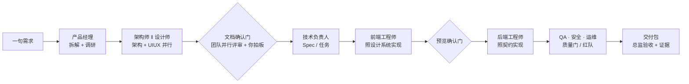
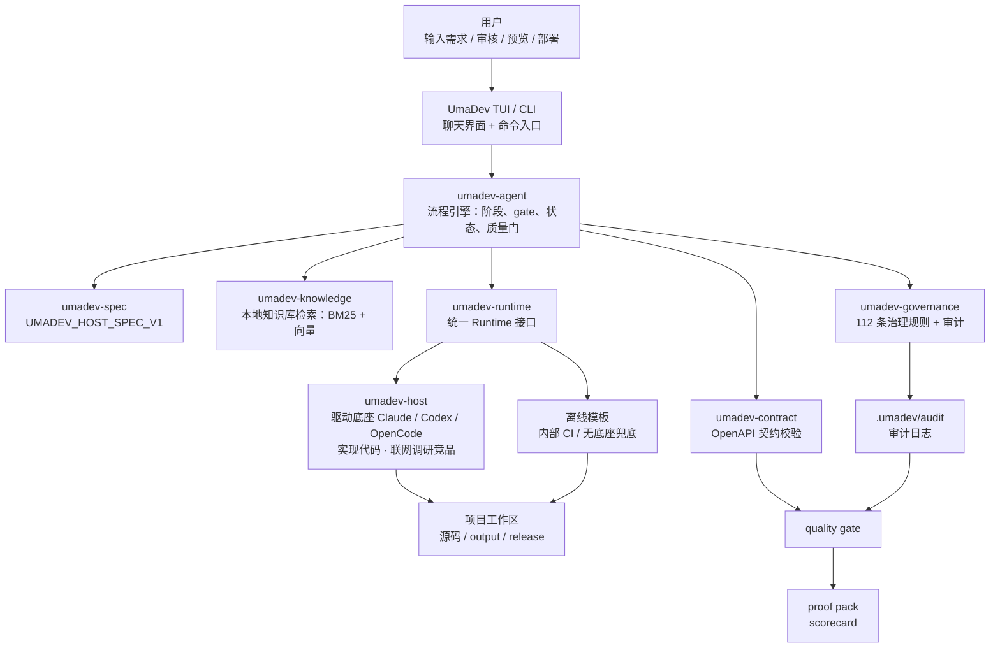
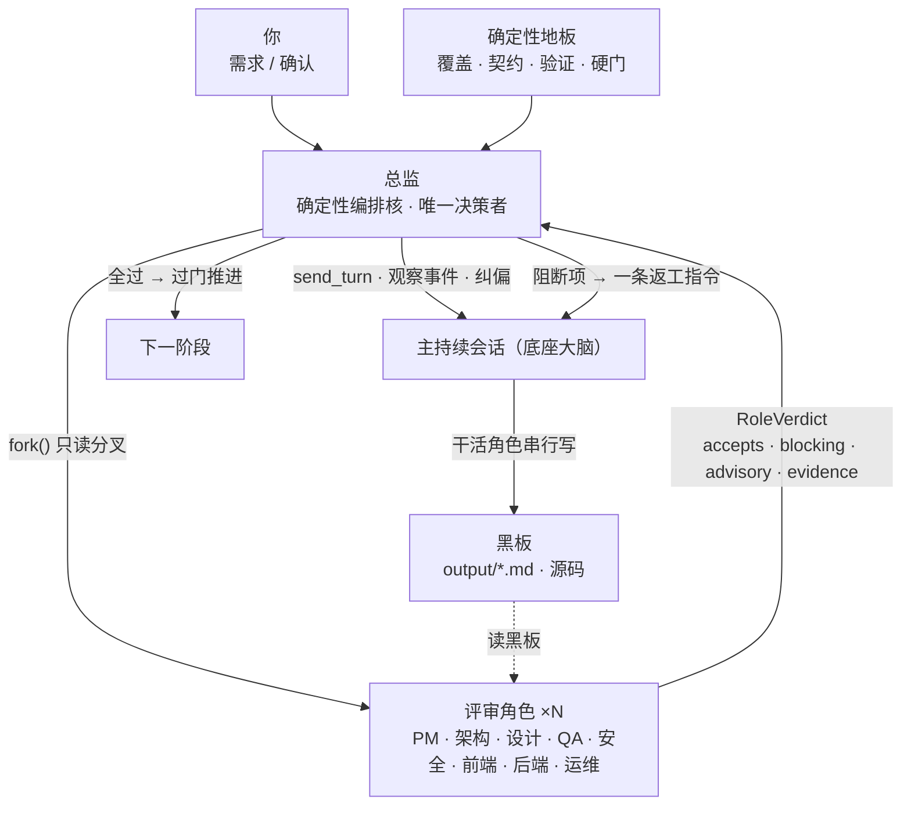
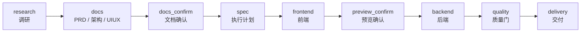
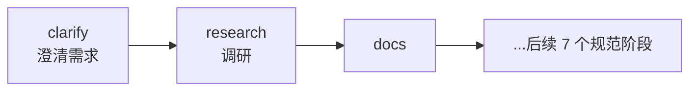
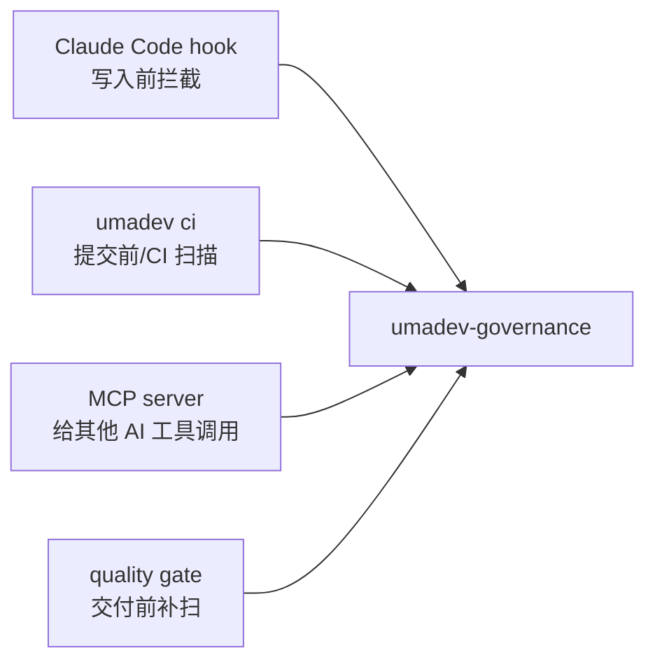
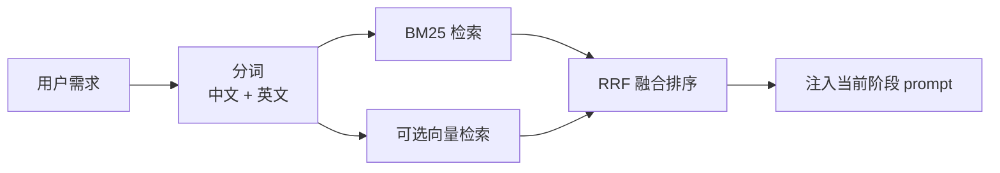

# UmaDev

<div align="center">


### 一个 AI 项目总监，带领一支完整团队，把你的需求交付成可上线产品

**产品 / 架构 / 设计 / 前后端 / 测试 / 安全 / 运维——像真实开发团队那样协作。底座是大脑，UmaDev 是带队交付的总监。**

[](LICENSE)
[](https://www.rust-lang.org/)
[](spec/UMADEV_HOST_SPEC_V1.md)
[](CHANGELOG.md)

简体中文 | [繁體中文](README.zh-TW.md) | [English](README_EN.md)

</div>

---

## 目录

- [简介](#简介) · [项目来源](#项目来源) · [它解决什么问题](#它解决什么问题)
- [快速体验](#快速体验) · [一个完整例子](#一个完整例子) · [UmaDev 如何工作](#umadev-如何工作) · [团队怎么协作](#团队怎么协作)
- [为什么可信](#为什么可信) · [运行模式](#运行模式) · [流水线设计](#流水线设计) · [质量门是什么](#质量门是什么)
- [治理规则是什么](#治理规则是什么) · [知识库是什么](#知识库是什么) · [交付产物长什么样](#交付产物长什么样)
- [**命令大全**](#命令大全) · [配置](#配置) · [Rust 架构](#rust-架构) · [开发](#开发)

## 简介

UmaDev 是一个本地运行的 **AI 项目总监 Agent**。它加载你**已经登录的 AI 编码底座**（Claude Code / Codex / OpenCode）的大脑——一个**常驻的持续会话**就是它的工作意识——然后像一位真正的项目总监那样，**带领一支完整团队**把你的一句需求交付成可上线产品。

总监不亲自敲代码。它做三件事：**理解你**、**调度团队**、**把关交付**。底座是干活的工程师（思考、调研、设计、写代码、审查都是底座的认知）；UmaDev 是带队的总监 + 确定性工具层（编排阶段、设置确认门、实时治理、跑质量门、留下审计证据）。

它的团队是一组**可调度的角色席位**，而非写死的判断逻辑：

- **产品经理** 拆解需求、定范围与验收标准
- **架构师** 定技术选型、分层分包、接口契约
- **UI/UX 设计师** 定设计系统、令牌、信息架构，盯住"不像 AI 模板"
- **前端 / 后端工程师** 真写代码（驱动底座连续用工具产出文件）
- **测试 / QA** 真跑构建测试、查覆盖
- **安全 / 红队** 扫漏洞、查攻击面、做 pre-PR 安全检查
- **运维 / DevOps** 管构建、CI、运行时证据、上线
- **总监** 在每道门汇总裁决、对照计划验收、拍板过或返工

干活的角色串行写主会话；评审的角色各自 fork 出**只读分叉会话并行**审，把结构化裁决交回总监。角色之间**不互相聊天**——它们只通过共享的产物文件（黑板）和结构化裁决沟通，避免多 Agent 互聊放大幻觉。总监**确定性地**汇总：把阻断项折成一条返工指令注入主会话，让团队带上下文修，循环由确定性信号（覆盖 / 契约 / 验证 / 硬门）有界终止——不靠模型自评"够不够好"。

它驱动的恰好是这三个一等底座；想覆盖更多模型，是把底座路由到第三方/本地模型，那是底座自己的事，UmaDev 不注入、不覆盖、不持有任何模型端点。

> 持续会话是**默认**：整条流水线复用一个底座会话，上下文全程在线；过去"每阶段单发"的旧模型只作为底座会话起不来时的兜底。这让底座连续干活、真写代码，而不是九个"陌生人"各做一段、客套不动手。

## 项目来源

UmaDev 脱胎于原项目 [shangyankeji/super-dev](https://github.com/shangyankeji/super-dev)。

早期的 `super-dev` 更像一个 **AI 编码治理工具**：它主要关注“AI 生成代码时不能写什么”，例如不要用 emoji 当图标、不要硬编码颜色、不要写不安全代码。

现在的 UmaDev 在这之上长成了一个带队交付的项目总监 Agent：

- **从单点治理扩展到全流程交付**：不只检查代码，而是把从需求到上线的每个阶段都交给对应角色，并加上门禁与验收。
- **从零散脚本升级为规范驱动系统**：核心是 [UMADEV_HOST_SPEC_V1](spec/UMADEV_HOST_SPEC_V1.md)，所有实现都围绕规范（持续会话与团队模型见 §9.3–§9.4）。
- **使用 Rust 重写**：单二进制、跨平台、启动快、依赖少、适合本地长期运行。
- **从“拦截问题”升级为“带队走完交付”**：Claude Code / Codex / OpenCode 是大脑和手，UmaDev 是加载这颗大脑、调度整支团队、把关交付的总监。

一句话概括这个演进：

> `super-dev` 关注“AI 不要写烂代码”；`UmaDev` 关注“一个 AI 项目总监如何带领一支团队，把需求交付成可上线、可审计的商业产品”。

## 它解决什么问题

很多人第一次用 AI 编码工具时都会遇到类似问题：

- AI 一上来就写代码，没有 PRD、没有架构、没有验收标准。
- 前端做完了，后端接口路径对不上。
- UI 看起来像模板，颜色和字体很随意。
- AI 写了占位代码、假数据、TODO，却说“完成了”。
- 修改一次需求后，上下文开始乱，前面约定被忘掉。
- 代码能生成，但没有质量报告、没有证据链，不知道能不能交付。
- 团队有自己的规范和知识库，但每次都要手动复制给 AI。

UmaDev 的目标就是把这些问题系统化解决——靠的不是更长的提示词，而是一支分工明确的团队，每个角色在该出手的节点出手：



## 快速体验

### 1. 安装

推荐用 npm 安装预编译二进制：

```bash
npm install -g umadev
```

npm 只是分发壳。真正运行的是 Rust 编译出的 `umadev` 二进制。

支持的平台：

- macOS Apple Silicon
- macOS Intel
- Linux x86_64
- Linux ARM64
- Windows x86_64

也可以从源码构建：

```bash
git clone https://github.com/umacloud/umadev.git
cd umadev
cargo build --release
./target/release/umadev --version
```

### 2. 准备一个 AI 编码底座

UmaDev 推荐驱动你已经登录的 CLI：

```bash
# 三选一即可
npm install -g @anthropic-ai/claude-code
npm install -g @openai/codex
npm install -g opencode-ai
```

然后按这些工具自己的方式登录。

UmaDev 不保存你的 Claude / Codex / OpenCode 登录信息。它只是把任务作为非交互命令发给它们。

### 3. 初始化项目

```bash
cd your-project
umadev init
```

这一步会写入一些项目配置：

```text
umadev.yaml              # 声明这是一个 UmaDev 管理的项目
.umadevrc               # 项目级配置
.umadev/rules.toml      # 治理规则配置
CLAUDE.md               # 给 Claude Code 看的项目说明
.gitignore              # 忽略 UmaDev 运行产物
knowledge/              # 项目内知识库和设计系统种子
```

### 4. 启动

```bash
umadev
```

第一次打开会让你选择：

1. 界面语言。
2. 使用哪个底座：Claude Code、Codex 或 OpenCode（你已经登录的那个）。

之后直接输入需求：

```text
做一个面向独立开发者的 SaaS 订阅管理后台，包含登录、订阅计划、账单记录和管理员仪表盘。
```

UmaDev 会开始组织完整流程。

### 5. 预览和交付

前端阶段完成后：

```text
/preview
```

交付阶段完成后：

```text
/deploy
```

最终交付证据会在：

```text
output/
release/
.umadev/audit/
```

其中最重要的是：

```text
release/proof-pack-<project>-<time>.zip
release/scorecard-<project>-<time>.html
```

这两个文件就是给团队、客户或审计方看的交付证明。

## 一个完整例子

假设你在一个空项目里运行：

```bash
umadev init
umadev
```

然后输入：

```text
做一个课程预约小程序，用户可以查看课程、选择时间、预约、取消预约，管理员可以管理课程和预约记录。
```

UmaDev 会做这些事：

1. **理清需求**：补全目标平台、是否需要支付、管理员后台复杂度等合理默认假设（自动模式下自动推进、不打断你；手动模式可逐条确认）。
2. **联网调研**：当底座具备联网能力时，搜索同类小程序 / 预约系统的竞品功能、定价、设计趋势和真实用户评价；同时检索内置知识库里的预约系统、后台 CRUD、权限、表单校验等规范。两者合并产出调研报告 `output/<slug>-research.md`。
3. 生成 PRD，明确用户角色、功能范围、EARS 可测验收标准。
4. 生成架构文档，定义数据模型、API、鉴权、部署方式。
5. 生成 UI/UX 文档，定义设计方向、颜色 token、字体、组件状态、图标库。
6. 拆成执行计划和任务（每个任务回链到需求 FR 编号）。
7. 驱动底座实现前端。
8. 暂停让你预览。
9. 驱动底座实现后端和集成。
10. 跑质量门：文档、契约、构建、设计、安全、交付文件全部检查。
11. 生成交付包和成绩单。

整个过程不是“AI 聊完就算完成”，而是会留下真实文件。

## UmaDev 如何工作

整体架构可以理解成四层：



更简单地说：

- **TUI/CLI**：你和总监对话的地方。一句"你好"、一个"审下这段代码"、一个完整需求，都进同一个会话，由底座判断该闲聊、做临时任务、还是开工跑流水线。
- **总监（umadev-agent）**：决定现在该做哪个阶段、点名哪些角色、什么时候停下设门、什么时候汇总裁决推进或返工。
- **持续会话 / 底座**：整条流水线复用你登录的底座（Claude Code / Codex / OpenCode）的一个会话——底座用它自己的登录和模型连续干活（调研、设计、真写代码、评审）；UmaDev 不注入、不覆盖任何模型或 key。
- **治理 / 质量**：底座每写一个文件就实时拦截不合规内容；交付前再跑一遍质量门补扫。
- **知识库**：把工程标准、设计系统、领域知识（本地 BM25 + 向量检索）注入给当前阶段的角色。
- **证据**：把每次工具调用、每份裁决、每道门记录下来，最后打包成交付证明。

## 团队怎么协作

UmaDev 把"质量判断"建模成**一支团队**，而不是单趟检查。一个**确定性总监**主导全程；干活角色串行写，评审角色并行只读审；沟通只走"共享文件黑板 + 结构化裁决"。



四条铁律保证这套团队既强又稳：

- **单写者**：任一时刻只有主会话在写黑板；评审分叉只读，绝不并行写，因此并行安全。
- **确定性控环**：循环继续还是终止，由确定性信号（gap-count、退出码、硬门）决定。底座和评审角色都是 **advisory**，永不驱动循环终止——避免模型"自我感觉良好"放行。
- **fail-open**：评审角色够不到底座时，空裁决 = 通过，绝不阻塞；总监退回确定性地板决策。一个评审的 bug 永远不会卡住底座。
- **有界返工**：阻断项折成返工指令注入主会话，带上下文修，再复审；gap-count + stall-counter 确定性收敛（默认最多几轮、无进展即停），残留进自学习库下次规避。

团队规模随任务复杂度缩放：bugfix / 小重构不组队，确定性地板独立把关；完整需求才上全套角色。简单需求因此能走轻量路径——跳过调研和三文档、保留 Spec 与硬门，几分钟出代码。

## 为什么可信

总监带队听起来像把判断权交给模型——其实恰恰相反。UmaDev 的可信来自把"模型说了什么"和"硬信号是什么"严格分开：

- **fail-open 治理**：底座每写一个文件，都实时拦截 emoji 当图标、硬编码颜色、AI 模板痕迹、无障碍缺失、前后端契约不符等。治理函数**永远 fail-open**——治理自身出 bug 时放行而非阻断，绝不让一个治理缺陷卡死底座。
- **确定性控环**：底座和评审 critic 都是 **advisory**。真正决定"过门 / 返工 / 硬停"的是确定性信号：FR→任务覆盖、前后端契约对照、真跑 verify 的退出码、质量门阈值、以及**零代码硬门**（计划要产出代码却没有真实源码 = 判失败，绝不把空骨架伪装成"完成"）。
- **不持有模型端点**：UmaDev 用你已登录的底座，不自带模型、不接第三方 API、不存你的 key。底座用谁的模型、什么思考强度，UmaDev 只读出来显示、绝不覆盖。
- **审计证据**：每次工具调用、每份角色裁决、每道门的状态都落盘（`.umadev/audit/*`、`team-ledger.jsonl`）；交付时打包成 proof-pack + 成绩单 + 合规映射（SOC 2 / ISO 27001 / EU AI Act），可直接发给团队、客户或审计方。
- **自我进化记忆**：踩坑自动识别→按技术栈指纹精准召回→复发触发更高层的纠正策略（反思）；相似教训沉淀成更稠密的"信念"，并做矛盾卫生；信任分级 + CJK 检索贯穿其中。越用越懂你的项目。
- **三语**：zh-CN / zh-TW / en 全程覆盖用户可见文案，按系统语言检测、可随时切换。

## 运行模式

### 模式 A：驱动本机 AI 编码 CLI（默认走持续会话）

这是产品模式。整条流水线复用底座的**一个持续会话**，上下文全程在线；底座连续用工具干活。

| Backend ID | 实际程序 | UmaDev 怎么驱动 | 适合谁 |
|---|---|---|---|
| `claude-code` | `claude` | 持续会话（stream-json 双向流），跨阶段 `--resume` 续接 | 已经在用 Claude Code 的用户 |
| `codex` | `codex` | 持续会话（`codex app-server`，同一 thread 续接） | 已经在用 Codex CLI 的用户 |
| `opencode` | `opencode` | 持续会话（`opencode serve`，同一 session 续接） | 已经在用 OpenCode 的用户 |

特点：

- UmaDev 不需要你的模型 API key。
- 继续使用你原来 CLI 的账号、订阅和配置。
- 底座负责真实读写文件和运行命令。
- UmaDev 负责团队调度、流程、规则、质量门和证据链。

> 单发兜底：底座的持续会话起不来时，自动回退到旧的"每阶段单发"路径（`claude --print` / `codex exec` / `opencode run`），保证不卡死；离线模式与显式 `UMADEV_CONTINUOUS=0` 也走单发。

### 底座自带模型 —— UmaDev 不接外部 API

UmaDev 不自带模型，也不接第三方 API —— **底座用它自己的模型**（你订阅登录的，或你给底座自己配的第三方 / 本地模型）。选底座时 UmaDev 会读出并显示它当前用的模型和思考强度（`/status` 也能看），但**绝不覆盖**：运行时默认不传 `--model`，底座用它自己的；想换就改底座自己的配置，或用 `/model <id>` 临时覆盖这一会话。

UmaDev 读取的来源：claude 的 `~/.claude/settings.json`（`model` / `effortLevel`）、codex 的 `~/.codex/config.toml`（`model` / `model_reasoning_effort`）、opencode 的 `opencode.json`（`model`，思考强度内置在模型变体里）。

### 模式 B：离线模板（内部兜底，不是产品）

```text
/offline
```

离线模式不会调用任何模型，也不会访问网络。它**不是一个让你选的产品形态**——产品永远是"驱动你登录的底座"。离线模板只是没有底座可用时的确定性兜底，适合：

- 快速看文件结构。
- CI smoke test。
- 演示 UmaDev 的流程。

离线产物只是模板（带 TODO 占位），不代表模型完成了真实开发；真实交付必须走底座。第一次启动的底座选择器也只列这三个底座，不会把离线当成一个选项。

## 流水线设计

规范主链是 9 个阶段：



当前产品实现还在主链前增加了一个 `clarify` 微阶段：



所以你可能先看到 UmaDev 生成：

```text
output/<slug>-clarify.md
```

你可以回答澄清问题，也可以输入 `c` 跳过。

> 小任务有轻量路径：9 阶段是面向"完整商业级交付"的主链，不是每个需求都得全程走完。用 `/kind`（全栈 / 仅前端 / 仅后端 / bugfix / 重构）声明任务类型后，UmaDev 会据此裁剪阶段——bugfix、小改动不会强行拉你走 PRD/架构/UIUX 全套。

### 每个阶段由谁主导、产出什么

| 阶段 | 主导角色 | 你能理解成 | 主要文件 |
|---|---|---|---|
| `clarify` | 产品经理 | 先把需求问清楚 | `output/<slug>-clarify.md`、`output/<slug>-clarify-answers.md` |
| `research` | 产品经理 | 联网调研竞品、领域、风险、设计趋势 | `output/<slug>-research.md` |
| `docs` | PM · 架构师 · 设计师 | 写三份核心文档（架构 ‖ UIUX 可并行） | `output/<slug>-prd.md`、`output/<slug>-architecture.md`、`output/<slug>-uiux.md` |
| `docs_confirm` | 团队并行评审 + 你 | PM + 架构 + 设计 critic 各自只读审，连同你一起确认方向 | `.umadev/workflow-state.json`、`.umadev/team-ledger.jsonl` |
| `spec` | 技术负责人 | 拆任务和执行计划（每任务回链 FR 编号） | `output/<slug>-execution-plan.md`、`.umadev/changes/<id>/tasks.md` |
| `frontend` | 前端工程师 | 照设计系统/令牌实现前端 | `output/<slug>-frontend-notes.md` |
| `preview_confirm` | 设计 + 前端 critic + 你 | 看前端效果、审实现质量 | TUI gate 状态、`.umadev/team-ledger.jsonl` |
| `backend` | 后端工程师 | 照契约实现后端和集成 | `output/<slug>-backend-notes.md` |
| `quality` | QA · 安全 · 后端 · 运维 critic | 真跑构建测试 + 红队 + 契约/覆盖/治理扫描 + 硬门 | `output/<slug>-quality-gate.json`、`output/<slug>-quality-gate.md` |
| `delivery` | 运维 / 总监验收 | 对照计划验收、打包交付 | `output/<slug>-delivery-notes.md`、`release/proof-pack-*.zip`、`release/scorecard-*.html` |

## 质量门是什么

质量门可以理解成 UmaDev 的“交付前验收”。

它不是简单看文件在不在，而是会检查：

- PRD 有没有目标、范围、验收标准。
- 架构文档有没有 API、数据模型、错误处理、鉴权。
- UI/UX 文档有没有设计 token、字体、图标库、组件状态、暗黑模式。
- 前端调用的 API 和后端契约是否一致。
- 是否存在 emoji 图标、硬编码颜色、AI 模板痕迹。
- 是否有构建、测试、lint、typecheck 结果。
- 是否生成 Dockerfile、CI、migration、`.env.example`。
- 是否泄露 API key、密码、连接串。
- 是否有审计日志和合规映射。

输出文件：

```text
output/<slug>-quality-gate.json
output/<slug>-quality-gate.md
```

默认通过线是 90 分，可以在 `.umadevrc` 调整：

```toml
[quality]
threshold = 90
skip_checks = []
```

## 治理规则是什么

UmaDev 最早来自治理工具，这部分仍然是核心能力。

这些规则是一条**治理基线**，不是绝对真理——每条都可以在 `.umadev/rules.toml` 里禁用、按路径排除或调参（见下文）。它们的作用是给底座的产出兜底，而不是替你做最终的工程判断。

规范层有 25 条 clause，实现层目前有 112 条规则，覆盖：

- UI 质量：不用 emoji 当图标，不写硬编码色，不产出模板感 UI。
- 安全：不写密钥，不写危险命令，不写 SQL 注入、SSRF、XXE 等危险代码。
- 前端质量：不用随意 `any`、裸 `fetch`、缺少 a11y、缺少 ErrorBoundary 等。
- 后端质量：鉴权、限流、日志、事务、输入校验、错误处理。
- 多语言危险模式：Rust `unwrap`、Go `panic`、Python `bare except`、Java `System.exit` 等。

治理入口有四个：



项目可以通过 `.umadev/rules.toml` 调整：

```toml
[disabled]
clauses = []

[exclusions]
paths = ["src/legacy/**", "**/*.test.ts"]

[extra]
blocked_domains = ["internal-bad-proxy.corp"]
```

## 知识库是什么

UmaDev 内置了 400+ 份 markdown 知识文件，不只是普通文档，而是给底座看的工程标准库。

它覆盖：

- 产品和 PRD。
- 架构和 API。
- 前端、后端、数据库。
- 安全、测试、CI/CD、运维。
- 移动端、桌面、小程序、鸿蒙、跨平台。
- 电商、金融科技、医疗、教育、游戏等行业。
- UI/UX、设计系统、设计反模式。
- 产品经理、架构师、前端负责人、后端负责人、QA、DevOps 等专家方法论。

检索方式：



你也可以添加自己的团队知识：

```bash
umadev knowledge-manage add ./team-docs --name team-docs
umadev knowledge-manage search "支付 webhook 幂等"
```

## 交付产物长什么样

一次完整运行后，目录大致是：

```text
your-project/
  output/
    app-clarify.md
    app-research.md
    app-prd.md
    app-architecture.md
    app-uiux.md
    app-execution-plan.md
    app-frontend-notes.md
    app-backend-notes.md
    app-quality-gate.json
    app-quality-gate.md
    app-compliance-mapping.json
    app-delivery-notes.md

  .umadev/
    workflow-state.json
    audit/
      tool-calls.jsonl
      frontend-api-calls.jsonl
      verify.jsonl
    changes/
    decisions/
    history/

  release/
    proof-pack-app-20260620090000.zip
    proof-pack-app-20260620090000.manifest.txt
    scorecard-app-20260620090000.html
```

其中：

- `output/` 是项目过程文档。
- `.umadev/` 是状态和审计记录。
- `release/` 是最终交付包。

## 命令大全

UmaDev 有两套入口,一一对应:

- **TUI 斜杠命令** —— 在 `umadev` 聊天界面里输入 `/`,日常推荐。
- **终端 CLI 子命令** —— 脚本 / CI 用,无需进 TUI。

> 提示:TUI 里输入 `/` 会弹出命令补全浮层,`Tab` 补全、`↑↓` 切换;`/help`(或 F1)列出全部命令和快捷键。

### TUI 斜杠命令

**选择"大脑"与模型**

| 命令 | 作用 |
|---|---|
| `/claude` · `/codex` · `/opencode` | 切换驱动的本机底座 CLI(存入 `~/.umadev/config.toml`);切换时显示该底座当前的模型与思考强度 |
| `/offline` | 切到离线确定性模板(演示 / CI,完全不联网) |
| `/status` | 当前底座、它的**驱动模型**和**思考强度**(读自底座自己的配置,UmaDev 不覆盖) |
| `/model <id>` | 临时覆盖这一会话用的模型(默认不覆盖,底座用它自己的) |
| `/kind <类型>` | 指定任务类型(全栈 / 仅前端 / 仅后端 / bugfix / 重构),据此裁剪阶段 |

**驱动流程与过门**

| 命令 | 作用 |
|---|---|
| 直接打字 | 发给底座,由它判断"闲聊还是开工";若有确认门打开,则作为修改意见 |
| `/run <需求>` | 显式开始一次流水线 |
| `/continue`(门上也可直接输 `c`) | 通过当前确认门、进入下一阶段 |
| `/revise <反馈>` | 停在当前门,带反馈重做本阶段 |
| `/manual` · `/auto` | 切换"逐门人工确认 / 全自动"(默认 `auto`;`shift+Tab` 也可切换) |
| `/redo` | 重跑上一个阶段块 |
| `/abort` · `/stop` | 中止当前运行(磁盘工作流状态保留,下次可续跑) |

**预览与交付**

| 命令 | 作用 |
|---|---|
| `/preview` | 启动前端 dev server 并打开浏览器 |
| `/stop-preview` | 停止预览服务 |
| `/deploy` | **预览**部署命令(只看不执行) |
| `/deploy confirm` | 真正执行部署 |

**检查点与回滚**(影子 git,不碰你自己的 `.git`)

| 命令 | 作用 |
|---|---|
| `/checkpoint [标签]` | 给当前工作区文件打快照 |
| `/rewind [id]` | 列出 / 回滚到某个文件检查点 |

**查看产物与状态**

| 命令 | 作用 |
|---|---|
| `/spec` | 查看完整 `UMADEV_HOST_SPEC_V1` 规范 |
| `/diff [名字]` | 查看某个产物(默认 `prd`,也可 `architecture` / `uiux` / …) |
| `/verify` | 工作区合规报告 + 证据链 |
| `/doctor` | 自检(二进制 / manifest / 探针) |
| `/status` | 当前阶段 / 门 / 运行状态 |
| `/history` | 完整对话历史 |
| `/usage` | token / 用量统计 |
| `/knowledge` | 本次命中的知识库条目 |
| `/skill` · `/mcp` | 已安装的 Skill / MCP server |
| `/config` | 当前生效配置 |

**设计与项目**

| 命令 | 作用 |
|---|---|
| `/design <方向>` | 锁定设计系统方向(`modern-minimal` / `editorial-clean` / …) |
| `/template <名字>` | 选脚手架模板 |
| `/name <名字>` | 设置项目 slug |
| `/init` | 写入 `umadev.yaml` manifest |

**通用**

| 命令 | 作用 |
|---|---|
| `/help`(或 F1) | 帮助浮层(含全部快捷键) |
| `/clear` | 清空聊天 |
| `/export` | 导出当前会话 |
| `/quit`(或 Esc) | 退出(工作流状态已保存,可续跑) |

### 终端 CLI 子命令

**工作区生命周期**

| 命令 | 作用 |
|---|---|
| `umadev init` | 脚手架工作区(写 `umadev.yaml` + 设计系统 / 模板 / 知识库种子) |
| `umadev`(无子命令) | 启动聊天 TUI |
| `umadev doctor` | 自检 |
| `umadev verify` | 工作区合规 + 证据链状态 |
| `umadev report` | 合规映射(SOC 2 / ISO 27001 / EU AI Act) |
| `umadev history` | 列出回滚快照 |
| `umadev rollback latest` | 回滚到某快照 |
| `umadev update` | 升级 UmaDev 到最新版(经 npm) |
| `umadev uninstall` | 完整卸载:确认后删 `~/.umadev` + 本项目治理钩子 + 二进制(加 `--base <claude-code\|pre-commit>` 则仅卸钩子) |

**非交互运行(脚本 / CI)**

| 命令 | 作用 |
|---|---|
| `umadev run "<需求>" --backend <id>` | 跑一次流水线,停在 `docs_confirm` 门 |
| `umadev continue [--backend <id>]` | 通过当前门(自动复用上次的 `--backend`) |
| `umadev revise "<反馈>"` | 停在门,记录修改并重跑本块 |
| `umadev spec [--clauses]` | 打印规范(`--clauses` 看条款表) |

**治理 / CI**

| 命令 | 作用 |
|---|---|
| `umadev ci [--changed-only] [--report-only]` | 对工作区每个源文件跑治理(CI 模式) |
| `umadev install --base <claude-code\|pre-commit\|…>` | 把 pre-write 治理钩子装到底座 CLI 或 git pre-commit |

**平台扩展**

| 命令 | 作用 |
|---|---|
| `umadev mcp serve` | 作为 MCP server 运行——把 `govern_file` / `govern_command` 暴露给 Claude Desktop / Cursor / Continue 等 |
| `umadev mcp-manage <install\|list\|remove>` | 管理底座的 MCP server |
| `umadev skill <install\|list\|remove>` | 管理 Skill(知识 + 规则 + 提示词包) |
| `umadev knowledge-manage <add\|list\|search\|remove>` | 管理自定义知识库文档 |

**帮助**

| 命令 | 作用 |
|---|---|
| `umadev examples` | 命令速查表 |
| `umadev guide` | 60 秒上手教程 |

### 常用环境变量

| 变量 | 作用 | 默认 |
|---|---|---|
| `UMADEV_CLAUDE_BIN` / `UMADEV_CODEX_BIN` | `claude` / `codex` 二进制路径 | `claude` / `codex` |
| `UMADEV_WORKER_TIMEOUT` | 单次 worker 超时(秒) | `300` |
| `UMADEV_VERIFY_TIMEOUT_SECS` | verify 循环单次超时(秒) | `120` |
| `UMADEV_MODEL_PLAN` / `UMADEV_MODEL_BUILD` | 分阶段模型分层(等价 `/model plan\|build`) | — |
| `OPENAI_EMBED_KEY` | 启用远程向量嵌入(否则用内置离线模型 + BM25) | — |
| `XDG_CONFIG_HOME` | `config.toml` 的基目录 | `$HOME` |

## 配置

### 用户级配置

默认路径：

```text
~/.umadev/config.toml
```

示例：

```toml
backend = "claude-code"
lang = "zh-CN"
# model 默认留空 —— 底座用它自己配置的模型;只有想覆盖某会话时才填(等价 /model <id>)
# model = "opus"
```

### 项目级配置

默认路径：

```text
.umadevrc
```

示例：

```toml
[quality]
threshold = 90
skip_checks = []

[pipeline]
skip_phases = []
max_review_rounds = 3
auto_approve_gates = true

[knowledge]
enabled = true
engine = "hybrid"
top_k = 6
```

## Rust 架构

UmaDev 是一个 10 crate Rust workspace。

| Crate | 普通人理解 | 技术职责 |
|---|---|---|
| `umadev` | 主程序 | CLI、TUI 入口、doctor、hook、CI、MCP/Skill/Knowledge 管理 |
| `umadev-spec` | 规则说明书 | `UMADEV_HOST_SPEC_V1` 的 Rust 数据 |
| `umadev-governance` | 质检和红线 | 112 条治理规则、审计、策略、合规映射 |
| `umadev-agent` | 总监引擎 | 9 阶段 runner、gate、质量门、角色 critic 团队、持续会话编排、验收/有界返工、信任分级、自我进化记忆 |
| `umadev-runtime` | 统一大脑接口 | Runtime trait + 持续会话 `BaseSession` trait、Offline、能力契约 |
| `umadev-host` | 驱动外部 CLI | Claude Code / Codex / OpenCode：持续会话驱动（`*_session.rs`）+ 单发兜底 |
| `umadev-contract` | API 对账员 | OpenAPI 契约、前后端路径校验 |
| `umadev-knowledge` | 知识检索 | BM25、chunk、tokenizer、可选 vector |
| `umadev-tui` | 终端界面 | ratatui 聊天 UI、预览/部署命令 |
| `umadev-i18n` | 多语言 | 简体中文、繁體中文、English |

目录结构：

```text
crates/               Rust workspace
spec/                 UMADEV_HOST_SPEC_V1 规范
knowledge/            内置知识库
docs/                 架构、产品、商业化和设计文档
docs/assets/          图片和 Mermaid 图
npm/                  npm 分发包
tests/spec_vectors/   规范测试向量
```

## 开发

要求：

- Rust 1.87+
- Cargo
- 如果要测试 npm 分发，需要 Node.js 18+

常用命令：

```bash
cargo build --workspace
cargo test --workspace
cargo clippy --workspace --all-targets -- -D warnings
cargo fmt --all
```

推荐阅读顺序：

1. [spec/UMADEV_HOST_SPEC_V1.md](spec/UMADEV_HOST_SPEC_V1.md)
2. [crates/umadev-spec/src/lib.rs](crates/umadev-spec/src/lib.rs)
3. [crates/umadev-agent/src/runner.rs](crates/umadev-agent/src/runner.rs)
4. [crates/umadev-governance/src/rules.rs](crates/umadev-governance/src/rules.rs)
5. [crates/umadev/src/main.rs](crates/umadev/src/main.rs)

## License

MIT，见 [LICENSE](LICENSE)。
