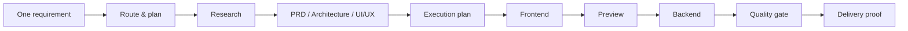
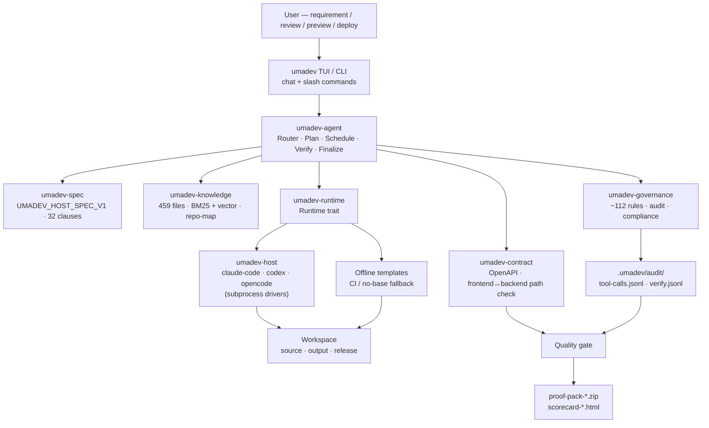
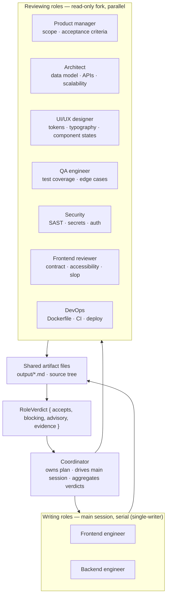
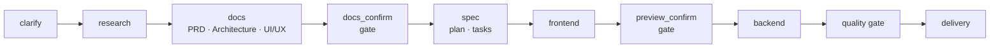
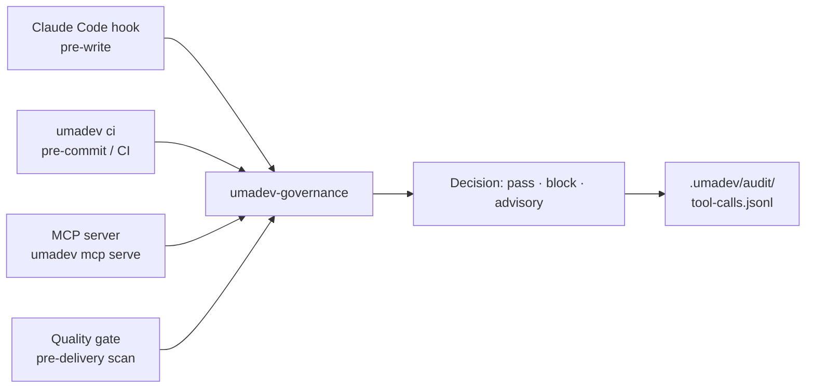
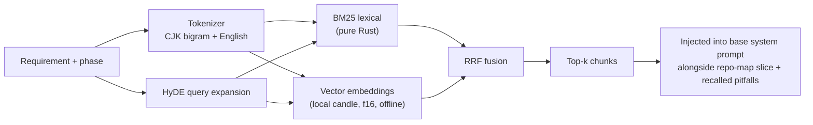
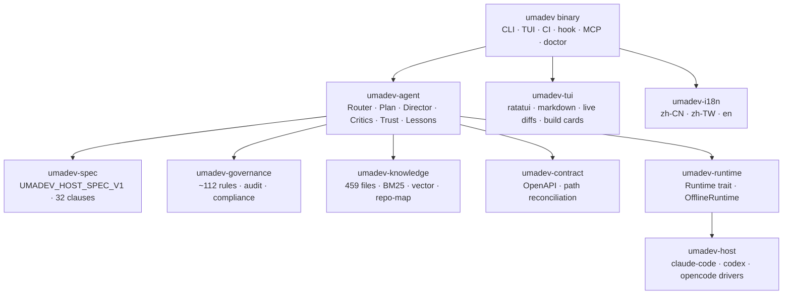

# umadev

<div align="center">


### UmaDev: A coding agent that works like a real dev team, commanding the Claude Code / Codex / OpenCode you already use.

[](LICENSE)
[](https://www.rust-lang.org/)
[](spec/UMADEV_HOST_SPEC_V1.md)
[](CHANGELOG.md)

English | [简体中文](README.zh-CN.md) | [繁體中文](README.zh-TW.md)

</div>

---

umadev is **a coding agent that works like a real dev team**. It drives an AI coding CLI you already have — Claude Code, Codex, or OpenCode — as one continuous session, and owns no model of its own: the model your base is connected to is the brain.

What you get is **a whole AI development team**. Eight specialists — product manager, architect, UI/UX designer, frontend engineer, backend engineer, QA, security, and DevOps — plan, build, review, and sign off the way a real team does, borrowing your already-logged-in base as their shared brain. You describe what you want in plain language, and the team turns it into runnable, shippable, auditable software: it researches, writes the PRD, architecture, and UI/UX, builds the frontend and backend, runs the quality and governance checks, and hands back the code plus a delivery proof. It sizes itself to the task — a small edit stays a small edit; a full project convenes the full roster.

A ninth seat, the **coordinator** (the team's technical lead), routes the request, owns a visible plan, schedules the team, enforces the gates, and leaves the audit trail. It doesn't write code; the base — the AI coding CLI — is the engineer that does that. The roles coordinate through shared artifact files and structured verdicts, never by chatting to each other.

It's a single Rust binary. npm is just the delivery shell.

---

## Table of Contents

- [Install](#install)
- [Quickstart](#quickstart)
- [Project Origin](#project-origin)
- [What Problem It Solves](#what-problem-it-solves)
- [Features](#features)
- [How It Works](#how-it-works)
- [The Team](#the-team)
- [Why You Can Trust the Output](#why-you-can-trust-the-output)
- [Runtime Modes](#runtime-modes)
- [The Full Delivery Flow](#the-full-delivery-flow)
- [Quality Gate](#quality-gate)
- [Governance](#governance)
- [Knowledge Base](#knowledge-base)
- [Deliverables](#deliverables)
- [Commands](#commands)
- [Configuration](#configuration)
- [Rust Architecture](#rust-architecture)
- [Development](#development)
- [License](#license)

---

## Install

```bash
npm install -g umadev
```

The npm package is a distribution shim. The actual program is a Rust binary. Prebuilt binaries ship for macOS (Apple Silicon and Intel), Linux (x86_64 and ARM64), and Windows (x86_64).

The binary and the curated knowledge corpus install from npm and work fully offline. The optional local embedding model (`multilingual-e5-small`, f16, ~224 MB) is **not** bundled in the npm package — it is fetched on first run to `~/.umadev/embed-model` (a one-time download), then powers offline vector search locally with no API key and no runtime network. If that first-run download is unavailable (offline install, restricted network), umadev still works: retrieval falls back to BM25-only until the model is present, and it self-heals — a later run re-downloads it (a corrupt cache is re-fetched, not trusted).

Build from source:

```bash
git clone https://github.com/umacloud/umadev.git
cd umadev && cargo build --release --features vector-local
./target/release/umadev --version
```

> **Building from source? The embedding model is not in the repo (it's too large for git, ~224 MB).** A plain `cargo build --release` gives a **BM25-only** binary; the local vector channel needs the `--features vector-local` flag **and** the model on disk. The prebuilt binaries and `npm i` bundle both automatically — for a source build, download `multilingual-e5-small` into `~/.umadev/embed-model/` once:
>
> ```bash
> mkdir -p ~/.umadev/embed-model && cd ~/.umadev/embed-model
> for f in config.json tokenizer.json model.safetensors; do
>   curl -fsSL "https://huggingface.co/intfloat/multilingual-e5-small/resolve/main/$f" -o "$f"
> done
> ```
>
> umadev auto-discovers it there (or point `UMADEV_EMBED_MODEL_DIR` at any directory with those three files). Without the model, umadev still works — retrieval just falls back to BM25-only.

You also need one AI coding CLI installed and logged in — that's the brain umadev drives:

| Base | Install | Log in |
|---|---|---|
| Claude Code | `npm i -g @anthropic-ai/claude-code` | `claude auth login` |
| Codex | `npm i -g @openai/codex` | `codex login` |
| OpenCode | see opencode.ai | `opencode auth login` |

umadev injects nothing into the base. Whatever your base is configured with — an official login or your own third-party / local-model routing — is exactly what runs.

---

## Quickstart

```bash
umadev                       # launch the chat UI; first run lets you pick a base
```

Tell it what you want built:

```text
> add CSV export to the reports page
> build me a todo app with a Postgres backend
> /goal ship a working SaaS landing page       # keep working until the goal is met
```

Or run a build non-interactively:

```bash
umadev run "add CSV export to the reports page" --backend claude-code
```

umadev sizes the work to the request — you don't pick a mode. A build typed in chat earns the same planning, team review, governance, and delivery proof as a `/run` — there is no separate chat path and build path. All builds run on an isolated `umadev/<slug>` branch; your working branch is never touched, and umadev never merges or pushes on its own.

### A full worked example

Suppose you run:

```bash
umadev init
umadev
```

Then type:

```text
Build a course-booking mini app. Users can browse courses, pick a time, book,
cancel. Admins can manage courses and bookings.
```

umadev will:

1. **Route the request.** The base's own model judges this: a full build, not a quick edit. You see an intent card — "full build, entering the delivery flow" — before any code is written.
2. **Clarify.** Fill in sensible defaults for target platform, payment scope, and admin complexity. Auto mode self-resolves; manual mode lets you confirm each.
3. **Research.** When the base has web access, search competing booking apps — features, pricing, design trends, real user reviews — and merge that with built-in knowledge about booking systems, admin CRUD, permissions, and form validation. Everything lands in `output/<slug>-research.md`.
4. **Draft three core documents.** PRD (roles, scope, EARS acceptance criteria), architecture (data model, APIs, auth, deployment), UI/UX (design direction, tokens, typography, component states, icon library). Pause for your review.
5. **Build an execution plan.** A dependency plan (`plan.json`) rendered as a live checklist. Each task links back to its FR id.
6. **Implement the frontend.** The coordinator schedules each task, the base writes the code, each file is governance-checked as it lands.
7. **Pause for preview.** You see the running app before backend work starts.
8. **Implement the backend and integration.**
9. **Run the full quality gate.** Build, test, lint, contract check, runtime probe, governance scan.
10. **Produce the delivery pack.** Scorecard, proof pack, compliance mapping — on disk and ready to hand to a teammate, client, or reviewer.

You end up with real files on disk — the research note, the three docs, source, a quality report, and a proof pack.

---

## Project Origin

umadev evolved from the original [shangyankeji/super-dev](https://github.com/shangyankeji/super-dev) project.

Early `super-dev` was closer to an AI coding governance tool. It focused on what AI-generated code must not contain: emoji icons, hardcoded colors, unsafe patterns.

umadev has grown that into a coding agent that works like a real dev team:

- **From single-point governance to whole-pipeline governance.** It no longer only checks code; every phase from requirement to delivery is brought under the process and its gates.
- **From loose scripts to a spec-driven system.** The source of truth is [UMADEV_HOST_SPEC_V1](spec/UMADEV_HOST_SPEC_V1.md), 32 clauses, ~112 governance rules.
- **Rewritten in Rust.** One binary, fast startup, low dependency surface, cross-platform distribution.
- **From blocking bad output to delivering like a team.** Claude Code / Codex / OpenCode are the brain and hands; umadev is the coding agent that works like a real dev team, with governance as the safety net underneath.

> `super-dev` asked: "how do we stop AI from writing bad code?" umadev asks: "how do we make AI deliver a complete, shippable, auditable project — the way a real software team would?"

---

## What Problem It Solves

Most people hit the same problems when they use AI coding tools at scale:

- The AI starts coding immediately, without a PRD, architecture, or acceptance criteria.
- The frontend is built, but backend API paths do not match.
- The UI looks generic: random colors, random fonts, template-like composition.
- The AI leaves placeholders, fake data, and TODOs — and still says "done."
- After one requirement change, context drifts and earlier decisions are forgotten.
- Code exists, but there is no quality report or delivery evidence.
- Your team has standards and internal knowledge, but you copy them manually into prompts.

umadev turns those problems into a structured workflow:



---

## Features

- **Drives a base you already use.** Claude Code, Codex, or OpenCode, run as one continuous session so the base keeps its context across a whole build instead of starting cold each step. No API key of its own.
- **A whole dev team.** Eight specialists — product manager, architect, UI/UX designer, frontend engineer, backend engineer, QA, security, and DevOps — each own a deliverable (PRD, API contract, design system, the build, tests + runtime-proof, security audit, deploy-proof) and plan, implement, review, and sign off the way a real team does. A coordinator schedules them, owns the plan, and enforces the gates.
- **Plans the work and shows it.** A build becomes a dependency plan (`.umadev/plan.json`) rendered as a live checklist you can steer with `/plan`. Steps are driven step by step; the coordinator owns the plan, not the base.
- **A build in chat is a real build.** A build typed in the chat UI earns the same planning, team scheduling, governance, and delivery proof as `umadev run`.
- **Ships a delivery proof.** PRD, architecture, and UI/UX docs, a scorecard, and a proof pack — scaled to the task, so a one-page change doesn't get an enterprise dossier.
- **Carries engineering standards into the base — with a fully-local dual-channel RAG.** 459 curated knowledge files (commercial-grade engineering standards, design rules) plus a map of your existing code are compiled into the binary and retrieved on every working turn by a two-channel hybrid engine: pure-Rust BM25 + a local vector model (`multilingual-e5-small`, f16, via candle) fused with RRF, HyDE query expansion on top. No API key, no network, millisecond recall over your own standards and business docs. Zero config. Cloud embedding is OFF by default and never triggered by a stray `OPENAI_API_KEY` — it runs only if you explicitly opt in (a dedicated `OPENAI_EMBED_KEY` **plus** `UMADEV_ALLOW_CLOUD_EMBED=1`); the default install never sends your corpus anywhere.
- **Self-evolving memory — it learns from each run.** Mistakes the base hits are recorded with a frequency signal to a local store; a genuine recurrence triggers a higher-level corrective *reflection*. Both are recalled into later prompts, so the same pitfall isn't repeated — umadev gets better on your codebase the more you use it.
- **Remembers your project's facts.** Stable facts the base discovers — the JDK path, the real build / test / lint commands, environment constraints — are written to `.umadev/memory/facts.jsonl` and re-injected every turn, so the team never re-discovers what it already knows even after the transcript is trimmed.
- **Surfaces the base's clarifying questions.** When the base asks a question mid-build (its `AskUserQuestion` tool), umadev renders the prompt and its options inline and relays your answer back into the same session — instead of the question silently auto-cancelling.
- **Your app's runtime model is yours to pick.** The base you borrow to *write* the code and the model your *built* AI app calls at runtime are kept separate: umadev treats the app's runtime provider, model id, and key as user-configurable env, instead of silently hardcoding the dev base's vendor into the generated product.
- **A real terminal UI.** Markdown, syntax-highlighted code, live diff cards as files change (word-level highlighting), folding tool rows, a build-completion card with a clickable preview URL, slash commands throughout, and `/logs` to surface the base's live build output for long-running commands.
- **Governance you can audit.** A trust dial (`plan` / `guarded` / `auto`), irreversible actions always confirm on every tier — including a fail-closed boundary for obfuscated commands — plus an MCP server (`umadev mcp serve`) that exposes the governor to other tools, and compliance mapping (SOC 2 / ISO 27001 / EU AI Act).
- **Goal-until-met builds.** `/goal <objective>` drives the base to keep working until the objective is met — native `/goal` on all three bases; `UMADEV_NO_GOAL_MODE=1` opts out.

---

## How It Works

A turn flows through up to five layers. Every consult of the base fails open to a safe default, so a bug or an unreachable base never blocks you.



The five layers in plain English:

1. **Route.** The base's own model judges what your message needs — a small edit, a debug, or a full build. The intent is surfaced immediately ("small change, on it" vs. "full build, entering the delivery flow") so you can correct it before work starts. The base model is authoritative; if it is unreachable, the turn falls to the lightest path, never a keyword guess.
2. **Plan.** A real build is broken into a dependency plan that umadev owns and renders as a live checklist. The plan is stored in `.umadev/plan.json` and is steerable with `/plan`.
3. **Schedule.** umadev walks the plan step by step. Writing roles (frontend / backend engineer) drive the main session serially — single-writer. Reviewing roles (product manager, architect, designer, QA, security, frontend, backend, DevOps) each get their own read-only forked session and review in parallel, returning structured verdicts. Roles communicate only through shared artifact files and their verdicts.
4. **Verify and self-correct.** Each step is checked against its acceptance criteria on a deterministic floor — coverage, contract, build/test, hard gates — not by the model self-assessing "good enough." Blocking findings come back as one fix directive with evidence attached. The loop is bounded by a gap counter and stall counter; it ends cleanly when done or genuinely stuck.
5. **Finalize.** Once the floor is clean, umadev produces the delivery artifacts and proof pack. The run's episodes feed the lessons store for future runs.

Underneath every path, a curated system prompt — identity, engineering and design standards, the relevant slice of the knowledge base, recalled pitfalls from past runs, your project's remembered facts, and an outline of your existing code — is injected into the base on every working turn. The stable part of that prompt is byte-stable across turns so the base's prompt cache stays warm.

The firmware is pre-loaded once at launch, so the first reply doesn't pay the 30–60s per-message cold start that re-priming from scratch would cost.

---

## The Team

umadev convenes a nine-seat team — eight specialists plus a coordinator — and each role is a real job function with a real deliverable. Each role owns something concrete on the shared blackboard:

| Role | What it owns (deliverable on the shared blackboard) |
|---|---|
| Product manager | Scope, user stories, EARS acceptance criteria — `*-prd.md` |
| Architect | Layering, data model, API contract — `*-architecture.md` + `openapi.*` |
| UI/UX designer | Design system: tokens, typography, component states, page skeleton — `*-uiux.md` |
| Frontend engineer | Components and pages that import the tokens and call the contract URLs |
| Backend engineer | Data model, endpoints, and business logic aligned to the contract |
| QA engineer | Tests + a runtime probe — `runtime-proof.json` |
| Security engineer | Threat model + SAST scan: auth, injection, secrets |
| DevOps | Build, CI, and deploy evidence — `deploy-proof.json` |
| Coordinator (technical lead) | Routes intent, owns the plan, schedules the team, enforces each gate, keeps the audit trail |



How the team ships without stepping on itself:

- **Doer roles** drive the main session serially to produce their deliverable. Only one writer touches source at a time (single-writer).
- **Reviewing roles** each run on their own read-only forked session, in parallel, and return a `RoleVerdict` — `accepts`, `blocking` findings with evidence, and `advisory` notes.
- **The coordinator aggregates deterministically.** The deterministic floor governs loop control; critic opinions are advisory only. Blocking findings are folded into one rework directive injected back into the main session, along with the evidence.
- **Roles never chat to each other.** The shared blackboard is the output artifact files and the source tree. The only communication channel between roles is the verdict.
- **The team scales with the task.** A bugfix convenes no team. A greenfield build convenes the full roster. Complexity determines the seats.

---

## Why You Can Trust the Output

Trust in the output comes from four things that happen on every build:

**1. The deterministic floor runs regardless of what the model thinks**

Build, lint, typecheck, and test results are checked directly. The acceptance floor checks spec coverage and contract alignment — the model doesn't self-report "it passed."

**2. The frontend↔backend contract is verified mechanically**

`umadev-contract` parses the architecture doc's API table into a typed spec, renders `openapi.json` to `.umadev/contracts/`, extracts every `fetch`/`axios` call in the frontend source, and cross-validates the paths. A mismatch is a blocking finding.

**3. Every important action leaves evidence**

Tool calls, verification runs, and critic verdicts are written to `.umadev/audit/` as JSONL. The proof pack includes the evidence chain.

**4. Governance runs on every file write**

~112 rules check for emoji-as-icons, hardcoded colors, leaked secrets, AI-slop UI patterns, and unsafe code constructs. They run as a pre-write hook into Claude Code, as a pre-commit hook in git, and as part of the quality gate. At write time only the irreversible floor (leaked secrets / credentials, sensitive-path writes, destructive shell) is hard-blocked; craft and quality findings (emoji, color, AI-slop) are flagged and repaired by the post-write QC loop rather than pinning the base's hands mid-file. All rules are configurable in `.umadev/rules.toml` and are fail-open — a bug in the governor never blocks your work.

---

## Runtime Modes

### Drive a local AI coding CLI (the product)

| Backend ID | Binary | How umadev calls it |
|---|---|---|
| `claude-code` | `claude` | `claude --print --output-format text` |
| `codex` | `codex` | `codex exec --sandbox workspace-write` |
| `opencode` | `opencode` | `opencode run` |

### The base brings its own model — umadev has none

umadev connects to no model API and stores no credentials of its own. The base uses its own configured model — your logged-in subscription, or whatever third-party / local model you routed through the base. umadev passes no `--model` flag and owns no model of its own: to change the model, change it in the base's own config. There is deliberately **no `/model` command and no `umadev run --model`** — UmaDev never imposes a model.

umadev reads and surfaces the base's model and reasoning effort where the base exposes them — it reads `~/.claude/settings.json` for Claude Code, `~/.codex/config.toml` for Codex, and `opencode.json` for OpenCode — but never overrides those values. In practice a Claude Code continuous session reports the exact resolved model most reliably (the base emits it on session start); other bases may only show what their config pins. The context-window gauge shows a real model **name** always, but a numeric window only when the base's own config exposes an exact one — UmaDev never guesses a window from a model-name table (it would drift, and a base can route to a third-party / local model whose real window UmaDev can't read).

Wider model coverage means routing the base to a third-party or local model. That is the base's job. umadev does not add new base drivers for that.

### Offline templates (internal fallback, not a product mode)

Offline mode (`/offline`) makes no model calls and no network requests. It is an internal deterministic fallback for demos, smoke tests, and CI — not a mode you choose for real work. The first-run picker lists only the three bases. The output is templates with `TODO` placeholders, not real code.

---

## The Full Delivery Flow

For a heavyweight greenfield build, the coordinator expands the plan into the full nine-phase chain — the most complete delivery path. Most requests route to something shorter.



Small tasks have a lightweight path — the router classifies the request and routes to the right depth, and the plan expands or trims to fit. A bugfix convenes no team; a greeting stays chat; only a full product requirement expands into the chain above. Force the light path for a trivial change with `/quick`.

### Phase outputs

| Phase | What it produces |
|---|---|
| `clarify` | `output/<slug>-clarify.md`, `output/<slug>-clarify-answers.md` |
| `research` | `output/<slug>-research.md` — web research + knowledge base hits merged |
| `docs` | `output/<slug>-prd.md`, `output/<slug>-architecture.md`, `output/<slug>-uiux.md` |
| `docs_confirm` | Gate — pause for review before any code is written |
| `spec` | `output/<slug>-execution-plan.md`, `.umadev/plan.json`, `.umadev/changes/<id>/tasks.md` |
| `frontend` | Source code + `output/<slug>-frontend-notes.md` |
| `preview_confirm` | Gate — running app in the browser before backend work begins |
| `backend` | Source code + `output/<slug>-backend-notes.md` |
| `quality` | `output/<slug>-quality-gate.json`, `output/<slug>-quality-gate.md`, `runtime-proof.json` |
| `delivery` | `output/<slug>-delivery-notes.md`, `release/proof-pack-*.zip`, `release/scorecard-*.html` |

---

## Quality Gate

The quality gate is a pre-delivery review that runs independently of the model.

It checks:

- PRD goal, scope, and acceptance criteria completeness.
- Architecture APIs, data model, error handling, and authentication.
- UI/UX tokens, typography, icon library, component states, and dark mode.
- Frontend API calls cross-validated against the backend contract.
- Emoji icons, hardcoded colors, and generic AI-template UI patterns.
- Build, test, lint, and typecheck results.
- Dockerfile, CI config, migrations, and `.env.example`.
- Leaked API keys, passwords, and connection strings.
- Audit logs and compliance mapping.

The runtime probe (`umadev verify --runtime`) boots the app and hits its routes, writing `runtime-proof.json` — evidence that the app actually starts and responds.

Outputs:

```text
output/<slug>-quality-gate.json
output/<slug>-quality-gate.md
runtime-proof.json
```

Default threshold:

```toml
[quality]
threshold = 90
skip_checks = []
```

---

## Governance

umadev started as a governance tool and that remains a core capability.

The spec layer has 32 clauses. The implementation includes ~112 governance checks across UI quality, security, frontend architecture, backend engineering, and language-specific hazards. Every check is configurable in `.umadev/rules.toml` — each rule can be disabled, path-excluded, or tuned. They exist to backstop the base's output, not to make the final engineering call for you.

Governance entry points:



Every governance function is fail-open: an error path returns `pass`, never a block. A bug in the governor never stops your work.

Project policy:

```toml
[disabled]
clauses = []

[exclusions]
paths = ["src/legacy/**", "**/*.test.ts"]

[extra]
blocked_domains = ["internal-bad-proxy.corp"]
```

The compliance mapping (`umadev report`) maps the evidence chain to SOC 2 / ISO 27001 / EU AI Act controls.

---

## Knowledge Base

umadev ships with 459 curated markdown knowledge files bundled directly into the binary and auto-extracted to `~/.umadev/knowledge` on first launch. They are not generic documentation — they are commercial-grade engineering standards formatted for injection into an AI coding CLI.

The corpus covers: product design, PRD methodology, system architecture, frontend engineering, backend engineering, database design, security, testing, CI/CD, operations, mobile, desktop, mini programs, HarmonyOS, cross-platform development, domain verticals, UI/UX, design systems, and engineering playbooks.

On every working turn, umadev retrieves the most relevant chunks for the current requirement and phase, prepends them into the base's system prompt, and also injects a dependency-ranked outline of your existing code (the repo map). The result is that every prompt the base sees arrives pre-loaded with the applicable standard — not just a generic instruction.

Retrieval flow:



**Two-channel hybrid retrieval, fully local.** Lexical BM25 (pure Rust, CJK-aware) and dense vector search run as two channels fused with Reciprocal Rank Fusion, with a HyDE-style query expansion widening recall first. The vector channel runs a small bilingual model (`multilingual-e5-small`, f16) **locally via candle** — bundled with the install, no API key, no network, millisecond recall over your own project standards and business docs. It degrades to BM25-only if the model is ever absent (fail-open). No cloud embedding service is required, and **none is used unless you explicitly opt in** — a dedicated `OPENAI_EMBED_KEY` **plus** an explicit `UMADEV_ALLOW_CLOUD_EMBED=1` flag. A generic `OPENAI_API_KEY` (set for some other tool) never causes an upload; the default install keeps your corpus fully on-device.

**It learns from each run.** Mistakes the base hits during a build are recorded with a frequency signal to a local store; on a genuine recurrence umadev asks the base for a higher-level corrective strategy (a *reflection*). Both are recalled into later prompts, so the same pitfall isn't repeated — the longer you use it on a codebase, the less it stumbles on the same thing twice.

Add your own knowledge:

```bash
umadev knowledge-manage add ./team-docs --name team-docs
umadev knowledge-manage search "payment webhook idempotency"
```

---

## Deliverables

After a full run:

```text
your-project/
  output/
    app-clarify.md
    app-research.md
    app-prd.md
    app-architecture.md
    app-uiux.md
    app-execution-plan.md
    app-frontend-notes.md
    app-backend-notes.md
    app-quality-gate.json
    app-quality-gate.md
    app-compliance-mapping.json
    app-delivery-notes.md

  .umadev/
    plan.json
    workflow-state.json
    contracts/
      openapi.json
      openapi.yaml
    audit/
      tool-calls.jsonl
      frontend-api-calls.jsonl
      verify.jsonl

  release/
    proof-pack-app-20260620090000.zip
    proof-pack-app-20260620090000.manifest.txt
    scorecard-app-20260620090000.html
    runtime-proof.json
```

The proof pack and scorecard are what you hand to a teammate, client, or reviewer. Everything else is intermediate work.

---

## Commands

umadev has two entry points that mirror each other:

- **TUI slash commands** — type inside the `umadev` chat UI (recommended for daily use).
- **Terminal CLI subcommands** — for scripts and CI, no TUI needed.

Typing `/` in the TUI opens a command palette — `Tab` to autocomplete, `↑`/`↓` to cycle. `/help` (or F1) lists every command and keybinding.

### TUI slash commands

**Pick the base and model**

| Command | What it does |
|---|---|
| `/claude` · `/codex` · `/opencode` | Switch the base being driven (saved to `~/.umadev/config.toml`) |
| `/offline` | Switch to deterministic offline templates (demo / CI, no network) |
| `/status` | Active base, its model, and reasoning effort where the base exposes them (read-only; UmaDev never sets a model) |
| `/sandbox [tier]` | View / change the Codex base's launch sandbox (`read-only` · `workspace-write` · `danger-full-access`) |

**Drive the flow**

| Command | What it does |
|---|---|
| just type | Routes to the right path; a build typed here gets the same systems as `/run` |
| `/run [slug] <req>` | Start a full build explicitly |
| `/goal <objective>` | Keep the base working until the objective is met (native on all three bases; `UMADEV_NO_GOAL_MODE=1` opts out) |
| `/quick <task>` | Force the light path for a trivial one-off change |
| `/plan [skip\|add\|veto\|up\|down <id>]` | View or steer the live dependency plan |
| `/continue` (or `c` at a gate) | Approve the current gate and advance |
| `/revise <feedback>` | Stay at the gate, redo the current phase with feedback |
| `/redo [phase]` | Re-run a phase block |
| `/mode <plan\|guarded\|auto>` | Set the trust / autonomy tier |
| `/manual` · `/auto` | Per-gate confirmation vs. fully automatic (`shift+Tab` also toggles) |
| `/cancel` · `/abort` | Abort the current run (on-disk state kept, resumable later) |
| `/tasks [stop\|resume]` | List / manage background runs |
| `/adopt` | Onboard an existing (brownfield) repo: detect stack, index source, derive the contract |
| `/init` | Write the `umadev.yaml` manifest |
| `/diff [artifact]` | Show an artifact (`prd` · `architecture` · `uiux` · …) |

**Preview and delivery**

| Command | What it does |
|---|---|
| `/preview` | Start the frontend dev server and open the browser |
| `/stop-preview` | Stop the preview server |
| `/deploy` | Detect the target and preview the deploy command (the deploy itself runs via `umadev deploy --run`) |
| `/pr [create]` | Dry-run the PR (review report + proof-pack as the body); `/pr create` opens it |
| `/export` | Export the current session |

**Checkpoints and rewind** (shadow git — never touches your `.git`)

| Command | What it does |
|---|---|
| `/checkpoint [label]` | Snapshot the workspace files |
| `/rewind [id]` | List / roll back to a file checkpoint |

**Inspect artifacts and state**

| Command | What it does |
|---|---|
| `/spec` | Print the full `UMADEV_HOST_SPEC_V1` spec |
| `/verify` | Workspace conformance report and evidence chain |
| `/doctor` | Self-test (binary / manifest / probes) |
| `/status` | Current phase, gate, and run state |
| `/team` · `/constitution` | The live team roster · the team's operating charter |
| `/lessons` · `/pitfalls` | What umadev has learned here (proven patterns · recurring pitfalls) |
| `/knowledge` | Knowledge-base hits for this run |
| `/usage` | Token and usage statistics |
| `/history` · `/runs` | Past gate snapshots · past runs |
| `/sessions` · `/resume <id>` · `/compact` | List · reopen · compress the persisted chat |
| `/skill` · `/mcp` | Installed Skills / MCP servers |
| `/config` | Effective configuration |
| `/version` · `/changelog` | Build version · release notes |

**Design and project**

| Command | What it does |
|---|---|
| `/design <direction>` | Lock the design-system direction (`modern-minimal` · `editorial-clean` · …) |
| `/template <name>` | Pick a scaffold template |

**General and UI**

| Command | What it does |
|---|---|
| `/help` (or F1) | Help overlay with all keybindings |
| `/lang [zh-CN\|zh-TW\|en]` | Switch the UI language |
| `/setup` | Re-run the first-launch base picker |
| `/logs` | Toggle visibility of the base's live process output (off by default) |
| `/mouse` · `/animations` · `/redraw` | Toggle mouse capture · animations · force a repaint |
| `/bug` | Open a pre-filled bug report |
| `/clear` | Clear the chat |
| `/quit` (or Esc) | Exit (workflow state is saved, resumable) |

### Terminal CLI subcommands

**Workspace lifecycle**

| Command | What it does |
|---|---|
| `umadev init` | Scaffold the workspace (`umadev.yaml` + design system / knowledge seeds) |
| `umadev adopt [path]` | Onboard an existing repo: detect stack, index source, reverse-derive the API contract |
| `umadev` | Launch the chat TUI |
| `umadev doctor` | Self-test |
| `umadev verify` | Workspace conformance and evidence chain; `--runtime` boots the app and hits its routes |
| `umadev report` | Compliance mapping (SOC 2 / ISO 27001 / EU AI Act); `--review` writes a PR-ready review report + runs the pre-PR security scan |
| `umadev usage` | Per-run / per-phase token usage + a rough cost estimate |
| `umadev lessons` | What this project has learned: high-frequency pitfalls + proven patterns |
| `umadev history` | List rollback snapshots |
| `umadev rollback latest` | Roll back to a snapshot |
| `umadev update` | Upgrade umadev via npm |
| `umadev uninstall` | Full uninstall: removes `~/.umadev`, governance hooks, and the binary (`--base <id>` for hook-only) |

**Non-interactive run (scripts / CI)**

| Command | What it does |
|---|---|
| `umadev run "<requirement>" --backend <id>` | Run a pipeline, pausing at the `docs_confirm` gate (`--mode plan\|guarded\|auto` sets the trust tier) |
| `umadev quick "<task>" --backend <id>` | Lean fast track for a trivial change (skips the heavy phases + gates) |
| `umadev continue [--backend <id>]` | Approve the current gate |
| `umadev revise "<feedback>"` | Stay at the gate, record a revision, rerun the block |
| `umadev redo <phase> [--backend <id>]` | Re-run one phase, reusing the prior run's context |
| `umadev spec [--clauses]` | Print the spec (`--clauses` for the clause table) |

**Delivery and PR**

| Command | What it does |
|---|---|
| `umadev deploy [--run]` | Detect the deploy target and print the command; `--run` deploys + writes `deploy-proof.json` |
| `umadev pr [--create]` | Dry-run the PR (review report + proof-pack body); `--create` commits on a feature branch, pushes, and opens it |

**Governance / CI**

| Command | What it does |
|---|---|
| `umadev ci [--changed-only] [--report-only]` | Run governance over every source file (CI mode) |
| `umadev install --base <claude-code\|pre-commit\|…>` | Install the pre-write governance hook |

**Platform extensions**

| Command | What it does |
|---|---|
| `umadev mcp serve` | Run as an MCP server — exposes `govern_file` / `govern_command` to Claude Desktop, Cursor, Continue, and others |
| `umadev mcp-manage <install\|list\|remove>` | Manage the base CLI's MCP servers |
| `umadev skill <install\|list\|remove>` | Manage Skills (knowledge + rules + prompt packs) |
| `umadev knowledge-manage <add\|list\|search\|remove>` | Manage custom knowledge-base docs |

**Help**

| Command | What it does |
|---|---|
| `umadev examples` | Command cheat-sheet |
| `umadev guide` | 60-second walkthrough |

### Common environment variables

| Variable | What it does | Default |
|---|---|---|
| `UMADEV_CLAUDE_BIN` / `UMADEV_CODEX_BIN` | Path to the `claude` / `codex` binary | `claude` / `codex` |
| `UMADEV_WORKER_TIMEOUT` | Per-call worker timeout in seconds | `300` |
| `UMADEV_VERIFY_TIMEOUT_SECS` | Verify-loop per-call timeout in seconds | `120` |
| `UMADEV_MODEL_PLAN` / `UMADEV_MODEL_BUILD` | Per-phase model tier override (plan phases / code phases) | — |
| `UMADEV_NO_GOAL_MODE` | Disable `/goal` mode if set to `1` | — |
| `UMADEV_SHOW_PROCESS_LOGS` | Seed the base's live process-log visibility (also toggled in-app with `/logs`) | off |
| `UMADEV_CONTINUOUS` | Set to `0` (or `UMADEV_LEGACY_RUN=1`) to opt out of the continuous single-session path | on |
| `OPENAI_EMBED_KEY` | Enable remote vector embeddings (else bundled local model + BM25) | — |
| `XDG_CONFIG_HOME` | Base directory for `config.toml` | `$HOME` |

---

## Configuration

User config:

```toml
# ~/.umadev/config.toml
backend = "claude-code"
lang = "en"
# umadev owns no model — the base runs on its own configured model.
# To change the model, change it in the base's own config (not here).
```

Project config:

```toml
# .umadevrc
[quality]
threshold = 90
skip_checks = []

[pipeline]
skip_phases = []
max_review_rounds = 3
auto_approve_gates = true

[knowledge]
enabled = true
engine = "hybrid"
top_k = 6
```

Trust mode controls autonomy: `umadev run --mode plan|guarded|auto` (default `guarded`). Irreversible actions — git merge, reset, deletes, deploys, network pushes — always confirm on every tier.

---

## Rust Architecture

umadev is a ten-crate Rust workspace.



| Crate | Role |
|---|---|
| `umadev` | Binary entry point. CLI verbs, TUI launch, CI runner, pre-write hook, MCP/Skill/Knowledge management, doctor. |
| `umadev-spec` | `UMADEV_HOST_SPEC_V1` as Rust data — clauses, phases, gates, runtime kinds. Normative prose mirror: `spec/`. |
| `umadev-governance` | Fail-open enforcement kernel. ~112 checks across UI quality, security, frontend, backend, and language hazards. Policy, audit (JSONL), compliance mapping (SOC 2 / ISO 27001 / EU AI Act). |
| `umadev-agent` | The team engine — a coordinator seat scheduling the role team. Router (typed `RoutePlan`, base-model intent triage), plan state (owned `Plan`/`PlanStep` DAG → `.umadev/plan.json`), firmware builder (`compose_firmware` — identity, standards, knowledge chunks, pitfall recall, repo-map slice), director loop (step drive, verify, bounded self-correct, finalize), critics (nine role seats, parallel forked sessions, structured `RoleVerdict`), trust tiers, lessons store (frequency-signal pitfall recall, HyDE query expansion, BM25+vector RRF fusion). |
| `umadev-runtime` | `Runtime` trait + `OfflineRuntime` + `RuntimeKind`. The three host drivers implement this trait; umadev owns no model endpoint. |
| `umadev-host` | `HostDriver` trait for the three bases: `claude`, `codex`, `opencode`. Each implements `umadev_runtime::Runtime`. `BACKEND_IDS` is the authoritative ID list, locked by tests. |
| `umadev-knowledge` | Structured retrieval over the bundled knowledge corpus. Markdown-aware chunker, pure-Rust BM25 + CJK-bigram tokenizer, a **local vector channel** (`multilingual-e5-small`, f16, via candle — bundled, offline; a remote endpoint via `OPENAI_EMBED_KEY` is an optional override), HyDE query expansion, RRF fusion, mtime-cached BM25 index. Also `repomap`: per-language regex symbol scan, degree-centrality ranked, intent-personalized, token-budgeted, mtime-cached. |
| `umadev-contract` | Machine-verifiable frontend↔backend API contract. Parses the architecture doc's API table into a typed `ApiSpec`, renders `openapi.{json,yaml}`, extracts frontend `fetch`/`axios` calls, cross-validates. Self-contained OpenAPI subset. |
| `umadev-tui` | ratatui terminal app over the engine event stream. Markdown rendering, syntax-highlighted code, live word-level diff cards, folding tool rows, build-completion card with clickable preview URL. |
| `umadev-i18n` | Trilingual (zh-CN / zh-TW / en) string catalogs and system-locale detection for all user-facing text. |

---

## Development

Requirements:

- Rust 1.87+
- Cargo
- Node.js 18+ only if testing the npm distribution shim

```bash
cargo build --workspace
cargo test --workspace
cargo clippy --workspace --all-targets -- -D warnings
cargo fmt --all
```

Clippy runs at `pedantic` level workspace-wide; new code must pass with `-D warnings`.

Recommended reading order:

1. [`spec/UMADEV_HOST_SPEC_V1.md`](spec/UMADEV_HOST_SPEC_V1.md) — the normative spec
2. [`crates/umadev-spec/src/lib.rs`](crates/umadev-spec/src/lib.rs) — clauses as Rust data
3. [`crates/umadev-agent/src/router.rs`](crates/umadev-agent/src/router.rs) — routing logic
4. [`crates/umadev-governance/src/rules.rs`](crates/umadev-governance/src/rules.rs) — the governance rules
5. [`crates/umadev/src/main.rs`](crates/umadev/src/main.rs) — binary entry point

Other authoritative references:

- [`docs/PRODUCT_VISION_AND_ROADMAP.md`](docs/PRODUCT_VISION_AND_ROADMAP.md) — the product model
- [`CHANGELOG.md`](CHANGELOG.md) — release history

---

## License

[MIT](LICENSE).
