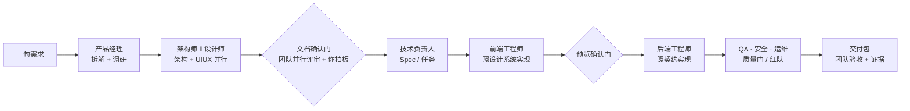
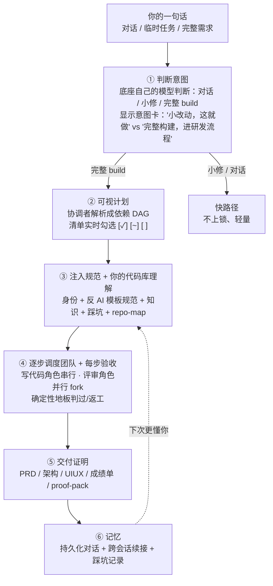
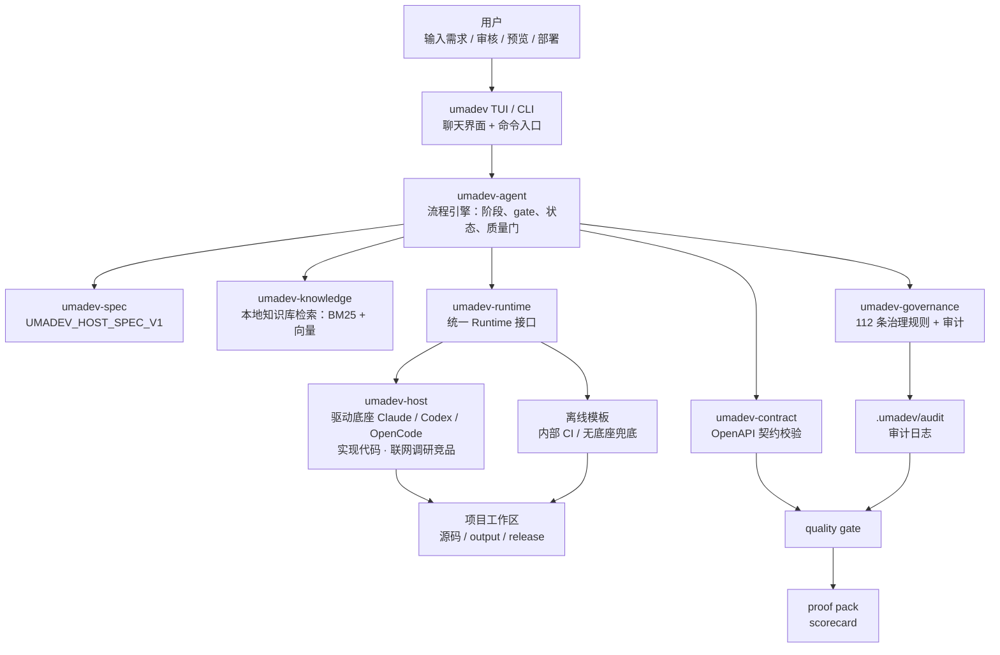
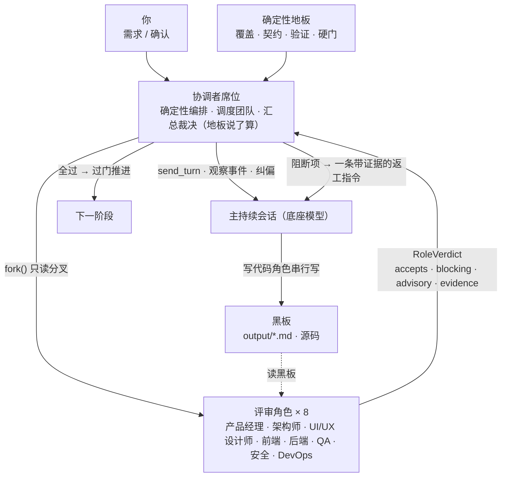
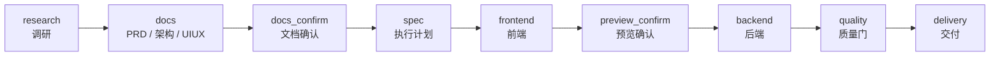
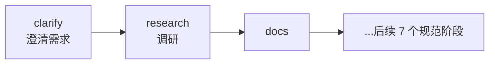
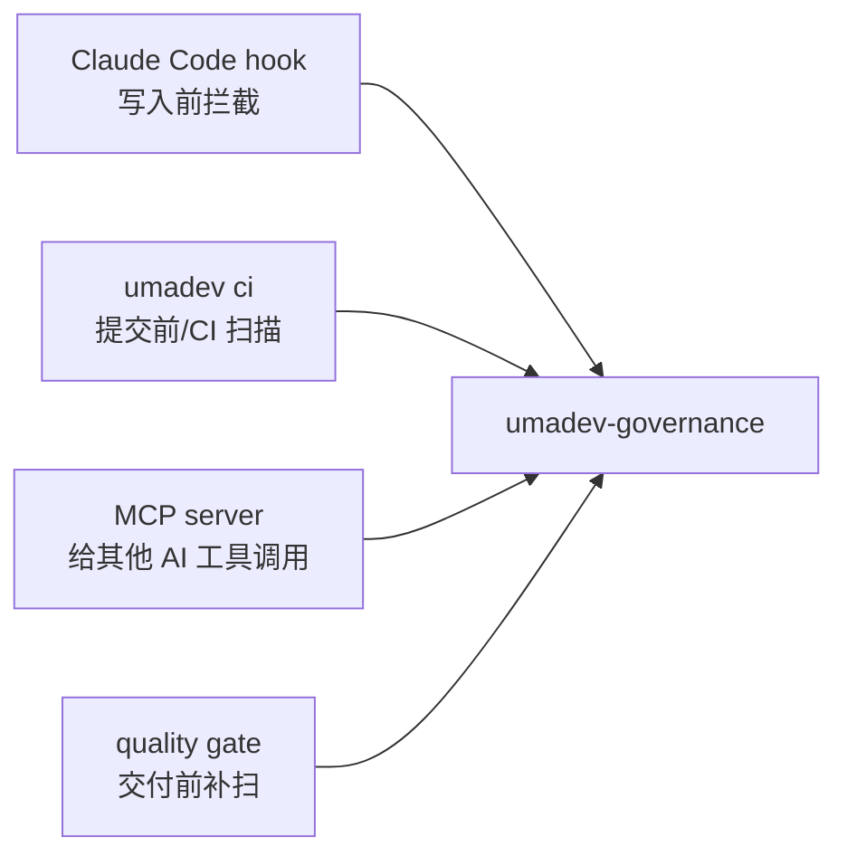
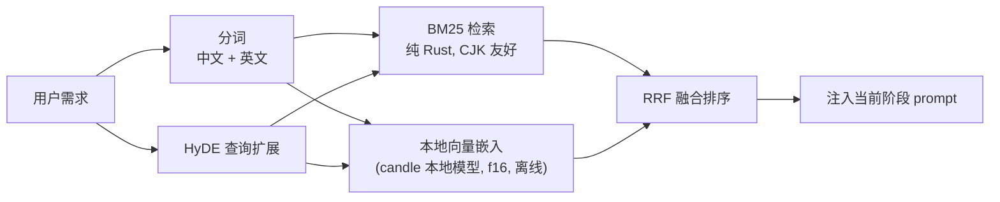

# umadev

<div align="center">


### UmaDev:一个模拟真实开发团队工作的 Agent,指挥你已经在用的 Claude Code / Codex / OpenCode 干活。

**产品经理 · 架构师 · UI/UX 设计师 · 前端 · 后端 · QA · 安全 · DevOps——八个角色像真实团队一样分工协作，把一句需求做成能上线、能交付、能审计的商业级应用。底座是大脑，团队替你交付，一个协调者负责调度与把关。**

[](LICENSE)
[](https://www.rust-lang.org/)
[](spec/UMADEV_HOST_SPEC_V1.md)
[](CHANGELOG.md)

[English](README.md) | 简体中文 | [繁體中文](README.zh-TW.md)

</div>

---

<div align="center">

**官方微信群** — 扫码加入,获取更新 · 反馈问题 · 和其他用户交流


</div>

---

## 目录

- [简介](#简介) · [项目来源](#项目来源) · [它解决什么问题](#它解决什么问题)
- [安装](#安装) · [快速上手](#快速上手) · [一个完整例子](#一个完整例子)
- [umadev 如何工作](#umadev-如何工作) · [团队怎么协作](#团队怎么协作)
- [为什么可信](#为什么可信) · [运行模式](#运行模式) · [流水线设计](#流水线设计) · [质量门是什么](#质量门是什么)
- [治理规则是什么](#治理规则是什么) · [知识库是什么](#知识库是什么) · [交付产物长什么样](#交付产物长什么样)
- [**命令大全**](#命令大全) · [配置](#配置) · [Rust 架构](#rust-架构) · [开发](#开发) · [许可证](#许可证)

## 简介

umadev 是**一个模拟真实开发团队来工作的 Coding Agent**。它驱动你已经在用的 AI 编码工具——Claude Code、Codex、OpenCode——作为一个持续的会话来工作；它自己不接任何模型：你的底座接入的模型，就是它的大脑。

你用自然语言描述你想要什么，**一支 AI 开发团队**替你把它做出来——产品经理拆需求、架构师定契约、设计师出设计系统、前后端真写代码、QA 跑测试、安全审攻击面、DevOps 管交付。八个角色像真实团队一样分工协作，借你已登录的底座大脑，把一句需求做成能上线、能交付、能审计的商业级应用。它按任务大小自动伸缩：小改动就只是小改动，完整项目才召集整支团队。

它是一个 **Rust 单二进制**。npm 只是分发壳。

团队里还有一个**协调者**（技术负责人）：它不写代码，负责路由意图、拆可视计划、调度团队、把关每道门、留下审计证据。思考、调研、设计、写代码、评审这些认知都来自底座；协调者是确定性的工具层，把这支团队拧成一个交付系统。独立开发者或小团队，因此瞬间拥有一支完整、专业、有工程纪律的开发团队。

团队的八个角色各有自己的真实产物：

- **产品经理** — 拆解需求、写 PRD、定范围与验收标准
- **架构师** — 定技术选型、分层分包、数据模型、API 契约
- **UI/UX 设计师** — 定设计系统、令牌、字体、组件状态、页面骨架，盯住"不像 AI 模板"
- **前端工程师** — 按设计系统 + 契约真写前端、跑通运行时
- **后端工程师** — 建数据模型 + API + 业务逻辑，对齐契约
- **QA** — 真跑构建测试、查覆盖、产出运行时证明
- **安全** — 扫攻击面、鉴权 / 越权 / 注入 / 密钥审查
- **DevOps** — 管构建、CI、部署证明、上线
- **协调者（技术负责人）** — 路由意图、拆计划、调度团队、每道门汇总裁决、留证据

写代码的角色串行驱动主会话；评审角色各自在**只读分叉会话里并行**审，把结构化裁决交回协调者。角色之间**不互相聊天**——它们只通过共享的产物文件（黑板）和结构化裁决沟通，避免多 Agent 互聊放大幻觉。协调者**确定性地**汇总：把阻断项折成一条返工指令注入主会话，循环由确定性信号（覆盖 / 契约 / 验证 / 硬门）有界终止，不靠模型自评"够不够好"。

umadev 驱动恰好三个一等底座：Claude Code、Codex、OpenCode。想覆盖更多模型，是把底座路由到第三方或本地模型——那是底座自己的事，umadev 不注入、不覆盖、不持有任何模型端点。

> 持续会话是**默认**：整条流水线复用一个底座会话，上下文全程在线。过去"每阶段单发"的旧模式只作为底座会话起不来时的兜底。底座因此带着全程上下文连续干活、真写代码。

## 项目来源

umadev 脱胎于原项目 [shangyankeji/super-dev](https://github.com/shangyankeji/super-dev)。

早期的 `super-dev` 更像一个 AI 编码治理工具：主要关注"AI 生成代码时不能写什么"，例如不要用 emoji 当图标、不要硬编码颜色、不要写不安全代码。

现在的 umadev 在这之上长成了一支完整的 AI 开发团队：

- **从单点治理扩展到全流程交付**：不只检查代码，而是把从需求到上线的每个阶段都交给对应角色，并加上门禁与验收。
- **从零散脚本升级为规范驱动系统**：核心是 [UMADEV_HOST_SPEC_V1](spec/UMADEV_HOST_SPEC_V1.md)，所有实现都围绕规范（持续会话与团队模型见 §9.3–§9.4）。
- **使用 Rust 重写**：单二进制、跨平台、启动快、依赖少、适合本地长期运行。
- **从"拦截问题"升级为"带队走完交付"**：Claude Code / Codex / OpenCode 是大脑和手，umadev 是加载这颗大脑、组成整支团队、把关交付的那层外壳。

一句话概括这个演进：

> `super-dev` 关注"AI 不要写烂代码"；`umadev` 关注"一支 AI 开发团队如何把需求交付成可上线、可审计的商业产品"。

## 它解决什么问题

很多人第一次用 AI 编码工具时都会遇到类似问题：

- AI 一上来就写代码，没有 PRD、没有架构、没有验收标准。
- 前端做完了，后端接口路径对不上。
- UI 看起来像模板，颜色和字体很随意。
- AI 写了占位代码、假数据、TODO，却说"完成了"。
- 修改一次需求后，上下文开始乱，前面约定被忘掉。
- 代码能生成，但没有质量报告、没有证据链，不知道能不能交付。
- 团队有自己的规范和知识库，但每次都要手动复制给 AI。

umadev 把这些问题交给一支分工明确的团队来系统化解决，每个角色在该出手的节点出手：



## 安装

推荐用 npm 安装预编译二进制：

```bash
npm install -g umadev
```

npm 只是分发壳。真正运行的是 Rust 编译出的 `umadev` 二进制。

安装时还会自动附带一个小型本地嵌入模型（`multilingual-e5-small`，f16，约 224MB，作为可选依赖）并自动接好——它驱动离线向量检索，无需 API key、运行时不联网，**无需手动下载**。若你的镜像源或网络跳过了这个可选下载，umadev 仍可用：检索降级为纯 BM25，重新执行 `npm install -g umadev` 即可恢复向量通道。

支持的平台：

- macOS Apple Silicon
- macOS Intel
- Linux x86_64
- Linux ARM64
- Windows x86_64

也可以从源码构建：

```bash
git clone https://github.com/umacloud/umadev.git
cd umadev
cargo build --release --features vector-local
./target/release/umadev --version
```

> **从源码构建？嵌入模型不在仓库里（太大，约 224MB，git 放不下）。** 普通 `cargo build --release` 出来的是**纯 BM25** 版；本地向量通道需要 `--features vector-local` **加上**磁盘上的模型。预编译二进制和 `npm i` 会自动带齐这两样——源码构建则需手动把 `multilingual-e5-small` 下到 `~/.umadev/embed-model/` 一次：
>
> ```bash
> mkdir -p ~/.umadev/embed-model && cd ~/.umadev/embed-model
> for f in config.json tokenizer.json model.safetensors; do
>   curl -fsSL "https://huggingface.co/intfloat/multilingual-e5-small/resolve/main/$f" -o "$f"
> done
> ```
>
> umadev 会自动发现这个目录（或用 `UMADEV_EMBED_MODEL_DIR` 指向任意放着这三个文件的目录）。没有模型 umadev 仍可用——检索降级为纯 BM25。

你还需要装好并登录一个 AI 编码 CLI——那就是 umadev 驱动的大脑：

| 底座 | 安装 | 登录 |
|---|---|---|
| Claude Code | `npm i -g @anthropic-ai/claude-code` | `claude auth login` |
| Codex | `npm i -g @openai/codex` | `codex login` |
| OpenCode | 见 opencode.ai | `opencode auth login` |

umadev 不往底座里注入任何东西。你的底座配的是什么——官方登录，还是你自己接的第三方 / 本地模型——跑的就是什么。umadev 不保存你的登录信息；它只是把任务作为非交互命令发给底座。

## 快速上手

```bash
umadev                       # 启动对话界面；首次运行会让你选一个底座
```

第一次打开会让你选择：

1. 界面语言。
2. 使用哪个底座：Claude Code、Codex 或 OpenCode（你已经登录的那个）。

然后直接描述你要做什么：

```text
> 给报表页加上 CSV 导出
> 帮我做一个带 Postgres 后端的待办应用
> /goal 做一个能上线的 SaaS 落地页          # 持续干到目标达成
```

也可以非交互地跑一次构建：

```bash
umadev run "给报表页加上 CSV 导出" --backend claude-code
```

umadev 按你的请求自动判断工作量大小——你不用选模式。一次构建跑在独立的 `umadev/<slug>` 分支上：你的工作分支不会被动，umadev 也绝不自动合并或推送。

## 一个完整例子

假设你在一个空项目里运行：

```bash
umadev init
umadev
```

然后输入：

```text
做一个课程预约小程序，用户可以查看课程、选择时间、预约、取消预约，管理员可以管理课程和预约记录。
```

umadev 会做这些事：

1. **理清需求**：补全目标平台、是否需要支付、管理员后台复杂度等合理默认假设（`auto` 模式自动推进、不打断你；`guarded` 模式可逐条确认）。
2. **联网调研**：当底座具备联网能力时，搜索同类小程序、预约系统的竞品功能、定价、设计趋势和真实用户评价；同时检索内置知识库里的预约系统、后台 CRUD、权限、表单校验等规范。两者合并产出调研报告 `output/<slug>-research.md`。
3. 生成 PRD，明确用户角色、功能范围、EARS 可测验收标准。
4. 生成架构文档，定义数据模型、API、鉴权、部署方式。
5. 生成 UI/UX 文档，定义设计方向、颜色 token、字体、组件状态、图标库。
6. 拆成执行计划和任务（每个任务回链到需求 FR 编号）。
7. 驱动底座实现前端，渲染真实 markdown 和逐文件 diff 卡。
8. 暂停让你预览。
9. 驱动底座实现后端和集成。
10. 跑质量门：文档、契约、构建、设计、安全、交付文件全部检查。
11. 生成交付包和成绩单。

整个过程会在磁盘上留下真实文件。在聊天界面里输入需求，和用 `/run` 显式发起构建，走的是同一套系统。

## umadev 如何工作

当你说出一句需求，umadev 像一支训练有素的团队（由协调者统筹）那样先想清楚、把计划摆给你看、带上团队规范和对你代码库的理解去干、逐步调度团队并每步验收、最后留下交付证明。一次输入会流经这几层（每一步向底座的咨询都 fail-open——失败就退回确定性兜底，绝不卡死）：



**① 判断意图（router）。** 每条非斜杠输入都先由底座自己的模型判断：一个问题留在对话；"改个文案"走快路径直接做；"做一个订阅后台"升级成完整 build。判断结果**会显示给你**（意图卡），你可以用 `/run` 强制完整流程、`/quick` 强制快路径来覆盖。底座连不上时退回最轻量路径，绝不做关键词猜测。

**② 可视计划（plan）。** 一个完整 build 开工前，协调者把目标拆成一份**它自己解析并持有**的依赖 DAG（落 `.umadev/plan.json`），在界面上渲染成一张**实时勾选的清单**（`[✓] 脚手架 · [~] 登录路由 · [ ] 登录表单  3/8`）。`/plan skip|add|veto|up|down <id>` 让你重排 / 跳过 / 否决 / 新增某一步，折回下一条指令同会话生效。

**③ 注入规范 + 你的代码库理解（compose_firmware + repo-map）。** 每条干活路径开跑前，umadev 给底座注入一段精选、有 token 预算的系统提示：团队**身份** + 工程**规范 / 反 AI 模板**品味 + 按需检索的**知识**摘要 + 按技术栈指纹召回的**踩坑**教训 + 你现有代码的 **repo-map 切片**（符号轮廓，按路由命中的文件排序）。知识库（459 份 markdown 文件）已编译进二进制，启动时自动解压到 `~/.umadev/knowledge`，首次回复不需要额外的冷启动时间。底座带着这些规范和对你代码库的理解开始干活。

**④ 逐步调度团队 + 每步验收（director_loop）。** 协调者沿 DAG 一步步驱动：每个就绪的 build 步在主会话上串行执行，并对照它自己的验收标准在**确定性地板**（源码在不在 / 构建测试 / 契约 / 评审）上验证——过则勾掉清单，不过则有界返工。评审步分叉出团队并行交叉审。运行有 30 分钟墙钟预算上限；gap-count 和 stall-count 确保循环有界收敛。

**⑤ 交付证明（finalize）。** 质检通过后，`finalize` 产出 PRD / 架构 / UIUX 文档、成绩单 HTML 和打包的 proof-pack（按深度裁剪——一个小页面不会硬塞一摞企业文档）。

**⑥ 记忆（持久化对话 + 跨会话）。** umadev 每轮把自己的有界对话发给底座，并把对话**持久化**到 `.umadev/chat/<id>.json`；重开 umadev 对话还在，未完成的计划会问你"继续目标 X（第 N/M 步）？"。踩坑沉淀进自学习库，下次注入到规范里**预防**同类错误。

> 这些都是**已实现**的真实行为（见 `crates/umadev-agent` 的 `router.rs` / `plan_state.rs` / `context.rs` / `director_loop.rs` 与 `crates/umadev-knowledge/src/repomap.rs`），不是路线图承诺。权威产品态见 [`docs/PRODUCT_VISION_AND_ROADMAP.md`](docs/PRODUCT_VISION_AND_ROADMAP.md)。

整体架构可以理解成四层：



简单说：

- **TUI/CLI**：你和团队对话的地方。一个问题、一次"审下这段代码"、一个完整需求，都进同一个会话，由底座的模型判断是对话、临时任务还是开工跑完整流程。
- **协调者引擎（umadev-agent）**：路由意图、拆出可视计划、注入规范、调度哪些角色、逐步驱动并每步验收、汇总裁决推进或返工、最后 finalize 交付。完整商业级交付时会展开成 9 阶段主链（见下文"流水线设计"）。
- **持续会话 / 底座**：整条流水线复用你登录的底座（Claude Code / Codex / OpenCode）的一个会话——底座用它自己的登录和模型连续干活（调研、设计、真写代码、评审）；umadev 不注入、不覆盖任何模型或 key。
- **治理 / 质量**：底座每写一个文件就实时拦截不合规内容；交付前再跑一遍质量门补扫。
- **知识库（全本地双通道 RAG）**：459 个精选知识文件 + 你现有代码的地图编进二进制，每个工作回合由双通道混合引擎检索——纯 Rust BM25 + 本地向量模型（multilingual-e5-small, f16, candle）RRF 融合 + HyDE；无 key、无网络、零配置，把工程标准、设计系统、领域知识注入给当前阶段的角色。
- **证据**：把每次工具调用、每份裁决、每道门记录下来，最后打包成交付证明。

## 团队怎么协作

umadev 是**一支八角色的开发团队**，外加一个协调者统筹全程——不是单趟检查。每个角色都有自己的真实产物落到黑板上：

| 角色 | 它产出什么（黑板上的产物） |
|---|---|
| 产品经理 | 拆需求、用户故事、EARS 验收标准 — `*-prd.md` |
| 架构师 | 分层、数据模型、API 契约 — `*-architecture.md` + `openapi.*` |
| UI/UX 设计师 | 设计系统：令牌、字体、组件状态、页面骨架 — `*-uiux.md` |
| 前端工程师 | 导入令牌、调契约 URL 的组件 / 页面 |
| 后端工程师 | 数据模型、端点、对齐契约的业务逻辑 |
| QA | 真跑测试 + 运行时探测 — `runtime-proof.json` |
| 安全 | 威胁模型 + SAST：鉴权 / 越权 / 注入 / 密钥 |
| DevOps | 构建、CI、部署证明 — `deploy-proof.json` |
| 协调者（技术负责人） | 路由意图、持有计划、调度团队、把关每道门、留审计证据 |

协作机制：一个**确定性协调者**主导全程；写代码的角色串行写，评审角色并行只读审；沟通只走"共享文件黑板 + 结构化裁决"。



四条铁律保证这套团队既有力又稳定：

- **单写者**：任一时刻只有主会话在写黑板；评审分叉只读，绝不并行写，并行安全。
- **确定性控环**：循环继续还是终止，由确定性信号（gap-count、退出码、硬门）决定。底座和评审角色都是 advisory，永不驱动循环终止——避免模型"自我感觉良好"放行。
- **fail-open**：评审角色够不到底座时，空裁决等于通过，绝不阻塞；协调者退回确定性地板决策。一个评审的 bug 永远不会卡住底座。
- **有界返工**：阻断项折成带上下文的返工指令注入主会话，带上下文修，再复审；gap-count 和 stall-count 确定性收敛（默认最多几轮、无进展即停），残留进自学习库下次规避。

团队规模随任务复杂度缩放：bugfix / 小重构不组队，确定性地板独立把关；完整需求才上全套八个角色加协调者。简单需求因此能走轻量路径——跳过调研和三文档、保留 Spec 与硬门，几分钟出代码。

## 大概要多久 · 命令怎么发现

**时间预期**（实际取决于你底座的模型、思考强度和需求复杂度——umadev 不持有模型，速度主要由底座决定，这里只给量级）：

| 你说的 | 路由判成 | 大致量级 |
|---|---|---|
| 一个问题 / "这怎么用" | 对话 | 秒级，不进流程 |
| "改个文案" / "重命名这个函数" | 快路径小修 | 一两分钟，单步直接做 |
| "审下这段代码会不会出 bug" / "帮我看这个报错" | 临时任务（带 repo-map / git 锚定） | 几分钟 |
| "给用户模型加个字段" / "修结账的 bug" | bugfix / 小改（不组队） | 几分钟，硬门把关 |
| "做一个订阅管理后台" | 完整 build（展开 9 阶段、全套团队） | 按需求规模从十几分钟到更长；中途在确认门停下等你 |

> 看得见进度：完整 build 全程有**实时勾选的计划清单**和**团队评审面板**，不会"卡在 0/9 不动"；超过几秒无输出时状态栏会染红，绝不让你对着静默猜它是否卡住。`auto` 模式全自动推进，`guarded`（默认）在每道确认门停下等你拍板。

**命令可发现性**：

- TUI 里输入 `/` 弹出**命令补全浮层**，`Tab` 补全、`↑↓` 切换、回车执行。
- `/help`（或 F1）列出**全部命令和快捷键**。
- 不确定下一步时，意图卡和计划清单本身会提示可用动作（`[c] 继续 · /revise 重做 · /plan 调整`）。
- `umadev guide` 是 60 秒上手教程，`umadev examples` 是命令速查表。

## 为什么可信

umadev 的可信来自把"模型说了什么"和"硬信号是什么"严格分开：

- **fail-open 治理**：底座每写一个文件，都实时拦截 emoji 当图标、硬编码颜色、AI 模板痕迹、无障碍缺失、前后端契约不符等。治理函数**永远 fail-open**——治理自身出 bug 时放行而非阻断，绝不让一个治理缺陷卡死底座。
- **确定性控环**：底座和评审角色都是 advisory。真正决定"过门 / 返工 / 硬停"的是确定性信号：FR→任务覆盖、前后端契约对照、真跑 verify 的退出码、质量门阈值，以及**零代码硬门**（计划要产出代码却没有真实源码 = 判失败，绝不把空骨架伪装成"完成"）。
- **不持有模型端点**：umadev 用你已登录的底座，不自带模型、不接第三方 API、不存你的 key。底座用谁的模型、什么思考强度，umadev 只读出来显示、绝不覆盖。
- **审计证据**：每次工具调用、每份角色裁决、每道门的状态都落盘（`.umadev/audit/*`、`team-ledger.jsonl`）；交付时打包成 proof-pack + 成绩单 + 合规映射（SOC 2 / ISO 27001 / EU AI Act），可直接发给团队、客户或审计方。
- **自进化记忆 + 记住项目事实**：构建中底座踩的坑带频率信号记到本地存储 → 真复发触发更高层的 reflection（纠正策略）→ 召回进后续提示，同样的坑不再犯；底座发现的稳定事实（JDK 路径、真实的构建 / 测试 / lint 命令、环境约束）写进 `.umadev/memory/facts.jsonl` 每轮回灌，转录被裁也不丢，用得越久越懂你的代码库。
- **App 运行时模型你说了算**：借来写代码的底座 ≠ 你做出来的 AI 应用运行时调的模型——umadev 把应用的运行时 provider / model id / key 当作用户可配的 env，绝不把开发底座的厂商悄悄写死进产物。
- **转达底座的追问**：底座构建中用 `AskUserQuestion` 提问时，umadev 把问题和编号选项内联渲染、把你的回答转回同一会话——而不是让追问静默自动取消。
- **三语**：zh-CN / zh-TW / en 全程覆盖用户可见文案，按系统语言检测、可随时切换。

## 运行模式

### 模式 A：驱动本机 AI 编码 CLI（默认走持续会话）

这是产品模式。整条流水线复用底座的**一个持续会话**，上下文全程在线；底座连续用工具干活。

| Backend ID | 实际程序 | umadev 怎么驱动 | 适合谁 |
|---|---|---|---|
| `claude-code` | `claude` | 持续会话（stream-json 双向流），跨阶段 `--resume` 续接 | 已经在用 Claude Code 的用户 |
| `codex` | `codex` | 持续会话（`codex app-server`，同一 thread 续接） | 已经在用 Codex CLI 的用户 |
| `opencode` | `opencode` | 持续会话（`opencode serve`，同一 session 续接） | 已经在用 OpenCode 的用户 |

特点：

- umadev 不需要你的模型 API key。
- 继续使用你原来 CLI 的账号、订阅和配置。
- 底座负责真实读写文件和运行命令。
- umadev 负责团队调度、流程、规则、质量门和证据链。

> 单发兜底：底座的持续会话起不来时，自动回退到旧的"每阶段单发"路径（`claude --print` / `codex exec` / `opencode run`），保证不卡死；离线模式与显式 `UMADEV_CONTINUOUS=0` 也走单发。

### 底座自带模型 — umadev 不接外部 API

umadev 不自带模型，也不接第三方 API。底座用它自己的模型——你订阅登录的，或你给底座自己配的第三方 / 本地模型。选底座时 umadev 会读出并显示它当前用的模型和思考强度（`/status` 也能看），但**绝不覆盖**：运行时默认不传 `--model`，底座用它自己的；想换就改底座自己的配置，或在 `~/.umadev/config.toml` 里填 `model` / 用 `umadev run --model <id>` 覆盖。TUI 里的 `/model` 命令不改任何东西——它只告诉你模型在哪（底座持有），因为 umadev 从不强加模型。

umadev 读取的来源：claude 的 `~/.claude/settings.json`（`model` / `effortLevel`）、codex 的 `~/.codex/config.toml`（`model` / `model_reasoning_effort`）、opencode 的 `opencode.json`（`model`，思考强度内置在模型变体里）。

### 模式 B：离线模板（内部兜底，不是产品）

```text
/offline
```

离线模式不会调用任何模型，也不会访问网络。它**不是一个让你选的产品形态**——产品永远是"驱动你登录的底座"。离线模板只是没有底座可用时的确定性兜底，适合：

- 快速看文件结构。
- CI smoke test。
- 演示 umadev 的流程。

离线产物只是模板（带 TODO 占位），不代表模型完成了真实开发；真实交付必须走底座。第一次启动的底座选择器只列三个底座，不会把离线当成一个选项。

## 流水线设计

**9 阶段主链是协调者为"完整商业级 greenfield 交付"展开的最完整交付路径。** 底座的模型先判断意图（上文"umadev 如何工作"①）：对话不进流程、小修走快路径、bugfix 不组队；只有一个完整产品需求，协调者才把计划展开成下面这条主链。规范里这条链就是 `standard` profile 的全程（见 [spec §4.1 / §9.5](spec/UMADEV_HOST_SPEC_V1.md)），是**怎么交付一个完整产品**的契约。

规范主链是 9 个阶段：



当前产品实现还在主链前增加了一个 `clarify` 微阶段：



所以你可能先看到 umadev 生成：

```text
output/<slug>-clarify.md
```

你可以回答澄清问题，也可以输入 `c` 跳过。

> 小任务有轻量路径：9 阶段是面向"完整商业级交付"的主链，不是每个需求都得全程走完。底座的模型先判意图，协调者据此裁剪或展开计划——对话不进流程、bugfix 不组队、小改动不会强行拉你走 PRD / 架构 / UIUX 全套；想强制走快路径用 `/quick`。

### 每个阶段由谁主导、产出什么

| 阶段 | 主导角色 | 你能理解成 | 主要文件 |
|---|---|---|---|
| `clarify` | 产品经理 | 先把需求问清楚 | `output/<slug>-clarify.md`、`output/<slug>-clarify-answers.md` |
| `research` | 产品经理 | 联网调研竞品、领域、风险、设计趋势 | `output/<slug>-research.md` |
| `docs` | 产品经理 · 架构师 · 设计师 | 写三份核心文档（架构和 UIUX 可并行） | `output/<slug>-prd.md`、`output/<slug>-architecture.md`、`output/<slug>-uiux.md` |
| `docs_confirm` | 团队并行评审 + 你 | 产品经理、架构师、设计师各自只读审，连同你一起确认方向 | `.umadev/workflow-state.json`、`.umadev/team-ledger.jsonl` |
| `spec` | 技术负责人 | 拆任务和执行计划（每任务回链 FR 编号） | `output/<slug>-execution-plan.md`、`.umadev/changes/<id>/tasks.md` |
| `frontend` | 前端工程师 | 照设计系统 / 令牌实现前端 | `output/<slug>-frontend-notes.md` |
| `preview_confirm` | 设计师 + 前端 critic + 你 | 看前端效果、审实现质量 | TUI gate 状态、`.umadev/team-ledger.jsonl` |
| `backend` | 后端工程师 | 照契约实现后端和集成 | `output/<slug>-backend-notes.md` |
| `quality` | QA · 安全 · 后端 · DevOps | 真跑构建测试 + 红队 + 契约 / 覆盖 / 治理扫描 + 硬门 | `output/<slug>-quality-gate.json`、`output/<slug>-quality-gate.md` |
| `delivery` | DevOps / 协调者验收 | 对照计划验收、打包交付 | `output/<slug>-delivery-notes.md`、`release/proof-pack-*.zip`、`release/scorecard-*.html` |

## 质量门是什么

质量门可以理解成 umadev 的"交付前验收"。

它逐项检查内容：

- PRD 有没有目标、范围、验收标准。
- 架构文档有没有 API、数据模型、错误处理、鉴权。
- UI/UX 文档有没有设计 token、字体、图标库、组件状态、暗黑模式。
- 前端调用的 API 和后端契约是否一致。
- 是否存在 emoji 图标、硬编码颜色、AI 模板痕迹。
- 是否有构建、测试、lint、typecheck 结果。
- 是否生成 Dockerfile、CI、migration、`.env.example`。
- 是否泄露 API key、密码、连接串。
- 是否有审计日志和合规映射。

输出文件：

```text
output/<slug>-quality-gate.json
output/<slug>-quality-gate.md
```

默认通过线是 90 分，可以在 `.umadevrc` 调整：

```toml
[quality]
threshold = 90
skip_checks = []
```

## 治理规则是什么

umadev 最早来自治理工具，这部分仍然是核心能力。

这些规则是一条**治理基线**，不是绝对真理——每条都可以在 `.umadev/rules.toml` 里禁用、按路径排除或调参（见下文）。它们的作用是给底座的产出兜底，而不是替你做最终的工程判断。

规范层有 32 条 clause，实现层目前有 112 条规则，覆盖：

- UI 质量：不用 emoji 当图标，不写硬编码颜色，不产出模板感 UI。
- 安全：不写密钥，不写危险命令，不写 SQL 注入、SSRF、XXE 等危险代码。
- 前端质量：不用随意 `any`、裸 `fetch`、缺少 a11y、缺少 ErrorBoundary 等。
- 后端质量：鉴权、限流、日志、事务、输入校验、错误处理。
- 多语言危险模式：Rust `unwrap`、Go `panic`、Python `bare except`、Java `System.exit` 等。

治理入口有四个：



项目可以通过 `.umadev/rules.toml` 调整：

```toml
[disabled]
clauses = []

[exclusions]
paths = ["src/legacy/**", "**/*.test.ts"]

[extra]
blocked_domains = ["internal-bad-proxy.corp"]
```

## 知识库是什么

umadev 内置了 459 份 markdown 知识文件，是一套给底座看的商业级工程标准库。这些文件已编译进二进制，首次运行时自动解压到 `~/.umadev/knowledge`，随后每次注入不再有额外的冷启动时间。

它覆盖：

- 产品和 PRD。
- 架构和 API。
- 前端、后端、数据库。
- 安全、测试、CI/CD、运维。
- 移动端、桌面、小程序、鸿蒙、跨平台。
- 电商、金融科技、医疗、教育、游戏等行业。
- UI/UX、设计系统、设计反模式。
- 产品经理、架构师、前端负责人、后端负责人、QA、DevOps 等专家方法论。

检索方式：



**双通道本地混合检索。** BM25（纯 Rust，CJK 友好）+ 稠密向量两通道经 RRF 融合，HyDE 先扩展召回再检索。向量通道用 multilingual-e5-small（f16）经 candle **本地运行** — 随安装内置，无需 API key、无网络，毫秒级召回你自己的项目规范与业务文档；模型缺失时自动降级为纯 BM25（fail-open）。它不需要、也不使用任何云端嵌入服务。

**自我进化记忆。** 构建中底座踩的坑会带频率信号记到本地存储；真正复发时 umadev 让底座给出更高层的纠正策略（reflection）；两者都会召回进后续提示，同样的坑不再重复 — 用得越久，在你的代码库上越少犯同样的错。

你也可以添加自己的团队知识：

```bash
umadev knowledge-manage add ./team-docs --name team-docs
umadev knowledge-manage search "支付 webhook 幂等"
```

## 交付产物长什么样

一次完整运行后，目录大致是：

```text
your-project/
  output/
    app-clarify.md
    app-research.md
    app-prd.md
    app-architecture.md
    app-uiux.md
    app-execution-plan.md
    app-frontend-notes.md
    app-backend-notes.md
    app-quality-gate.json
    app-quality-gate.md
    app-compliance-mapping.json
    app-delivery-notes.md

  .umadev/
    workflow-state.json
    plan.json
    audit/
      tool-calls.jsonl
      frontend-api-calls.jsonl
      verify.jsonl
    changes/
    decisions/
    history/
    chat/

  release/
    proof-pack-app-20260620090000.zip
    proof-pack-app-20260620090000.manifest.txt
    scorecard-app-20260620090000.html
```

其中：

- `output/` 是项目过程文档。
- `.umadev/` 是状态、计划和审计记录。
- `release/` 是最终交付包。

## 命令大全

umadev 有两套入口，一一对应：

- **TUI 斜杠命令** — 在 `umadev` 聊天界面里输入 `/`，日常推荐。
- **终端 CLI 子命令** — 脚本 / CI 用，无需进 TUI。

> 提示：TUI 里输入 `/` 会弹出命令补全浮层，`Tab` 补全、`↑↓` 切换；`/help`（或 F1）列出全部命令和快捷键。

### TUI 斜杠命令

**选择底座与模型**

| 命令 | 作用 |
|---|---|
| `/claude` · `/codex` · `/opencode` | 切换驱动的本机底座 CLI（存入 `~/.umadev/config.toml`）；切换时显示该底座当前的模型与思考强度 |
| `/offline` | 切到离线确定性模板（演示 / CI，完全不联网） |
| `/status` | 当前底座、它的**驱动模型**和**思考强度**（读自底座自己的配置，umadev 不覆盖） |
| `/model [id]` | 只告诉你模型在哪——底座持有，umadev 不强加（要覆盖就改 config 的 `model` 或用 `run --model`） |
| `/sandbox [档位]` | 查看 / 切换 Codex 底座的启动沙箱（`read-only` · `workspace-write` · `danger-full-access`） |

**驱动流程与过门**

| 命令 | 作用 |
|---|---|
| 直接打字 | 底座的模型判断：对话 / 小修 / 完整 build；若有确认门打开，则作为修改意见 |
| `/run [slug] <需求>` | 显式开始一次完整构建 |
| `/goal <目标>` | 让底座持续干到目标达成（三个底座都支持；`UMADEV_NO_GOAL_MODE=1` 退出） |
| `/quick <需求>` | 强制走快路径（轻量单点改动，不展开计划） |
| `/plan [skip\|add\|veto\|up\|down <id>]` | 查看 / 步级调度当前可视计划；无参折叠面板 |
| `/continue`（门上也可直接输 `c`） | 通过当前确认门、进入下一阶段 |
| `/revise <反馈>` | 停在当前门，带反馈重做本阶段 |
| `/redo [阶段]` | 重跑某个阶段块 |
| `/mode <plan\|guarded\|auto>` | 设置信任 / 自主档位 |
| `/manual` · `/auto` | 切换"逐门人工确认 / 全自动"（默认 `guarded`；`shift+Tab` 也可切换） |
| `/cancel` · `/abort` | 中止当前运行（磁盘工作流状态保留，下次可续跑） |
| `/tasks [stop\|resume]` | 列出 / 管理后台运行 |
| `/adopt` | 接管现有（棕地）仓库：识别技术栈、索引源码、反推契约 |
| `/init` | 写入 `umadev.yaml` manifest |
| `/diff [产物]` | 查看某个产物（默认 `prd`，也可 `architecture` / `uiux` / …） |

**预览与交付**

| 命令 | 作用 |
|---|---|
| `/preview` | 启动前端 dev server 并打开浏览器 |
| `/stop-preview` | 停止预览服务 |
| `/deploy` | 识别目标并**预览**部署命令（真正部署用 `umadev deploy --run`） |
| `/pr [create]` | 干跑 PR（评审报告 + proof-pack 作为正文）；`/pr create` 真正开 PR |
| `/export` | 导出当前会话 |

**检查点与回滚**（影子 git，不碰你自己的 `.git`）

| 命令 | 作用 |
|---|---|
| `/checkpoint [标签]` | 给当前工作区文件打快照 |
| `/rewind [id]` | 列出 / 回滚到某个文件检查点 |

**查看产物与状态**

| 命令 | 作用 |
|---|---|
| `/spec` | 查看完整 `UMADEV_HOST_SPEC_V1` 规范 |
| `/verify` | 工作区合规报告 + 证据链 |
| `/doctor` | 自检（二进制 / manifest / 探针） |
| `/status` | 当前阶段 / 门 / 运行状态 |
| `/team` · `/constitution` | 实时团队花名册 · 团队运行章程 |
| `/lessons` · `/pitfalls` | 本项目学到的（验证过的模式 · 复发踩坑） |
| `/knowledge` | 本次命中的知识库条目 |
| `/usage` | token / 用量统计 |
| `/history` · `/runs` | 过去的门快照 · 过去的运行 |
| `/sessions` · `/resume <id>` · `/compact` | 列出 · 续接 · 压缩持久化对话 |
| `/skill` · `/mcp` | 已安装的 Skill / MCP server |
| `/config` | 当前生效配置 |
| `/version` · `/changelog` | 构建版本 · 更新日志 |

**设计与项目**

| 命令 | 作用 |
|---|---|
| `/design <方向>` | 锁定设计系统方向（`modern-minimal` / `editorial-clean` / …） |
| `/template <名字>` | 选脚手架模板 |

**通用与界面**

| 命令 | 作用 |
|---|---|
| `/help`（或 F1） | 帮助浮层（含全部快捷键） |
| `/lang [zh-CN\|zh-TW\|en]` | 切换界面语言 |
| `/setup` | 重新走首启底座选择器 |
| `/logs` | 切换底座实时进程输出的可见性（默认关） |
| `/mouse` · `/animations` · `/redraw` | 切换鼠标捕获 · 动画 · 强制重绘 |
| `/bug` | 打开预填的 bug 反馈 |
| `/clear` | 清空聊天 |
| `/quit`（或 Esc） | 退出（工作流状态已保存，可续跑） |

### 终端 CLI 子命令

**工作区生命周期**

| 命令 | 作用 |
|---|---|
| `umadev init` | 脚手架工作区（写 `umadev.yaml` + 设计系统 / 模板 / 知识库种子） |
| `umadev adopt [path]` | 接管现有仓库：识别技术栈、索引源码、反推 API 契约 |
| `umadev`（无子命令） | 启动聊天 TUI |
| `umadev doctor` | 自检 |
| `umadev verify` | 工作区合规 + 证据链状态（`--runtime` 启动应用并探测路由） |
| `umadev report` | 合规映射（SOC 2 / ISO 27001 / EU AI Act）；`--review` 生成 PR 级评审报告 + 跑 pre-PR 安全扫描 |
| `umadev usage` | 按运行 / 阶段的 token 用量 + 粗略成本估算 |
| `umadev lessons` | 本项目学到的：高频踩坑 + 验证过的模式 |
| `umadev history` | 列出回滚快照 |
| `umadev rollback latest` | 回滚到某快照 |
| `umadev update` | 升级 umadev 到最新版（经 npm） |
| `umadev uninstall` | 完整卸载：确认后删 `~/.umadev` + 本项目治理钩子 + 二进制（加 `--base <claude-code\|pre-commit>` 则仅卸钩子） |

**非交互运行（脚本 / CI）**

| 命令 | 作用 |
|---|---|
| `umadev run "<需求>" --backend <id>` | 跑一次构建，停在 `docs_confirm` 门（`--mode plan\|guarded\|auto` 设信任档） |
| `umadev quick "<任务>" --backend <id>` | 轻量快路径（跳过重阶段与门） |
| `umadev continue [--backend <id>]` | 通过当前门（自动复用上次的 `--backend`） |
| `umadev revise "<反馈>"` | 停在门，记录修改并重跑本块 |
| `umadev redo <阶段> [--backend <id>]` | 复用上次上下文重跑某一阶段 |
| `umadev spec [--clauses]` | 打印规范（`--clauses` 看条款表） |

**交付与 PR**

| 命令 | 作用 |
|---|---|
| `umadev deploy [--run]` | 识别部署目标并打印命令；`--run` 真正部署并写 `deploy-proof.json` |
| `umadev pr [--create]` | 干跑 PR（评审报告 + proof-pack 正文）；`--create` 在功能分支提交、推送、开 PR |

**治理 / CI**

| 命令 | 作用 |
|---|---|
| `umadev ci [--changed-only] [--report-only]` | 对工作区每个源文件跑治理（CI 模式） |
| `umadev install --base <claude-code\|pre-commit\|…>` | 把 pre-write 治理钩子装到底座 CLI 或 git pre-commit |

**平台扩展**

| 命令 | 作用 |
|---|---|
| `umadev mcp serve` | 作为 MCP server 运行——把 `govern_file` / `govern_command` 暴露给 Claude Desktop / Cursor / Continue 等 |
| `umadev mcp-manage <install\|list\|remove>` | 管理底座的 MCP server |
| `umadev skill <install\|list\|remove>` | 管理 Skill（知识 + 规则 + 提示词包） |
| `umadev knowledge-manage <add\|list\|search\|remove>` | 管理自定义知识库文档 |

**帮助**

| 命令 | 作用 |
|---|---|
| `umadev examples` | 命令速查表 |
| `umadev guide` | 60 秒上手教程 |

### 常用环境变量

| 变量 | 作用 | 默认 |
|---|---|---|
| `UMADEV_CLAUDE_BIN` / `UMADEV_CODEX_BIN` | `claude` / `codex` 二进制路径 | `claude` / `codex` |
| `UMADEV_WORKER_TIMEOUT` | 单次 worker 超时（秒） | `300` |
| `UMADEV_VERIFY_TIMEOUT_SECS` | verify 循环单次超时（秒） | `120` |
| `UMADEV_MODEL_PLAN` / `UMADEV_MODEL_BUILD` | 分阶段模型分层覆盖（规划阶段 / 写码阶段） | — |
| `UMADEV_NO_GOAL_MODE` | 置 `1` 关闭 `/goal` 模式 | — |
| `UMADEV_SHOW_PROCESS_LOGS` | 预置底座实时进程日志可见性（也可在 App 内用 `/logs` 切换） | 关 |
| `UMADEV_CONTINUOUS` | 置 `0`（或 `UMADEV_LEGACY_RUN=1`）退出持续单会话路径 | 开 |
| `OPENAI_EMBED_KEY` | 启用远程向量嵌入（否则用内置离线模型 + BM25） | — |
| `XDG_CONFIG_HOME` | `config.toml` 的基目录 | `$HOME` |

## 配置

### 用户级配置

默认路径：

```text
~/.umadev/config.toml
```

示例：

```toml
backend = "claude-code"
lang = "zh-CN"
# model 默认留空 — 底座用它自己配置的模型；只有想覆盖时才填（或用 `umadev run --model <id>`）
# model = "opus"
```

### 项目级配置

默认路径：

```text
.umadevrc
```

示例：

```toml
[quality]
threshold = 90
skip_checks = []

[pipeline]
skip_phases = []
max_review_rounds = 3
auto_approve_gates = true

[knowledge]
enabled = true
engine = "hybrid"
top_k = 6
```

## Rust 架构

umadev 是一个 10 crate Rust workspace。

| Crate | 普通话理解 | 技术职责 |
|---|---|---|
| `umadev` | 主程序 | CLI、TUI 入口、doctor、hook、CI、MCP / Skill / Knowledge 管理 |
| `umadev-spec` | 规则说明书 | `UMADEV_HOST_SPEC_V1` 的 Rust 数据（32 条 clause） |
| `umadev-governance` | 质检和红线 | 112 条治理规则、审计、策略、合规映射 |
| `umadev-agent` | 协调者引擎 | 意图路由（`router`）、可视计划 DAG（`plan_state`）、规范注入（`context::compose_firmware`）、团队调度（`director::summon` + `director_loop`）、finalize 交付、gate、质量门、8 个评审角色、验收 / 有界返工、信任分级、自学习记忆；9 阶段主链是最完整的交付路径 |
| `umadev-runtime` | 统一大脑接口 | Runtime trait + 持续会话 `BaseSession` trait、Offline、能力契约 |
| `umadev-host` | 驱动外部 CLI | Claude Code / Codex / OpenCode：持续会话驱动（`*_session.rs`）+ 单发兜底 |
| `umadev-contract` | API 对账员 | OpenAPI 契约、前后端路径校验 |
| `umadev-knowledge` | 知识检索 | 纯 Rust BM25 + CJK-bigram 分词、chunk、**本地向量通道**（multilingual-e5-small, f16, candle，内置离线；远程 `OPENAI_EMBED_KEY` 仅为可选覆盖）、HyDE 查询扩展、RRF 融合；459 份文件编译进二进制 |
| `umadev-tui` | 终端界面 | ratatui 聊天 UI：真实 markdown 渲染、逐词 diff 卡、折叠工具行、构建完成卡（带可点击预览地址） |
| `umadev-i18n` | 多语言 | 简体中文、繁體中文、English |

目录结构：

```text
crates/               Rust workspace
spec/                 UMADEV_HOST_SPEC_V1 规范
knowledge/            内置知识库
docs/                 架构、产品、商业化和设计文档
docs/assets/          图片和 Mermaid 图
npm/                  npm 分发包
tests/spec_vectors/   规范测试向量
```

## 开发

要求：

- Rust 1.87+
- Cargo
- 如果要测试 npm 分发，需要 Node.js 18+

常用命令：

```bash
cargo build --workspace
cargo test --workspace
cargo clippy --workspace --all-targets -- -D warnings
cargo fmt --all
```

推荐阅读顺序：

1. [spec/UMADEV_HOST_SPEC_V1.md](spec/UMADEV_HOST_SPEC_V1.md)
2. [crates/umadev-spec/src/lib.rs](crates/umadev-spec/src/lib.rs)
3. [crates/umadev-agent/src/runner.rs](crates/umadev-agent/src/runner.rs)
4. [crates/umadev-governance/src/rules.rs](crates/umadev-governance/src/rules.rs)
5. [crates/umadev/src/main.rs](crates/umadev/src/main.rs)

## 许可证

MIT，见 [LICENSE](LICENSE)。
