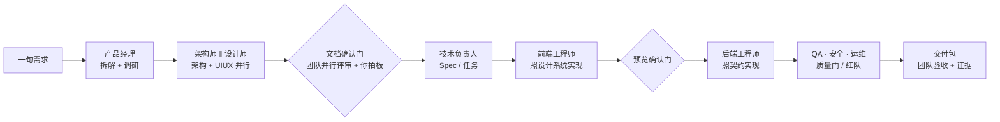
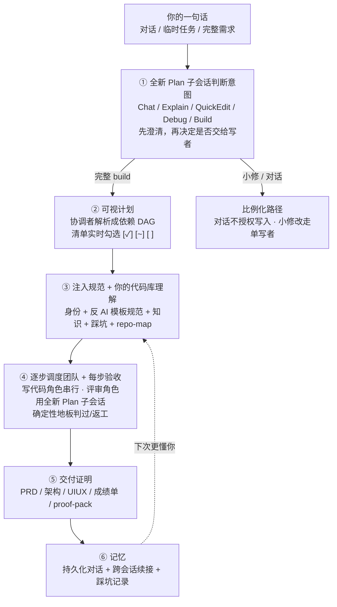
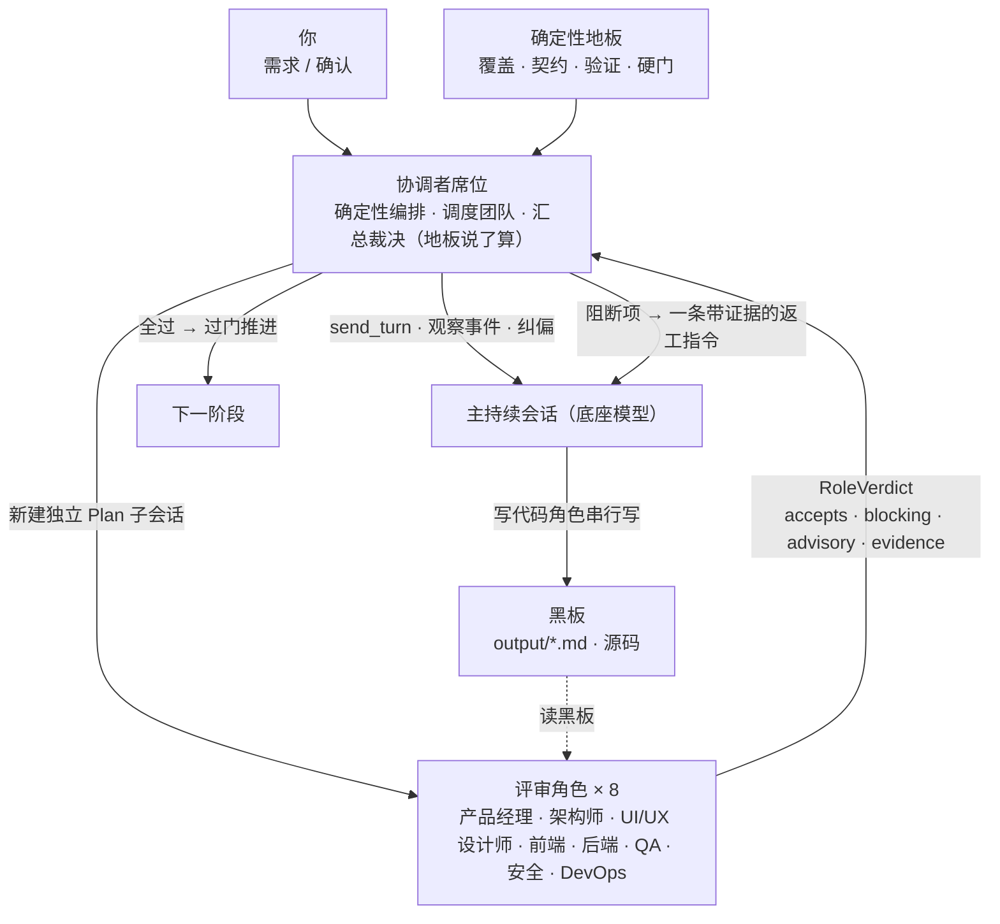
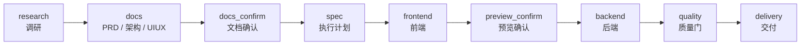
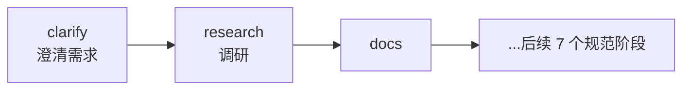
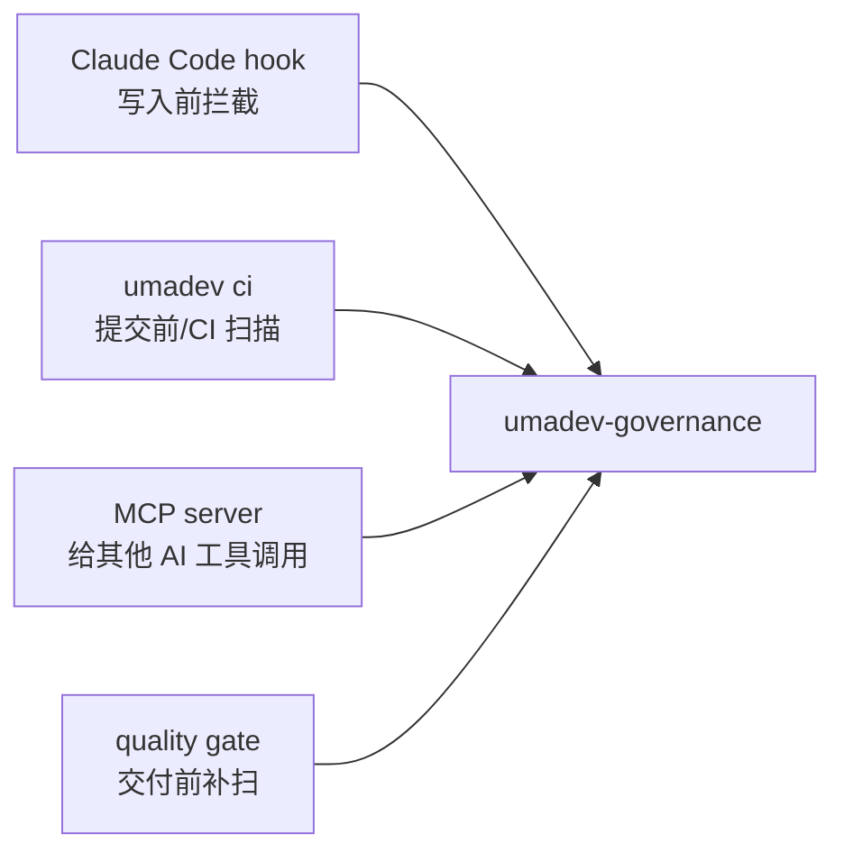
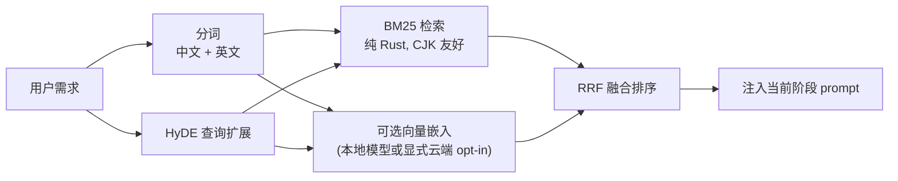

# umadev

<div align="center">


### UmaDev：一个模拟真实开发团队工作的 Agent，指挥你已经在用的五种 AI 编码 CLI 干活。

**按任务深度模拟产品、架构、UI/UX、前端、后端、QA、安全、DevOps 职责；底座是大脑，协调者持有计划和确定性验收，失败不会被包装成完成。**

[](LICENSE)
[](https://www.rust-lang.org/)
[](spec/UMADEV_HOST_SPEC_V1.md)
[](CHANGELOG.md)

[English](README.md) | 简体中文 | [繁體中文](README.zh-TW.md)

</div>

---

<div align="center">

**官方微信群** — 扫码加入,获取更新 · 反馈问题 · 和其他用户交流


</div>

---

## 目录

- [简介](#简介) · [项目来源](#项目来源) · [它解决什么问题](#它解决什么问题)
- [安装](#安装) · [快速上手](#快速上手) · [一个完整例子](#一个完整例子)
- [umadev 如何工作](#umadev-如何工作) · [团队怎么协作](#团队怎么协作)
- [为什么可信](#为什么可信) · [运行模式](#运行模式) · [流水线设计](#流水线设计) · [质量门是什么](#质量门是什么)
- [治理规则是什么](#治理规则是什么) · [知识库是什么](#知识库是什么) · [交付产物长什么样](#交付产物长什么样)
- [**命令大全**](#命令大全) · [配置](#配置) · [Rust 架构](#rust-架构) · [开发](#开发) · [许可证](#许可证)

## 简介

umadev 是**一个模拟真实开发团队来工作的 Coding Agent**。它驱动五个一等 AI 编码底座之一——Claude Code、Codex、OpenCode、Grok Build 或 Kimi Code；它自己不持有模型端点：所选底座接入的模型，就是它的大脑。

你用自然语言描述目标，umadev 会按深度选择产品、架构、UI/UX、前端、后端、QA、安全、DevOps 等有界角色会话。它们不是八个独立的人，裁决也是 advisory；真正决定是否完成的是计划状态和确定性证据。小改动保持小路径，深度任务才扩大角色与交付物；失败或未完成不会拿到商业交付结论。

它是一个 **Rust 单二进制**。npm 只是分发壳。

一个**协调者**负责路由意图、为 deliberate work 持有可视计划、调度所选角色、评估 gate 并留下审计证据。思考、调研、设计、写代码与评审认知来自底座；UmaDev 提供的是软件化团队纪律与证据边界，不等于真实团队的人类签字或质量保证。

深度足够且对应步骤实际执行时，角色可以负责这些产物：

- **产品经理** — 拆解需求、写 PRD、定范围与验收标准
- **架构师** — 定技术选型、分层分包、数据模型、API 契约
- **UI/UX 设计师** — 定设计系统、令牌、字体、组件状态、页面骨架，盯住"不像 AI 模板"
- **前端工程师** — 按设计系统 + 契约真写前端、跑通运行时
- **后端工程师** — 建数据模型 + API + 业务逻辑，对齐契约
- **QA** — 真跑构建测试、查覆盖、产出运行时证明
- **安全** — 扫攻击面、鉴权 / 越权 / 注入 / 密钥审查
- **DevOps** — 管构建、CI、部署证明、上线
- **协调者（技术负责人）** — 路由意图、拆计划、调度团队、每道门汇总裁决、留证据

写代码的角色串行驱动主会话；评审角色各自在**全新、独立的 Plan 子会话里并行**审，只接收黑板工件与验收条件，不继承写者对话。Plan 会映射到每个厂商真实提供的权限面，不能把所有底座都宣传成同一种硬只读沙箱。角色之间**不互相聊天**——它们只通过共享的产物文件（黑板）和结构化裁决沟通，避免多 Agent 互聊放大幻觉。协调者**确定性地**汇总：把阻断项折成一条返工指令注入主会话，循环由确定性信号（覆盖 / 契约 / 验证 / 硬门）有界终止，不靠模型自评"够不够好"。

umadev 驱动**恰好五个一等、深度适配底座**。五者在产品层没有等级差异：`claude-code`、`codex`、`opencode` 使用各自的厂商专属协议驱动；`grok-build` 与 `kimi-code` 使用厂商正式提供的 ACP v1 接口、共享加固核心和相互隔离的能力配置。协议差异只是内部实现，用户获得的是统一的 UmaDev 交互契约；更多模型覆盖仍由所选底座自己的第三方 / 本地模型路由负责，umadev 不持有模型端点。

五个底座在产品层都维持**逻辑持续、双向的会话界面**：用户始终在 UmaDev TUI 中交互，驱动按厂商真实能力传送后续回合，并呈现已公开/已协商的追问、审批和工具事件。缺失能力会明确显示，不会伪造。“无头 / 非交互”只指后台机器协议子进程不显示厂商自己的 TUI，不代表 UmaDev 产品没有交互。

> 逻辑持续写者会话是默认：流程不会故意每阶段冷启动。物理子进程可按厂商能力恢复、重挂或安全重建；只有底座明确证明时才宣称恢复完整 transcript。单次调用路径只是有界降级，不会把认证/协议失败伪装成成功。

## 项目来源

umadev 脱胎于原项目 [shangyankeji/super-dev](https://github.com/shangyankeji/super-dev)。

早期的 `super-dev` 更像一个 AI 编码治理工具：主要关注"AI 生成代码时不能写什么"，例如不要用 emoji 当图标、不要硬编码颜色、不要写不安全代码。

现在的 umadev 在这之上长成了一支完整的 AI 开发团队：

- **从单点治理扩展到全流程交付**：不只检查代码，而是把从需求到上线的每个阶段都交给对应角色，并加上门禁与验收。
- **从零散脚本升级为规范驱动系统**：核心是 [UMADEV_HOST_SPEC_V1](spec/UMADEV_HOST_SPEC_V1.md)，所有实现都围绕规范（持续会话与团队模型见 §9.3–§9.4）。
- **使用 Rust 重写**：单二进制、跨平台、启动快、依赖少、适合本地长期运行。
- **从"拦截问题"升级为"带队走完交付"**：所选底座是大脑和手，umadev 是加载这颗大脑、组成整支团队、把关交付的那层外壳。

一句话概括这个演进：

> `super-dev` 关注"AI 不要写烂代码"；`umadev` 关注"一支 AI 开发团队如何把需求交付成可上线、可审计的商业产品"。

## 它解决什么问题

很多人第一次用 AI 编码工具时都会遇到类似问题：

- AI 一上来就写代码，没有 PRD、没有架构、没有验收标准。
- 前端做完了，后端接口路径对不上。
- UI 看起来像模板，颜色和字体很随意。
- AI 写了占位代码、假数据、TODO，却说"完成了"。
- 修改一次需求后，上下文开始乱，前面约定被忘掉。
- 代码能生成，但没有质量报告、没有证据链，不知道能不能交付。
- 团队有自己的规范和知识库，但每次都要手动复制给 AI。

umadev 把这些问题交给一支分工明确的团队来系统化解决，每个角色在该出手的节点出手：



## 安装

推荐用 npm 安装预编译二进制：

```bash
npm install -g umadev
```

**Linux 上不要用 sudo。** npm 默认前缀（`/usr/local`）属主是 root，普通用户 `npm i -g` 会 `EACCES`；而 `sudo npm i -g` 看似「解决」了，实则在 npm 前缀里留下一棵 **root 属主**的目录树——之后你以普通用户执行的每一条 npm 全局命令（`npm update -g`、`npm i -g <任何包>`）都会 `EACCES`，且 npm 会整体回滚，**连带**你的其它全局包（含底座 CLI `@anthropic-ai/claude-code`、`@openai/codex`）也再也更新不动。正确做法是换一个你自己拥有的前缀：

```bash
npm config set prefix ~/.npm-global
export PATH="$HOME/.npm-global/bin:$PATH"   # 写进 ~/.zshrc 或 ~/.bashrc
npm install -g umadev
```

或者干脆不做全局安装——不改前缀、不用 sudo、不占 PATH：

```bash
npx umadev                 # 直接从 registry 拉起来跑
npm i umadev && npx umadev # 或作为项目本地依赖
```

（不带 `-g` 的 `npm i umadev` 是能装上的，只是 npm 按设计**不会**把本地命令挂到 PATH 上，直接敲 `umadev` 会提示 command not found——这不是装坏了，用 `npx umadev` 运行即可。）

已经踩了 sudo 的坑？`umadev doctor` 会检出 root 属主的安装目录或 npm 缓存，并打印确切的修复命令（`sudo chown -R $(whoami) ~/.npm`，然后在自有前缀下重装）。

npm 只是分发壳。真正运行的是 Rust 编译出的 `umadev` 二进制。

npm tarball 不内含向量模型。第一次执行需要检索的命令时，npm 启动器会从同版本 GitHub Release 下载并校验 `multilingual-e5-small`（f16，约 224MB），缓存到 `~/.umadev/embed-model`；以后本地推理无需 API key 或运行时网络。下载受限时 UmaDev 仍以 BM25 检索，后续符合条件的启动会重试；损坏缓存不会被信任，而会重新下载。真实编码仍需要已安装、已认证的底座 CLI。

支持的平台：

- macOS Apple Silicon
- macOS Intel
- Linux x86_64
- Linux ARM64
- Windows x86_64

也可以从源码构建：

```bash
git clone https://github.com/umacloud/umadev.git
cd umadev
cargo build --release --features vector-local
./target/release/umadev --version
```

> **从源码构建？** 模型不在仓库中。普通 `cargo build --release` 支持 BM25 和显式开启的远程向量后端，但不会编译本地 candle 后端。本地向量需要 `--features vector-local`，并且磁盘上要有相互兼容的 `config.json`、`tokenizer.json`、`model.safetensors`；可用 `UMADEV_EMBED_MODEL_DIR` 指向该目录，或放到 `~/.umadev/embed-model`。npm 启动器会配置同版本、已校验的 Release 资产，源码二进制不会自动下载。没有可用向量后端时，`engine = "hybrid"` 会如实降级成纯 BM25。

你还需要装好并登录一个 AI 编码 CLI——那就是 umadev 驱动的大脑：

| 流水线底座（`umadev run/quick --backend`） | 安装 | 登录 / 认证 |
|---|---|---|
| Claude Code（`claude-code`） | `npm i -g @anthropic-ai/claude-code` | `claude auth login` |
| Codex（`codex`） | `npm i -g @openai/codex` | `codex login` |
| OpenCode（`opencode`） | `npm i -g opencode-ai` | `opencode auth login` |
| Grok Build（`grok-build`） | `curl -fsSL https://x.ai/cli/install.sh \| bash` | `grok login`；无浏览器 / 无头环境可设置 `XAI_API_KEY` |
| Kimi Code（`kimi-code`） | `npm i -g @moonshot-ai/kimi-code@0.26.0`（Node.js >= 22.19） | `kimi login` |

表中的 `curl | bash/sh` 是当前驱动展示的 Unix 安装提示；Windows 请使用各厂商官方 Windows 安装方式，不要把这些 Unix 命令直接粘进 PowerShell。

UmaDev 自身**不额外需要模型 API key**，但你仍要安装并认证所选底座。账号、订阅、凭据、模型与第三方 / 本地路由都由底座持有；UmaDev 不会替你执行登录流程或主动打开认证浏览器。它会发送任务和治理上下文，但不会保存或暗中替换底座凭据与模型端点。`umadev doctor` 只在有可靠探针时确认登录状态；Grok Build 只有真实会话成功才能证明可用——“已安装”不等于“已登录”。

## 快速上手

```bash
umadev                       # 启动对话界面；首次运行会让你选一个底座
```

第一次打开会让你选择：

1. 界面语言。
2. 使用哪个底座：从五个一等底座中选择你已经安装并登录的那个。

然后直接描述你要做什么：

```text
> 给报表页加上 CSV 导出
> 帮我做一个带 Postgres 后端的待办应用
> /goal 做一个能上线的 SaaS 落地页          # 持续干到目标达成
```

也可以非交互地跑一次构建：

```bash
umadev run "给报表页加上 CSV 导出" --backend claude-code
```

umadev 按你的请求自动判断工作量大小——你不用手动选择意图类别。聊天和 `umadev run` 中被判为 Build 的请求都进入同一套 Director 合约，但计划、角色评审、检查和交付物会按深度缩放。干净的 Git worktree 可以创建派生的 `umadev/<slug>` 隔离分支；非 Git 或已有未提交改动时会说明跳过原因并保留既有改动。umadev 不会自行合并或推送。

## 一个完整例子

假设你在一个空项目里运行：

```bash
umadev init
umadev
```

然后输入：

```text
做一个课程预约小程序，用户可以查看课程、选择时间、预约、取消预约，管理员可以管理课程和预约记录。
```

umadev 会做这些事：

1. **理清需求**：补全目标平台、是否需要支付、管理员后台复杂度等合理默认假设（`auto` 模式自动推进、不打断你；`guarded` 模式可逐条确认）。
2. **联网调研**：当底座具备联网能力时，搜索同类小程序、预约系统的竞品功能、定价、设计趋势和真实用户评价；同时检索内置知识库里的预约系统、后台 CRUD、权限、表单校验等规范。两者合并产出调研报告 `output/<slug>-research.md`。
3. 生成 PRD，明确用户角色、功能范围、EARS 可测验收标准。
4. 生成架构文档，定义数据模型、API、鉴权、部署方式。
5. 生成 UI/UX 文档，定义设计方向、颜色 token、字体、组件状态、图标库。
6. 拆成执行计划和任务（每个任务回链到需求 FR 编号）。
7. 驱动底座实现前端，渲染真实 markdown 和逐文件 diff 卡。
8. 暂停让你预览。
9. 驱动底座实现后端和集成。
10. 跑质量门：文档、契约、构建、设计、安全、交付文件全部检查。
11. 生成交付包和成绩单。

整个过程会在磁盘上留下真实文件。在聊天界面里输入需求，和用 `/run` 显式发起构建，走的是同一套系统。

## umadev 如何工作

当你说出一句需求，umadev 会按需编排协调者、写者和只读评审角色：先判断意图，再选择比例化路径，并用确定性证据决定是否完成。检索、治理辅助和 advisory 评审都能有界降级；认证、传输、硬门和验证失败则会明确显示为降级、阻塞、不兼容或失败，不会为了“继续”伪装成成功。



**① 判断意图（router）。** 每条普通输入都会先交给所选底座模型的**全新、独立 Plan 子会话**，在任何写者动作前输出类型化路由。有效模型判断可以双向增减深度：既能看懂“做一个网站”只是被引用的问题，也能判断一句短需求确实需要完整 build。底座连不上、超时或结构无效时才使用保守的确定性兜底；不授权写入的意图、Plan、单写者和不可逆操作确认不能被模型放宽。需要澄清时，系统会在写锁、隔离分支和写者回合之前先问你。Plan 的硬隔离强度取决于厂商真实能力，详见“运行模式”。

当前 run 正在执行时，只有明确的当前任务纠偏会进入 steer；问题，以及下一项/含糊任务会排到后续对话，等 run 收敛后重新走正常模型路由。gate 上问“为什么”也不会被误解成返工指令。

**② 可视计划（plan）。** 一个完整 build 开工前，协调者把目标拆成一份**它自己解析并持有**的依赖 DAG（落 `.umadev/plan.json`），在界面上渲染成一张**实时勾选的清单**（`[✓] 脚手架 · [~] 登录路由 · [ ] 登录表单  3/8`）。`/plan skip|add|veto|up|down <id>` 让你重排 / 跳过 / 否决 / 新增某一步，折回下一条指令同会话生效。

**③ 按路由注入固件（compose_firmware + repo-map）。** 所有路径共享稳定的团队身份与语言层，但不会把完整研发规范塞进普通聊天：Chat 只带身份；Explain 追加有界只读上下文；QuickEdit / Debug 追加工程实践；完整 Build 才再加入知识摘要、踩坑召回、项目事实、repo-map 和团队心法。精选 markdown 知识语料已编译进二进制，启动时自动解压到 `~/.umadev/knowledge`；语料数量会持续增长，不作为产品协议。

**④ 逐步调度团队 + 每步验收（director_loop）。** 协调者沿 DAG 一步步驱动：每个就绪的 build 步在主会话上串行执行，并对照它自己的验收标准在**确定性地板**（源码在不在 / 构建测试 / 契约 / 评审）上验证——过则勾掉清单，不过则有界返工。评审角色各自在全新 Plan 子会话中读取同一份黑板快照并行交叉审，不继承写者对话。运行有墙钟预算上限；gap-count 和 stall-count 确保循环有界收敛。

**⑤ 交付证明（finalize）。** 质检通过后，`finalize` 产出 PRD / 架构 / UIUX 文档、成绩单 HTML 和打包的 proof-pack（按深度裁剪——一个小页面不会硬塞一摞企业文档）。

**⑥ 记忆（持久化对话 + 证据门槛）。** umadev 把有界对话持久化到 `.umadev/chat/<id>.json` 供后续理解；旧计划、TODO、run 笔记和项目文档都只是上下文，只有当前输入能授权新工作。符合条件的事故、精确修复/验证结果和稳定项目事实才会进入各自存储，并按路由有界召回；一次运行不会自动变成“经验”。

> 这些都是**已实现**的真实行为（见 `crates/umadev-agent` 的 `router.rs` / `plan_state.rs` / `context.rs` / `director_loop.rs` 与 `crates/umadev-knowledge/src/repomap.rs`），不是路线图承诺。规范真相源见 [`spec/UMADEV_HOST_SPEC_V1.md`](spec/UMADEV_HOST_SPEC_V1.md)；路线图保留设计缘由和历史实施波次，当前成熟度见 [`docs/ENTERPRISE_MATURITY_AUDIT_2026-07-14.md`](docs/ENTERPRISE_MATURITY_AUDIT_2026-07-14.md)。

整体架构可以理解成四层：


简单说：

- **TUI/CLI**：你和团队共享一条逻辑对话，但执行权限分离。每条普通输入都会先由所选底座的大模型在全新 Plan 子会话里判断 `Chat / Explain / QuickEdit / Debug / Build`，有效判断可以双向增减深度；只有子会话不可用、超时或结构无效时才走保守的确定性兜底。无写入授权、单写者和不可逆操作确认始终是硬边界；Plan 的底层权限实现按厂商能力映射。
- **协调者引擎（umadev-agent）**：路由意图、拆出可视计划、注入规范、调度哪些角色、逐步驱动并每步验收、汇总裁决推进或返工、最后 finalize 交付。完整商业级交付时会展开成 9 阶段主链（见下文"流水线设计"）。
- **持续会话 / 底座**：五个底座都是一等深度适配。Claude Code、Codex、OpenCode 使用厂商专属持续会话协议；Grok Build 与 Kimi Code 使用官方 ACP v1 接口、加固会话核心和隔离的厂商配置。底座用自己的登录和模型连续干活；umadev 不持有或覆盖任何模型端点与 key。
- **治理 / 质量**：底座每写一个文件就实时拦截不合规内容；交付前再跑一遍质量门补扫。
- **知识库（本地优先、失败软降级）**：精选语料编进二进制，BM25 始终是词法地板；只有完整层级的 Build / Debug 才加入知识与踩坑检索。官方发布在本地功能和已校验模型可用时运行 candle 向量并做 RRF / HyDE；否则降级 BM25。远程向量只有专用 key 与上传开关同时设置才会启用。
- **证据**：把每次工具调用、每份裁决、每道门记录下来，最后打包成交付证明。

## 团队怎么协作

umadev 用一个协调者按任务深度模拟八种专业角色。它们是隔离的底座会话与类型化职责，不是八个独立的人，也不保证每个小修改都召集全员；完整任务才会按需把产物和 advisory 裁决写入共享黑板：

| 角色 | 它产出什么（黑板上的产物） |
|---|---|
| 产品经理 | 拆需求、用户故事、EARS 验收标准 — `*-prd.md` |
| 架构师 | 分层、数据模型、API 契约 — `*-architecture.md` + `openapi.*` |
| UI/UX 设计师 | 设计系统：令牌、字体、组件状态、页面骨架 — `*-uiux.md` |
| 前端工程师 | 导入令牌、调契约 URL 的组件 / 页面 |
| 后端工程师 | 数据模型、端点、对齐契约的业务逻辑 |
| QA | 真跑测试 + 运行时探测 — `runtime-proof.json` |
| 安全 | 威胁模型 + SAST：鉴权 / 越权 / 注入 / 密钥 |
| DevOps | 构建、CI、部署证明 — `deploy-proof.json` |
| 协调者（技术负责人） | 路由意图、持有计划、调度团队、把关每道门、留审计证据 |

协作机制：一个**确定性协调者**主导全程；写代码的角色串行写，评审角色在独立 Plan 子会话并行审；沟通只走"共享文件黑板 + 结构化裁决"。



四条执行边界约束这套角色编排：

- **单写者**：任一时刻只有主会话获得写者席位；评审子会话使用 Plan profile，且不被调度为写者。底层是否存在可验证硬只读沙箱取决于厂商能力，不能一概而论。
- **确定性控环**：循环继续还是终止，由确定性信号（gap-count、退出码、硬门）决定。底座和评审角色都是 advisory，永不驱动循环终止——避免模型"自我感觉良好"放行。
- **fail-open**：评审角色够不到底座时，空裁决等于通过，绝不阻塞；协调者退回确定性地板决策。一个评审的 bug 永远不会卡住底座。
- **有界返工**：阻断项折成带上下文的返工指令注入主会话，带上下文修，再复审；gap-count 和 stall-count 确定性收敛（默认最多几轮、无进展即停），残留进自学习库下次规避。

团队规模随任务复杂度缩放：bugfix / 小重构不组队，确定性地板独立把关；完整需求才上全套八个角色加协调者。简单需求因此能走轻量路径——跳过调研和三文档、保留 Spec 与硬门，几分钟出代码。

## 大概要多久 · 命令怎么发现

**时间预期**（实际取决于你底座的模型、思考强度和需求复杂度——umadev 不持有模型，速度主要由底座决定，这里只给量级）：

| 你说的 | 路由判成 | 大致量级 |
|---|---|---|
| 一个问题 / "这怎么用" | 对话 | 秒级，不进流程 |
| "改个文案" / "重命名这个函数" | 快路径小修 | 一两分钟，单步直接做 |
| "审下这段代码会不会出 bug" / "帮我看这个报错" | 临时任务（带 repo-map / git 锚定） | 几分钟 |
| "给用户模型加个字段" / "修结账的 bug" | bugfix / 小改（不组队） | 几分钟，硬门把关 |
| "做一个订阅管理后台" | 完整 build（展开 9 阶段、全套团队） | 按需求规模从十几分钟到更长；中途在确认门停下等你 |

> 看得见进度：完整 build 会显示实时计划和团队评审状态；长时间没有进展时状态区会提示，而不是把沉默当完成。CLI `run/quick --mode` 默认是 `guarded`；TUI 则兼容 `.umadevrc` 的 `auto_approve_gates` 映射，当前生成值 `true` 对应自动普通 gate。不可逆操作仍始终确认。

**命令可发现性**：

- TUI 里输入 `/` 弹出**命令补全浮层**，`Tab` 补全、`↑↓` 切换、回车执行。
- `/help`（或 F1）列出**全部命令和快捷键**。
- 不确定下一步时，意图卡和计划清单本身会提示可用动作（`[c] 继续 · /revise 重做 · /plan 调整`）。
- `umadev guide` 是 60 秒上手教程，`umadev examples` 是命令速查表。

## 为什么可信

umadev 的可信来自把"模型说了什么"和"硬信号是什么"严格分开：

- **fail-open 治理**：底座每写一个文件，都实时拦截 emoji 当图标、硬编码颜色、AI 模板痕迹、无障碍缺失、前后端契约不符等。治理函数**永远 fail-open**——治理自身出 bug 时放行而非阻断，绝不让一个治理缺陷卡死底座。
- **确定性控环**：底座和评审角色都是 advisory。真正决定"过门 / 返工 / 硬停"的是确定性信号：FR→任务覆盖、前后端契约对照、真跑 verify 的退出码、质量门阈值，以及**零代码硬门**（计划要产出代码却没有真实源码 = 判失败，绝不把空骨架伪装成"完成"）。
- **不持有模型端点**：umadev 用你已登录的底座，不自带模型、不接第三方 API、不存你的 key。底座用谁的模型、什么思考强度，umadev 只读出来显示、绝不覆盖。
- **审计证据**：每次工具调用、每份角色裁决、每道门的状态都落盘（`.umadev/audit/*`、`team-ledger.jsonl`）；交付时打包成 proof-pack + 成绩单 + 合规映射（SOC 2 / ISO 27001 / EU AI Act），可直接发给团队、客户或审计方。
- **可审计的踩坑学习 + 项目事实**：具体事故先记到本地；同一精确问题在独立 episode 中复发可形成待验证规则，只有对应修复后同一验证器通过才会验证。证据用于降低重复犯错，不承诺概率型底座永不再犯。稳定事实只在有意义的工作后由有界只读提取产生，经秘密过滤后写入 `.umadev/memory/facts.jsonl`，并在后续工作类回合召回；纯聊天不注入，过期或矛盾事实会降级/墓碑化。
- **App 运行时模型你说了算**：借来写代码的底座 ≠ 你做出来的 AI 应用运行时调的模型——umadev 把应用的运行时 provider / model id / key 当作用户可配的 env，绝不把开发底座的厂商悄悄写死进产物。
- **转达底座已支持的追问**：当前驱动暴露结构化提问事件时，umadev 内联渲染问题/选项并把回答关联回活会话。追问和审批事件丰富度取决于厂商协议与实时能力；不支持时会说明，而不是模拟。
- **三语**：zh-CN / zh-TW / en 全程覆盖用户可见文案，按系统语言检测、可随时切换。

## 运行模式

### 模式 A：驱动本机 AI 编码 CLI（默认走持续会话）

这是产品模式。整条流水线维持一个**逻辑持续写者会话**；底层可按厂商能力恢复、重挂或重建，并用有界项目状态续接。不能证明厂商 transcript 完整恢复时，界面不会声称“上下文原样在线”。

| Backend ID | 会话传输 | Plan / 审批映射 | 恢复方式 |
|---|---|---|---|
| `claude-code` | 厂商专属 stream-json | Claude permission mode | 精确 `--resume` |
| `codex` | 厂商专属 `codex app-server` JSON-RPC | Codex sandbox + approval policy | 精确 `thread/resume` |
| `opencode` | 厂商专属 `opencode serve` HTTP/SSE | OpenCode permission rules | 精确持久 session id |
| `grok-build` | ACP v1 stdio | Plan 增加只读 sandbox、禁用子 Agent、限制为只读工具集 | 协商到 `session/resume` 时优先使用，否则使用已声明的 `session/load` |
| `kimi-code` | 官方 `kimi acp` v1 stdio | Plan=`plan`；Guarded/Auto 保持 `default`，由 UmaDev 审批策略和不可逆红线掌权 | 标准 `session/resume`，并按声明回退 `session/load`；工作区与权限身份必须一致 |

特点：

- UmaDev 自身不额外需要模型 API key；底座仍按自己的方式登录 / 配置凭据。
- 继续使用你原来 CLI 的账号、订阅和配置。
- 底座负责真实读写文件和运行命令。
- umadev 负责团队调度、流程、规则、质量门和证据链。

> 能力边界：上表五个底座全部是一等适配。ACP 是 Grok Build 与 Kimi Code 正式提供的机器协议路径，不是降级模式。Grok Build 在有效沙箱证明与原生恢复预检尚不完整时使用新会话交接。Kimi Code 固定到官方源码审计版本，通过 ACP 只复验已有登录，不自动运行登录命令或打开浏览器，并按声明使用标准 `session/resume` / `session/load`。评审始终新开 Plan 子会话，不加载可写主线。

附件走保序的结构化输入，绝不会静默退化成隐藏的 `@path` 文本。Claude Code 与 Codex 原生发送图片，普通文件必须由用户明确选择有界 UTF-8 文本物化；OpenCode 原生发送图片/文件 part；Grok Build 与 Kimi Code 只有在实时 ACP 握手声明相应能力后才发送图片或资源。TUI 会逐块显示实际投递方式。当前只有 Codex 的 `turn/steer` 被证明具有同轮语义；其他四个底座按真实会话能力排到下一轮或明确拒绝，不伪装成交互能力完全相同。

### 底座自带模型 — umadev 不接外部 API

umadev 不自带模型，也不接第三方模型 API。底座使用它自己的账号和模型配置；想换模型，请在底座自身配置中修改。`/status` 和 `/model` 只在底座公开配置或会话元数据时读取并展示，缺失值保持“未知”，不会猜测或覆盖。

umadev 读取的来源：claude 的 `~/.claude/settings.json`（`model` / `effortLevel`）、codex 的 `~/.codex/config.toml`（`model` / `model_reasoning_effort`）、opencode 的 `opencode.json`（`model`，思考强度内置在模型变体里）、Kimi Code 的 `$KIMI_CODE_HOME/config.toml` 或 `~/.kimi-code/config.toml`（`default_model` / `thinking` / 精确上下文）。

### 模式 B：离线模板（内部兜底，不是产品）

```text
/offline
```

离线模式不会调用任何模型，也不会访问网络。它**不是一个让你选的产品形态**——产品永远是"驱动你登录的底座"。离线模板只是没有底座可用时的确定性兜底，适合：

- 快速看文件结构。
- CI smoke test。
- 演示 umadev 的流程。

离线产物只是模板（带 TODO 占位），不代表模型完成了真实开发；真实交付必须走底座。第一次启动的底座选择器列出五个一等底座，不会把离线当成一个选项。

## 流水线设计

**9 阶段主链是协调者为"完整商业级 greenfield 交付"展开的最完整交付路径。** 底座的模型先判断意图（上文"umadev 如何工作"①）：对话不进流程、小修走快路径、bugfix 不组队；只有一个完整产品需求，协调者才把计划展开成下面这条主链。规范里这条链就是 `standard` profile 的全程（见 [spec §4.1 / §9.5](spec/UMADEV_HOST_SPEC_V1.md)），是**怎么交付一个完整产品**的契约。

规范主链是 9 个阶段：



当前产品实现还在主链前增加了一个 `clarify` 微阶段：



所以你可能先看到 umadev 生成：

```text
output/<slug>-clarify.md
```

你可以回答澄清问题，也可以输入 `c` 跳过。

> 小任务有轻量路径：9 阶段是面向"完整商业级交付"的主链，不是每个需求都得全程走完。底座的模型先判意图，协调者据此裁剪或展开计划——对话不进流程、bugfix 不组队、小改动不会强行拉你走 PRD / 架构 / UIUX 全套；想强制走快路径用 `/quick`。

### 每个阶段由谁主导、产出什么

| 阶段 | 主导角色 | 你能理解成 | 主要文件 |
|---|---|---|---|
| `clarify` | 产品经理 | 先把需求问清楚 | `output/<slug>-clarify.md`、`output/<slug>-clarify-answers.md` |
| `research` | 产品经理 | 联网调研竞品、领域、风险、设计趋势 | `output/<slug>-research.md` |
| `docs` | 产品经理 · 架构师 · 设计师 | 写三份核心文档（架构和 UIUX 可并行） | `output/<slug>-prd.md`、`output/<slug>-architecture.md`、`output/<slug>-uiux.md` |
| `docs_confirm` | 团队并行评审 + 你 | 产品经理、架构师、设计师各自在独立 Plan 子会话审，连同你一起确认方向 | `.umadev/workflow-state.json`、`.umadev/team-ledger.jsonl` |
| `spec` | 技术负责人 | 拆任务和执行计划（每任务回链 FR 编号） | `output/<slug>-execution-plan.md`、`.umadev/changes/<id>/tasks.md` |
| `frontend` | 前端工程师 | 照设计系统 / 令牌实现前端 | `output/<slug>-frontend-notes.md` |
| `preview_confirm` | 设计师 + 前端 critic + 你 | 看前端效果、审实现质量 | TUI gate 状态、`.umadev/team-ledger.jsonl` |
| `backend` | 后端工程师 | 照契约实现后端和集成 | `output/<slug>-backend-notes.md` |
| `quality` | QA · 安全 · 后端 · DevOps | 真跑构建测试 + 红队 + 契约 / 覆盖 / 治理扫描 + 硬门 | `output/<slug>-quality-gate.json`、`output/<slug>-quality-gate.md` |
| `delivery` | DevOps / 协调者验收 | 对照计划验收、打包交付 | `output/<slug>-delivery-notes.md`、`release/proof-pack-*.zip`、`release/scorecard-*.html` |

## 质量门是什么

质量门可以理解成 umadev 的"交付前验收"。

它逐项检查内容：

- PRD 有没有目标、范围、验收标准。
- 架构文档有没有 API、数据模型、错误处理、鉴权。
- UI/UX 文档有没有设计 token、字体、图标库、组件状态、暗黑模式。
- 前端调用的 API 和后端契约是否一致。
- 是否存在 emoji 图标、硬编码颜色、AI 模板痕迹。
- 是否有构建、测试、lint、typecheck 结果。
- 是否生成 Dockerfile、CI、migration、`.env.example`。
- 是否泄露 API key、密码、连接串。
- 是否有审计日志和合规映射。

输出文件：

```text
output/<slug>-quality-gate.json
output/<slug>-quality-gate.md
```

默认通过线是 90 分，可以在 `.umadevrc` 调整：

```toml
[quality]
threshold = 90
skip_checks = []
```

## 治理规则是什么

umadev 最早来自治理工具，这部分仍然是核心能力。

这些规则是一条**治理基线**，不是绝对真理——每条都可以在 `.umadev/rules.toml` 里禁用、按路径排除或调参（见下文）。它们的作用是给底座的产出兜底，而不是替你做最终的工程判断。

规范层有 34 条正式 clause，实现层有 113 个内容检查，覆盖：

- UI 质量：不用 emoji 当图标，不写硬编码颜色，不产出模板感 UI。
- 安全：不写密钥，不写危险命令，不写 SQL 注入、SSRF、XXE 等危险代码。
- 前端质量：不用随意 `any`、裸 `fetch`、缺少 a11y、缺少 ErrorBoundary 等。
- 后端质量：鉴权、限流、日志、事务、输入校验、错误处理。
- 多语言危险模式：Rust `unwrap`、Go `panic`、Python `bare except`、Java `System.exit` 等。

治理入口有四个：



项目可以通过 `.umadev/rules.toml` 调整：

```toml
[disabled]
clauses = []

[exclusions]
paths = ["src/legacy/**", "**/*.test.ts"]

[extra]
blocked_domains = ["internal-bad-proxy.corp"]
```

## 知识库是什么

umadev 内置了一套给底座看的商业级 markdown 工程标准语料。这些文件已编译进二进制，首次运行时自动解压到 `~/.umadev/knowledge`；具体数量会随语料演进，不作为产品协议。

它覆盖：

- 产品和 PRD。
- 架构和 API。
- 前端、后端、数据库。
- 安全、测试、CI/CD、运维。
- 移动端、桌面、小程序、鸿蒙、跨平台。
- 电商、金融科技、医疗、教育、游戏等行业。
- UI/UX、设计系统、设计反模式。
- 产品经理、架构师、前端负责人、后端负责人、QA、DevOps 等专家方法论。

检索方式：



**配置为 hybrid，不伪造已运行通道。** `engine = "hybrid"` 请求 BM25 与向量经 RRF 融合，并可使用 HyDE 扩展。官方发布编译本地 candle 功能；npm 启动器在首次符合条件的使用时下载并校验同版本 f16 模型。源码构建还需显式 `vector-local` 与兼容模型。只有同时配置 `OPENAI_EMBED_KEY` 和 `UMADEV_ALLOW_CLOUD_EMBED=1` 才允许远程上传，普通 `OPENAI_API_KEY` 不授权。模型缺失、网络失败、空向量或维度不匹配都如实降级为 BM25。

**保守、可验证的踩坑学习。** 具体失败先记到本地；同一精确问题在独立回合复发后可以形成待验证纠正规则，只有原验证器在对应修复尝试后重跑通过，规则才会变成已验证。证据会被召回以减少重复犯错，但这不是“底座永不再犯”的承诺；一般 lesson 的被动召回在具备精确记忆 ID 与回合归因前不做宽泛奖惩。

不同记忆资产不能混为“自动进化”：

| 资产 | 真实作用域 | 写入 / 使用门槛 |
|---|---|---|
| `/pitfalls` | 项目事故账本：`.umadev/learned/_raw/dev-errors.jsonl` | 只计独立 episode；重复 stderr 行不叠加，泛化/未分类条目隔离。 |
| `/lessons` | 可复用纠正规则与安全投影 | 复发可形成 pending；精确修复后同一 verifier 通过才 validated。 |
| 学习型 skills | 项目本地：`.umadev/memory/learned-skills/skills.jsonl` | 仅非平凡且干净的交付可毕业；精确投递回执及 pass/fail/unknown 才结算使用。旧 `.umadev/skills/` 仅作迁移输入，不再写入。 |
| recipes | 项目本地：`.umadev/memory/recipes/recipes.jsonl` | 严格匹配 stack/kind/shape，最多召回一个，只是建议而非 gate。 |
| facts | 项目本地稳定事实 | 有意义工作后提取；有界、过滤秘密，过期/矛盾内容会降级或墓碑化。 |
| run notes | 当前 run 的工作记忆：`.umadev/run-notes.md` | 仅计划步骤产生进展且通过确定性验收后由 UmaDev 写一条；失败、阻塞、空评审不写，底座不得直接写。 |
| open decisions | 项目可见的 `docs/decisions/OPEN-DECISIONS.md` | 未决项可进入有界、不可信提示块；recall off 只关闭该提示块，不隐藏已提交的登记表及其计数/report。 |

run notes 是后续计划步骤可读的有界、不可信历史，不是完整转录、全局记忆、当前授权或完成证明。`umadev skill` 安装的知识/规则/prompt 包是另一类资产，不等于学习型 procedural skills。检索可以组合内置语料、项目 `.umadev/learned/` sediment，以及 `~/.umadev/learned/` 下经过隐私审查的通用安全投影；原始事故、facts、recipes 和学习型 procedural skills 不会静默变成跨项目记忆。

`umadev memory inventory --scope all` 只展示各叶子存储的位置、占用和生效策略，不打印记忆内容。自动写入与提示词召回可以分别控制，例如 `umadev memory capture off --scope project --store facts`、`umadev memory recall off --scope project --store recipes`。开关不会删除数据、不会把数据从 inventory/report 隐藏，也不会暂停已经投递的 recipe/踩坑回执结算、信任/失效治理或 run-note 轮转；facts、recipes 与复发踩坑反思会在可选只读底座提取/蒸馏/反思调用前检查 capture 策略，因此关闭后不会浪费这次调用。策略缺失使用默认值；策略无法读取或 TOML 损坏时，自动写入与提示词召回会按隐私保守原则关闭，修复策略后再恢复。

你也可以添加自己的团队知识：

```bash
umadev knowledge-manage add ./team-docs --name team-docs
umadev knowledge-manage search "支付 webhook 幂等"
```

## 交付产物长什么样

一次完整运行后，目录大致是：

```text
your-project/
  output/
    app-clarify.md
    app-research.md
    app-prd.md
    app-architecture.md
    app-uiux.md
    app-execution-plan.md
    app-frontend-notes.md
    app-backend-notes.md
    app-quality-gate.json
    app-quality-gate.md
    app-compliance-mapping.json
    app-delivery-notes.md

  .umadev/
    workflow-state.json
    plan.json
    audit/
      tool-calls.jsonl
      frontend-api-calls.jsonl
      verify.jsonl
    changes/
    decisions/
    history/
    chat/

  release/
    proof-pack-app-20260620090000.zip
    proof-pack-app-20260620090000.manifest.txt
    scorecard-app-20260620090000.html
```

其中：

- `output/` 是项目过程文档。
- `.umadev/` 是状态、计划和审计记录。
- `release/` 是最终交付包。

## 命令大全

umadev 有两套入口，一一对应：

- **TUI 斜杠命令** — 在 `umadev` 聊天界面里输入 `/`，日常推荐。
- **终端 CLI 子命令** — 脚本 / CI 用，无需进 TUI。

> 提示：TUI 里输入 `/` 会弹出命令补全浮层，`Tab` 补全、`↑↓` 切换；`/help`（或 F1）列出全部命令和快捷键。

### TUI 斜杠命令

**选择底座与模型**

| 命令 | 作用 |
|---|---|
| `/claude` · `/codex` · `/opencode` · `/grok` · `/kimi` | 在五个一等底座间切换（存入 `~/.umadev/config.toml`；别名：`/grok-build`、`/kimi-code`） |
| `/offline` | 切到离线确定性模板（演示 / CI，完全不联网） |
| `/status` | 当前底座、它的**驱动模型**和**思考强度**（读自底座自己的配置，umadev 不覆盖） |
| `/model` | 只读显示底座公开的模型信息；umadev 不选择或覆盖模型 |
| `/sandbox [档位]` | 查看 / 切换 Codex 底座的启动沙箱（`read-only` · `workspace-write` · `danger-full-access`） |

**驱动流程与过门**

| 命令 | 作用 |
|---|---|
| 直接打字 | 底座的模型判断：对话 / 小修 / 完整 build；若有确认门打开，则作为修改意见 |
| `/run [slug] <需求>` | 显式开始一次完整构建 |
| `/goal <目标>` | 五个底座统一的持续目标入口（厂商暴露专属 goal 能力时直接映射；ACP 底座由协调者保持目标；`UMADEV_NO_GOAL_MODE=1` 退出） |
| `/quick <需求>` | 强制走快路径（轻量单点改动，不展开计划） |
| `/plan [skip\|add\|veto\|up\|down <id>]` | 查看 / 步级调度当前可视计划；无参折叠面板 |
| `/continue`（门上也可直接输 `c`） | 通过当前确认门、进入下一阶段 |
| `/revise <反馈>` | 停在当前门，带反馈重做本阶段 |
| `/redo [阶段]` | 重跑某个阶段块 |
| `/mode <plan\|guarded\|auto>` | 设置信任 / 自主档位 |
| `/manual` · `/auto` | 切换普通 gate 的人工确认 / 自动批准；不可逆操作始终确认（`shift+Tab` 也可切换） |
| `/cancel` · `/abort` | 中止当前运行（磁盘工作流状态保留，下次可续跑） |
| `/tasks [stop\|resume]` | 列出 / 管理后台运行 |
| `/adopt` | 接管现有（棕地）仓库：识别技术栈、索引源码、反推契约 |
| `/init` | 写入 `umadev.yaml` manifest |
| `/diff [产物]` | 查看某个产物（默认 `prd`，也可 `architecture` / `uiux` / …） |

**预览与交付**

| 命令 | 作用 |
|---|---|
| `/preview` | 启动前端 dev server 并打开浏览器 |
| `/stop-preview` | 停止预览服务 |
| `/deploy` | 识别目标并**预览**部署命令（真正部署用 `umadev deploy --run`） |
| `/pr [create]` | 干跑 PR（评审报告 + proof-pack 作为正文）；`/pr create` 真正开 PR |
| `/export` | 导出当前会话 |

**检查点与回滚**（影子 git，不碰你自己的 `.git`）

| 命令 | 作用 |
|---|---|
| `/checkpoint [标签]` | 给当前工作区文件打快照 |
| `/rewind [id]` | 列出 / 回滚到某个文件检查点 |

**查看产物与状态**

| 命令 | 作用 |
|---|---|
| `/spec` | 查看完整 `UMADEV_HOST_SPEC_V1` 规范 |
| `/verify` | 工作区合规报告 + 证据链 |
| `/doctor` | 自检（二进制 / manifest / 探针） |
| `/status` | 当前阶段 / 门 / 运行状态 |
| `/team` · `/constitution` | 实时团队花名册 · 团队运行章程 |
| `/pitfalls` | 具体事故台账：签名、独立发生次数、时间、证据与修复状态 |
| `/lessons` | 从复发事故或机械验证结果中提炼的可复用规则，不重复列事故 |
| `/knowledge` | 本次命中的知识库条目 |
| `/usage` | token / 用量统计 |
| `/history` · `/runs` | 过去的门快照 · 过去的运行 |
| `/sessions` · `/resume <id>` · `/compact` | 列出 · 续接 · 压缩持久化对话 |
| `/skill` · `/mcp` | 已安装的 Skill / MCP server |
| `/config` | 当前生效配置 |
| `/version` · `/changelog` | 构建版本 · 更新日志 |

**设计与项目**

| 命令 | 作用 |
|---|---|
| `/design <方向>` | 锁定设计系统方向（`modern-minimal` / `editorial-clean` / …） |
| `/template <名字>` | 选脚手架模板 |

**通用与界面**

| 命令 | 作用 |
|---|---|
| `/help`（或 F1） | 帮助浮层（含全部快捷键） |
| `/lang [zh-CN\|zh-TW\|en]` | 切换界面语言 |
| `/setup` | 重新走首启底座选择器 |
| `/logs` | 切换底座实时进程输出的可见性（默认关） |
| `/mouse` · `/animations` · `/redraw` | 切换鼠标捕获 · 动画 · 强制重绘 |
| `/bug` | 打开预填的 bug 反馈 |
| `/clear` | 清空聊天 |
| `/quit`（或 Esc） | 退出（工作流状态已保存，可续跑） |

### 终端 CLI 子命令

**工作区生命周期**

| 命令 | 作用 |
|---|---|
| `umadev init` | 脚手架工作区（写 `umadev.yaml` + 设计系统 / 模板 / 知识库种子） |
| `umadev adopt [path]` | 接管现有仓库：识别技术栈、索引源码、反推 API 契约 |
| `umadev`（无子命令） | 启动聊天 TUI |
| `umadev doctor` | 自检 |
| `umadev verify` | 工作区合规 + 证据链状态（`--runtime` 启动应用并探测路由） |
| `umadev report` | 合规映射（SOC 2 / ISO 27001 / EU AI Act）；`--review` 生成 PR 级评审报告 + 跑 pre-PR 安全扫描 |
| `umadev usage` | 按运行 / 阶段的 token 用量 + 粗略成本估算 |
| `umadev lessons` | 查看由复发事故或机械验证结果形成的可复用规则及其 pending / validated / needs-revision 状态；具体事故看 TUI `/pitfalls` |
| `umadev history` | 列出回滚快照 |
| `umadev rollback latest` | 回滚到某快照 |
| `umadev update` | 升级 umadev 到最新版（经 npm） |
| `umadev uninstall` | 完整卸载：确认后删 `~/.umadev` + 本项目治理钩子 + 二进制（加 `--base <claude-code\|pre-commit>` 则仅卸钩子） |

**脚本 / CI 运行（外层命令非交互）**

| 命令 | 作用 |
|---|---|
| `umadev run "<需求>" --backend <id>` | 跑一次构建，停在 `docs_confirm` 门（`--mode plan\|guarded\|auto` 设信任档） |
| `umadev quick "<任务>" --backend <id>` | 轻量快路径（跳过重阶段与门） |
| `umadev continue [--backend <id>]` | 通过当前门（自动复用上次的 `--backend`） |
| `umadev revise "<反馈>"` | 停在门，记录修改并重跑本块 |
| `umadev redo <阶段> [--backend <id>]` | 复用上次上下文重跑某一阶段 |
| `umadev spec [--clauses]` | 打印规范（`--clauses` 看条款表） |

**交付与 PR**

| 命令 | 作用 |
|---|---|
| `umadev deploy [--run]` | 识别部署目标并打印命令；`--run` 真正部署并写 `deploy-proof.json` |
| `umadev pr [--create]` | 干跑 PR（评审报告 + proof-pack 正文）；`--create` 在功能分支提交、推送、开 PR |

**治理 / CI**

| 命令 | 作用 |
|---|---|
| `umadev ci [--changed-only] [--report-only]` | 对工作区每个源文件跑治理（CI 模式） |
| `umadev install --base <claude-code\|kimi-code\|pre-commit>` | 安装项目作用域的原生 pre/post-tool 治理钩子，或 git 兜底 |

**平台扩展**

| 命令 | 作用 |
|---|---|
| `umadev mcp serve` | 作为 MCP server 运行——把 `govern_file` / `govern_command` 暴露给兼容的 MCP 客户端 |
| `umadev mcp-manage <install\|list\|remove>` | 管理底座的 MCP server |
| `umadev skill <install\|list\|remove>` | 管理 Skill（知识 + 规则 + 提示词包） |
| `umadev knowledge-manage <add\|list\|search\|remove>` | 管理自定义知识库文档 |

**帮助**

| 命令 | 作用 |
|---|---|
| `umadev examples` | 命令速查表 |
| `umadev guide` | 60 秒上手教程 |

### 常用环境变量

| 变量 | 作用 | 默认 |
|---|---|---|
| `UMADEV_CLAUDE_BIN` / `UMADEV_CODEX_BIN` / `UMADEV_OPENCODE_BIN` | 覆盖 Claude Code / Codex / OpenCode 可执行文件 | `claude` / `codex` / `opencode` |
| `UMADEV_GROK_BIN` | 覆盖 Grok Build 可执行文件 | `grok` |
| `UMADEV_WORKER_TIMEOUT` | 单次 worker 超时（秒） | `300` |
| `UMADEV_VERIFY_TIMEOUT_SECS` | verify 循环单次超时（秒） | `120` |
| `UMADEV_NO_GOAL_MODE` | 置 `1` 关闭 `/goal` 模式 | — |
| `UMADEV_SHOW_PROCESS_LOGS` | 预置底座实时进程日志可见性（也可在 App 内用 `/logs` 切换） | 关 |
| `UMADEV_CONTINUOUS` | 置 `0`（或 `UMADEV_LEGACY_RUN=1`）退出持续单会话路径 | 开 |
| `OPENAI_EMBED_KEY` | 远程向量专用 key；没有下面的显式上传开关时不生效 | — |
| `UMADEV_ALLOW_CLOUD_EMBED` | 与专用 key 同时设为 `1` 才允许远程 embedding 上传 | 关 |
| `OPENAI_EMBED_BASE` | 远程 embedding 服务基址；只在双重云端 opt-in 后读取 | `https://api.openai.com` |
| `UMADEV_EMBED_MODEL_DIR` | 放置兼容 `config.json`、`tokenizer.json`、`model.safetensors` 的本地目录 | `~/.umadev/embed-model` |
| `XDG_CONFIG_HOME` | `config.toml` 的基目录 | `$HOME` |

## 配置

### 用户级配置

默认路径：

```text
~/.umadev/config.toml
```

示例：

```toml
backend = "claude-code"
lang = "zh-CN"
# umadev 不保存或覆盖模型；请在所选底座自身配置中选择模型。
```

### 项目级配置

默认路径：

```text
.umadevrc
```

示例：

```toml
[quality]
threshold = 90
skip_checks = []

[pipeline]
skip_phases = []
max_review_rounds = 3
auto_approve_gates = true

[knowledge]
enabled = true
engine = "hybrid"
top_k = 6
```

## Rust 架构

umadev 是一个 11 crate Rust workspace。

| Crate | 普通话理解 | 技术职责 |
|---|---|---|
| `umadev` | 主程序 | CLI、TUI 入口、doctor、hook、CI、MCP / Skill / Knowledge 管理 |
| `umadev-spec` | 规则说明书 | `UMADEV_HOST_SPEC_V1` 的 Rust 数据（34 条正式 clause） |
| `umadev-governance` | 质检和红线 | 113 个内容检查、审计、策略、合规映射 |
| `umadev-agent` | 协调者引擎 | 意图路由（`router`）、可视计划 DAG（`plan_state`）、比例化固件、团队调度、finalize、gate、质量门、隔离评审会话、验收 / 有界返工、信任分级和证据门控项目记忆；9 阶段主链是最完整的交付路径 |
| `umadev-runtime` | 统一大脑接口 | Runtime trait + 持续会话 `BaseSession` trait、Offline、能力契约 |
| `umadev-host` | 驱动外部 CLI | 恰好五个一等深度适配底座：Claude Code / Codex / OpenCode 使用厂商专属协议驱动；Grok Build 与 Kimi Code 使用官方 ACP v1 接口、共享加固核心和隔离厂商配置；`BACKEND_IDS` 长度由测试锁定为 5 |
| `umadev-contract` | API 对账员 | OpenAPI 契约、前后端路径校验 |
| `umadev-knowledge` | 知识检索 | 纯 Rust BM25 + CJK-bigram 分词、chunk；`vector-local` 与已校验磁盘模型可用时启用本地向量，或在双重 opt-in 后使用远程向量；另有 HyDE、RRF 与 `repo_map` |
| `umadev-tui` | 终端界面 | ratatui 聊天 UI：真实 markdown 渲染、逐词 diff 卡、折叠工具行、构建完成卡（带可点击预览地址） |
| `umadev-i18n` | 多语言 | 简体中文、繁體中文、English |
| `umadev-state` | 持久化与记忆策略 | 跨平台安全持久化原语，以及供 agent/TUI 共用的叶子存储 capture、recall、retention 策略 schema |

目录结构：

```text
crates/               Rust workspace
spec/                 UMADEV_HOST_SPEC_V1 规范
knowledge/            内置知识库
docs/                 架构、产品、商业化和设计文档
docs/assets/          图片和 Mermaid 图
npm/                  npm 分发包
tests/spec_vectors/   规范测试向量
```

## 开发

要求：

- Rust 1.88+
- Cargo
- 如果要测试 npm 分发，需要 Node.js 18+

常用命令：

```bash
cargo build --workspace
cargo test --workspace
cargo clippy --workspace --all-targets -- -D warnings
cargo fmt --all
```

推荐阅读顺序：

1. [spec/UMADEV_HOST_SPEC_V1.md](spec/UMADEV_HOST_SPEC_V1.md)
2. [crates/umadev-spec/src/lib.rs](crates/umadev-spec/src/lib.rs)
3. [crates/umadev-agent/src/runner.rs](crates/umadev-agent/src/runner.rs)
4. [crates/umadev-governance/src/rules.rs](crates/umadev-governance/src/rules.rs)
5. [crates/umadev/src/main.rs](crates/umadev/src/main.rs)

## 许可证

MIT，见 [LICENSE](LICENSE)。
