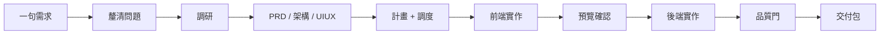
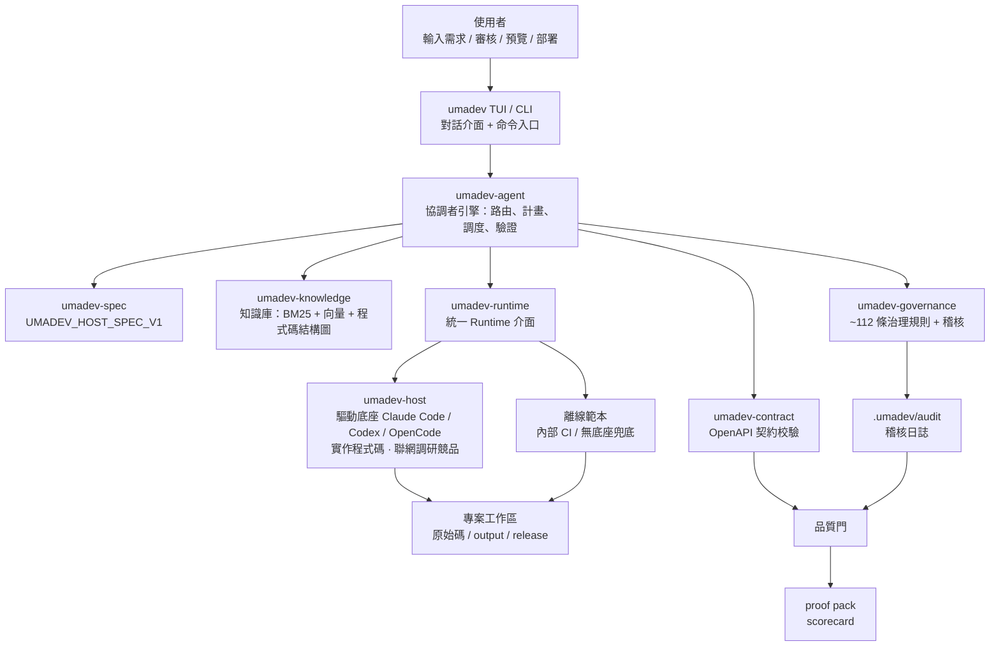
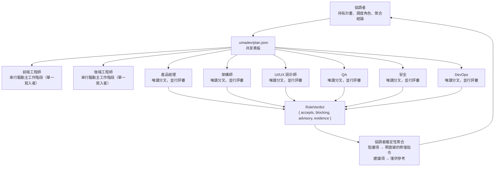
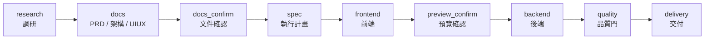
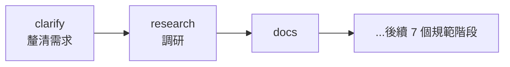
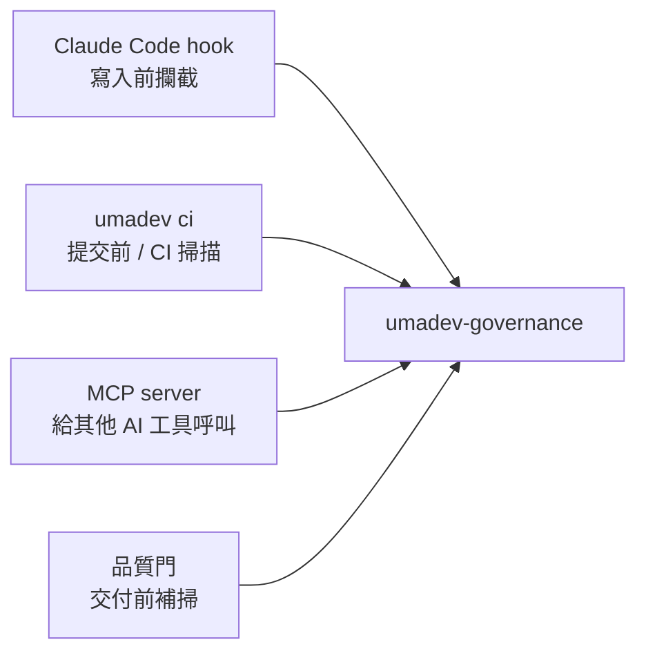
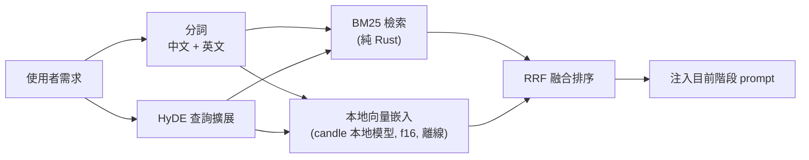
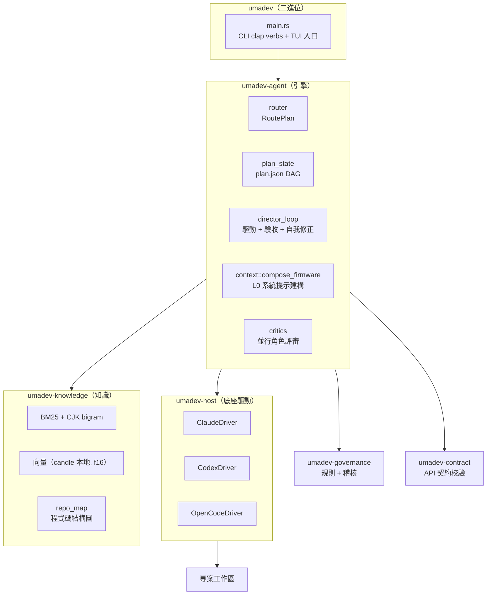

# umadev

<div align="center">


### UmaDev:一個模擬真實開發團隊工作的 Agent,指揮你已經在用的 Claude Code / Codex / OpenCode 幹活。

**產品經理 · 架構師 · UI/UX 設計師 · 前端 · 後端 · QA · 安全 · DevOps——八個角色像真實團隊一樣分工協作，把一句需求做成能上線、能交付、能稽核的商業級應用。底座是大腦，團隊替你交付，一個協調者負責調度與把關。**

[](LICENSE)
[](https://www.rust-lang.org/)
[](spec/UMADEV_HOST_SPEC_V1.md)
[](CHANGELOG.md)

[English](README.md) | [简体中文](README.zh-CN.md) | 繁體中文

</div>

---

<div align="center">

**官方微信群** — 掃碼加入,獲取更新 · 回報問題 · 和其他使用者交流


</div>

---

## 目錄

- [簡介](#簡介) · [專案來源](#專案來源) · [它解決什麼問題](#它解決什麼問題)
- [安裝](#安裝) · [快速上手](#快速上手) · [一個完整例子](#一個完整例子)
- [功能](#功能) · [它如何工作](#它如何工作) · [角色團隊如何協作](#角色團隊如何協作)
- [執行模式](#執行模式) · [交付流程](#交付流程) · [品質門](#品質門)
- [治理規則](#治理規則) · [知識庫](#知識庫) · [交付產物](#交付產物)
- [命令](#命令) · [設定](#設定) · [Rust 架構](#rust-架構) · [開發](#開發) · [授權](#授權)

---

## 簡介

umadev 是**一個模擬真實開發團隊來工作的 Coding Agent**。它驅動你已經在用的 AI 編碼工具——Claude Code、Codex、OpenCode——作為一個持續的工作階段來運作；它自己不接任何模型：你的底座接入的模型，就是它的大腦。

你用自然語言描述你想要什麼，**一支 AI 開發團隊**替你把它做出來——產品經理拆需求、架構師定契約、設計師出設計系統、前後端真寫程式碼、QA 跑測試、安全審攻擊面、DevOps 管交付。八個角色像真實團隊一樣分工協作，借你已登入的底座大腦（Claude Code / Codex / OpenCode），把一句需求做成能上線、能交付、能稽核的商業級應用。它按任務大小自動伸縮：小改動就只是小改動，完整專案才召集整支團隊。

團隊裡還有一個**協調者**（技術負責人）：它不寫程式碼，負責路由意圖、拆可視計畫、調度團隊、把關每道門、留下稽核證據；底座（AI 編碼 CLI）才是實際動手的工程師。八個角色各司其職、各有自己的產物，只透過共享的產物檔案和結構化結論溝通，絕不互相聊天。獨立開發者或小團隊，因此瞬間擁有一支完整、專業、有工程紀律的開發團隊。

它是一個 Rust 單一二進位檔。npm 只是分發殼。

---

## 安裝

推薦用 npm 安裝預編譯二進位：

```bash
npm install -g umadev
```

**Linux 上不要用 sudo。** npm 預設前綴（`/usr/local`）屬主是 root，一般使用者 `npm i -g` 會 `EACCES`；而 `sudo npm i -g` 看似「解決」了，實則在 npm 前綴裡留下一棵 **root 屬主**的目錄樹——之後你以一般使用者執行的每一條 npm 全域指令（`npm update -g`、`npm i -g <任何套件>`）都會 `EACCES`，且 npm 會整體回滾，**連帶**你的其它全域套件（含底座 CLI `@anthropic-ai/claude-code`、`@openai/codex`）也再也更新不動。正確做法是換一個你自己擁有的前綴：

```bash
npm config set prefix ~/.npm-global
export PATH="$HOME/.npm-global/bin:$PATH"   # 寫進 ~/.zshrc 或 ~/.bashrc
npm install -g umadev
```

或者乾脆不做全域安裝——不改前綴、不用 sudo、不佔 PATH：

```bash
npx umadev                 # 直接從 registry 拉起來跑
npm i umadev && npx umadev # 或作為專案本地相依
```

（不帶 `-g` 的 `npm i umadev` 是能裝上的，只是 npm 按設計**不會**把本地指令掛到 PATH 上，直接敲 `umadev` 會提示 command not found——這不是裝壞了，用 `npx umadev` 執行即可。）

已經踩到 sudo 的坑？`umadev doctor` 會檢出 root 屬主的安裝目錄或 npm 快取，並印出確切的修復指令（`sudo chown -R $(whoami) ~/.npm`，然後在自有前綴下重裝）。

npm 只是分發外殼。真正執行的是 Rust 編譯出的 `umadev` 二進位。

安裝時還會自動附帶一個小型本地嵌入模型（`multilingual-e5-small`，f16，約 224MB，作為可選依賴）並自動接好——它驅動離線向量檢索，無需 API key、執行時不連網，**無需手動下載**。若你的鏡像源或網路跳過了這個可選下載，umadev 仍可用：檢索降級為純 BM25，重新執行 `npm install -g umadev` 即可恢復向量通道。

預編譯二進位涵蓋：

- macOS Apple Silicon
- macOS Intel
- Linux x86_64
- Linux ARM64
- Windows x86_64

也可以從原始碼建置：

```bash
git clone https://github.com/umacloud/umadev.git
cd umadev && cargo build --release --features vector-local
./target/release/umadev --version
```

> **從原始碼建置？嵌入模型不在儲存庫裡（太大，約 224MB，git 放不下）。** 普通 `cargo build --release` 出來的是**純 BM25** 版；本地向量通道需要 `--features vector-local` **加上**磁碟上的模型。預編譯二進位和 `npm i` 會自動帶齊這兩樣——原始碼建置則需手動把 `multilingual-e5-small` 下載到 `~/.umadev/embed-model/` 一次：
>
> ```bash
> mkdir -p ~/.umadev/embed-model && cd ~/.umadev/embed-model
> for f in config.json tokenizer.json model.safetensors; do
>   curl -fsSL "https://huggingface.co/intfloat/multilingual-e5-small/resolve/main/$f" -o "$f"
> done
> ```
>
> umadev 會自動發現這個目錄（或用 `UMADEV_EMBED_MODEL_DIR` 指向任意放著這三個檔案的目錄）。沒有模型 umadev 仍可用——檢索降級為純 BM25。

你還需要裝好並登入一個 AI 編碼 CLI——那就是 umadev 驅動的大腦：

| 底座 | 安裝 | 登入 |
|---|---|---|
| Claude Code | `npm i -g @anthropic-ai/claude-code` | `claude auth login` |
| Codex | `npm i -g @openai/codex` | `codex login` |
| OpenCode | 見 opencode.ai | `opencode auth login` |

umadev 不往底座裡注入任何東西。你的底座配的是什麼——官方登入，還是你自己接的第三方 / 本地模型——跑的就是什麼。

---

## 專案來源

umadev 脫胎於原專案 [shangyankeji/super-dev](https://github.com/shangyankeji/super-dev)。

早期的 `super-dev` 更像一個 AI 編碼治理工具：主要關注「AI 生成程式碼時不能寫什麼」，例如不要用 emoji 當圖示、不要硬編碼顏色、不要寫不安全程式碼。

現在的 umadev 在這之上長成了一支完整的 AI 開發團隊：

- **從單點治理擴展到全流程治理**：不只檢查程式碼，而是把從需求到交付的每個階段都納入流程和門禁。
- **從零散腳本升級為規範驅動系統**：核心是 [UMADEV_HOST_SPEC_V1](spec/UMADEV_HOST_SPEC_V1.md)，所有實作都圍繞規範。
- **使用 Rust 重寫**：單一二進位、跨平台、啟動快、相依少，適合本地長期執行。
- **從「攔截問題」擴展到「帶著底座走完流程」**：Claude Code / Codex / OpenCode 是大腦和手，umadev 是組成整支團隊、包在外面的流程與治理軌道。

一句話概括這次演進：

> `super-dev` 關注「AI 不要寫爛程式碼」；`umadev` 關注「一支 AI 開發團隊如何把需求交付成可上線、可稽核的商業專案」。

---

## 它解決什麼問題

很多人第一次使用 AI 編碼工具時，都會遇到類似問題：

- AI 一開始就寫程式碼，沒有 PRD、沒有架構、沒有驗收標準。
- 前端做完了，後端 API 路徑對不上。
- UI 看起來像範本，顏色和字體很隨意。
- AI 寫了佔位程式碼、假資料、TODO，卻說「完成了」。
- 修改一次需求後，上下文開始混亂，前面約定被忘掉。
- 程式碼能生成，但沒有品質報告、沒有證據鏈，不知道能不能交付。
- 團隊有自己的規範和知識庫，但每次都要手動複製給 AI。

umadev 的目標是把這些問題系統化解決。它讓 AI 走一條更像真實團隊的流程：



---

## 快速上手

```bash
umadev                       # 啟動對話介面；首次執行會讓你選一個底座
```

然後告訴它你要做什麼：

```text
> 給報表頁加上 CSV 匯出
> 幫我做一個帶 Postgres 後端的待辦應用
> /goal 做一個能上線的 SaaS 著陸頁          # 持續做到目標達成
```

也可以非互動地跑一次建置：

```bash
umadev run "給報表頁加上 CSV 匯出" --backend claude-code
```

umadev 由底座自己的模型判斷工作量大小——你不用選模式。一次建置跑在獨立的 `umadev/<slug>` 分支上：你的工作分支不會被動，umadev 也絕不自動合併或推送。

在對話介面裡直接描述需求就能觸發完整建置——不需要切換到 CLI。打在對話框裡的建置請求走的是和 `/run` 完全相同的計畫 → 調度 → 驗證 → 收尾流程。

### 第一次啟動

第一次開啟 umadev 會讓你選擇：

1. 介面語言。
2. 使用哪個底座：Claude Code、Codex 或 OpenCode（你已經登入的那個）。

之後直接輸入需求，umadev 會組織完整流程。

### 預覽和交付

前端階段完成後：

```text
/preview
```

交付階段完成後：

```text
/deploy
```

最終交付證據會在：

```text
output/
release/
.umadev/audit/
```

---

## 一個完整例子

假設你在一個空專案裡執行：

```bash
umadev init
umadev
```

然後輸入：

```text
做一個課程預約小程式，使用者可以查看課程、選擇時間、預約、取消預約，管理員可以管理課程和預約記錄。
```

umadev 會做這些事：

1. **理清需求**：補全目標平台、是否需要支付、管理後台複雜度等合理預設假設（自動模式下自動推進；手動模式可逐條確認）。
2. **聯網調研**：當底座具備聯網能力時，搜尋同類小程式和預約系統的競品功能、定價、設計趨勢；同時檢索內建知識庫裡的預約系統、後台 CRUD、權限、表單校驗等規範。兩者合併產出調研報告 `output/<slug>-research.md`。
3. 生成 PRD，明確使用者角色、功能範圍、可測驗收標準。
4. 生成架構文件，定義資料模型、API、鑑權、部署方式。
5. 生成 UI/UX 文件，定義設計方向、顏色 token、字體、元件狀態、圖示庫。
6. 拆成執行計畫和任務（每個任務回鏈到需求 FR 編號），算繪為可調度的即時清單（`.umadev/plan.json`）。
7. 驅動底座實作前端。
8. 暫停讓你預覽。
9. 驅動底座實作後端和整合。
10. 跑品質門：文件、契約、建置、設計、安全、交付檔案全部檢查。
11. 生成交付包和成績單。

整個過程會在磁碟上留下真實檔案：文件、原始碼、品質報告、交付包。

---

## 功能

- **驅動你已經在用的底座。** Claude Code、Codex、OpenCode，作為一個持續工作階段執行，讓底座在整次建置裡保留上下文，而不是每一步都從零開始。它沒有自己的 API key。
- **把工作拆成計畫，並讓你看見。** 一次建置會變成一份相依計畫（`.umadev/plan.json`），算繪成一個可用 `/plan` 調度的即時清單。`EngineEvent::PlanPosted` 和 `PlanStepStatus` 事件讓計畫進度在終端介面上實時可見。
- **一支完整的開發團隊，不是一個助手。** 八個專家——產品經理、架構師、UI/UX 設計師、前端、後端、QA、安全、DevOps——各自負責一項產物（PRD、API 契約、設計系統、前後端程式碼、測試 + 執行時證明、安全稽核、部署證明），像真實團隊一樣計畫、實作、評審、簽核；一個協調者負責調度、持有計畫、把關每道門。寫程式碼的角色串行驅動主工作階段（單一寫入者），評審角色各自在唯讀分叉上並行評審，把結構化結論（`RoleVerdict { accepts, blocking, advisory, evidence }`）交回來，阻塞項折成一條帶證據的修復指令注入主工作階段。角色之間不對話——只透過共享的產物檔案和各自的結論溝通。
- **跑品質與治理檢查。** 建置 / 測試 / lint、一項前後端契約校驗（前端呼叫是否與後端路由對得上）、一個啟動應用並探測其路由的執行時驗證（`runtime-proof.json`），以及一個會擋下 emoji 當圖示、硬編碼顏色、外洩密鑰、AI 範本痕跡的規則引擎（規範層 32 條 clause、實作層約 112 條規則）。
- **交付一份證明。** PRD、架構、UI/UX 文件、一份成績單和一個證明包——按任務裁剪，一個改一頁的活兒不會塞一疊企業文件給你。
- **全本地雙通道 RAG。** 459 個精選知識檔案＋你現有程式碼的地圖編進二進位檔，每個工作回合由雙通道混合引擎檢索：純 Rust BM25 ＋本地向量模型（multilingual-e5-small、f16、candle）以 RRF 融合＋HyDE 查詢擴展；無 key、無網路、零設定。
- **自進化記憶。** 帶頻率訊號記坑 → 真正復發時觸發更高層的 reflection → 召回進後續提示，同樣的坑不再犯，用得越久越懂你的程式碼庫。
- **記住專案的事實。** 底座發現的穩定事實——JDK 路徑、真實的建置 / 測試 / lint 命令、環境約束——寫進 `.umadev/memory/facts.jsonl` 每回合回灌，就算轉錄被裁剪，團隊也不會重新查它已經知道的東西。
- **轉達底座的追問。** 底座建置中用 `AskUserQuestion` 工具提問時，umadev 把問題和編號選項內聯算繪、把你的回答轉回同一工作階段——而不是讓追問靜默自動取消。
- **App 執行時模型由你決定。** 借來「寫」程式碼的底座，和你「做出來」的 AI 應用執行時呼叫的模型分開：umadev 把應用的執行時 provider、model id、key 當作使用者可設定的 env，絕不把開發底座的廠商悄悄寫死進產物。
- **一個真正的終端介面。** Markdown 渲染、語法高亮程式碼、檔案改動時的即時 diff 卡片（字詞級高亮）、可折疊工具列、一張帶可點擊預覽位址的建置完成卡、貫穿全程的斜線命令，以及 `/logs` 把底座的即時建置輸出顯示出來（長命令也看得見）。
- **可稽核的治理。** 一個信任檔位（`plan` / `guarded` / `auto`）、不可逆操作在每一檔都一律確認——包含對混淆命令的失敗關閉邊界、一個把治理器暴露給其它工具的 MCP server（`umadev mcp serve`），以及合規對應（SOC 2 / ISO 27001 / EU AI Act）。

---

## 它如何工作

整體架構可以理解成五層，每次向底座的諮詢都會在出錯時退回安全預設，所以一個 bug 或一個連不上的底座都不會卡住你：



一個回合最多流經五層：

1. **L0 底座韌體。** 一套精選的系統提示——身分與工藝規範、知識庫裡相關的那一片、從每次執行裡召回的踩坑，以及你現有程式碼的結構概覽（`repo_map`）——在每一條路徑底下注入底座，留下稽核記錄。
2. **L1 路由。** 底座自己的模型判斷這條訊息需要什麼——一個小改動、一次除錯，還是一次完整建置（`route_via_brain`：一次無狀態的 `complete()` 判斷，底座的模型自己決定，不用關鍵字清單）。路由結果以 `EngineEvent::IntentDecided` 呈現，你看得見「小改動，搞定」還是「完整建置，進入交付流程」，也可以覆寫。
3. **L2 計畫 + 調度。** 一次建置被拆成一份由 umadev 持有的相依計畫（`.umadev/plan.json`），算繪成可用 `/plan` 調度的即時清單。做程式碼的角色串行驅動主工作階段（單一寫入者）；評審的角色唯讀分叉、並行評審。
4. **L3 驗證與自我修正。** 每一步都在一條確定性底線上對照它的驗收（覆蓋、契約、建置 / 測試、硬門），而不是讓模型自評「差不多了」。阻塞項作為一條帶證據的修復指令回來，迴圈在做完或卡住時（有界的間距計數器和停滯計數器）乾淨退出。
5. **L4 收尾。** 底線乾淨之後，umadev 產出交付物和證明包；每次執行的片段回饋進自我進化記憶。

完整的交付路徑（研究 → 文件 → 規格 → 前端 → 預覽 → 後端 → 品質 → 交付）是最完整的一條路徑，在一次重型從零建置需要時才走；多數訊息會路由到更短的流程。

完整模型見 [`docs/PRODUCT_VISION_AND_ROADMAP.md`](docs/PRODUCT_VISION_AND_ROADMAP.md) 和規格 [`spec/UMADEV_HOST_SPEC_V1.md`](spec/UMADEV_HOST_SPEC_V1.md)。

---

## 角色團隊如何協作

umadev 是**一支八角色的開發團隊**，外加一個協調者統籌全程。每個角色都有自己的真實產物落到黑板上：

| 角色 | 它產出什麼（黑板上的產物） |
|---|---|
| 產品經理 | 拆需求、使用者故事、EARS 驗收標準 — `*-prd.md` |
| 架構師 | 分層、資料模型、API 契約 — `*-architecture.md` + `openapi.*` |
| UI/UX 設計師 | 設計系統：令牌、字體、元件狀態、頁面骨架 — `*-uiux.md` |
| 前端工程師 | 匯入令牌、呼叫契約 URL 的元件 / 頁面 |
| 後端工程師 | 資料模型、端點、對齊契約的業務邏輯 |
| QA | 真跑測試 + 執行時探測 — `runtime-proof.json` |
| 安全 | 威脅模型 + SAST：鑑權 / 越權 / 注入 / 密鑰 |
| DevOps | 建置、CI、部署證明 — `deploy-proof.json` |
| 協調者（技術負責人） | 路由意圖、持有計畫、調度團隊、把關每道門、留稽核證據 |

這個設計的關鍵在分工方式：



幾個關鍵設計：

- **做程式碼的角色（前端 / 後端工程師）串行驅動主工作階段**，確保工作區有單一寫入者，不會互相覆蓋。
- **評審角色（產品、架構、設計、QA、安全、DevOps）各自在唯讀的分叉工作階段上並行跑**，不佔用主工作階段的時間。
- **角色之間只透過共享的產物檔案和各自的結論溝通**，不互相聊天。
- **協調者確定性聚合結論**：底線（覆蓋 / 契約 / 建置 / 硬門）控制迴圈；評審結論只是建議，永遠不會直接終止迴圈；阻塞項折成一條帶證據的修復指令，注回主工作階段。
- **團隊規模與任務複雜度對應**：修一個 bug 不調度任何評審團隊；一次從零建置才召集完整陣容。

---

## 執行模式

### 驅動本機 AI 編碼 CLI（推薦模式）

| Backend ID | 實際程式 | umadev 如何呼叫 | 適合誰 |
|---|---|---|---|
| `claude-code` | `claude` | `claude --print --output-format text` | 已經在用 Claude Code 的使用者 |
| `codex` | `codex` | `codex exec --sandbox workspace-write` | 已經在用 Codex CLI 的使用者 |
| `opencode` | `opencode` | `opencode run` | 已經在用 OpenCode 的使用者 |

### 底座自帶模型——umadev 不接外部 API

umadev 不自帶模型，也不接第三方 API。底座用它自己的模型（你訂閱登入的，或你給底座自己配的第三方 / 本地模型）。選底座時 umadev 會讀出並顯示它當前用的模型與思考強度（`/status` 也能看），但不會覆寫：執行時預設不傳 `--model`，底座用它自己的；想換就改底座自己的設定，或在 `~/.umadev/config.toml` 裡填 `model` / 用 `umadev run --model <id>` 覆寫。TUI 裡的 `/model` 命令不改任何東西——它只告訴你模型在哪（底座持有），因為 umadev 從不強加模型。

umadev 讀取的來源：claude 的 `~/.claude/settings.json`（`model` / `effortLevel`）、codex 的 `~/.codex/config.toml`（`model` / `model_reasoning_effort`）、opencode 的 `opencode.json`（`model`，思考強度內建在模型變體裡）。

連續工作階段啟動時預先載入一次，所以第一次回覆不用承擔 30–60 秒的冷啟動代價。

### `/goal` 模式

```text
/goal 做一個能上線的 SaaS 著陸頁
```

`/goal <目標>` 讓協調者帶著團隊持續建置直到目標達成。三個底座都支援原生 `/goal` 模式；設 `UMADEV_NO_GOAL_MODE=1` 可退出。

### 離線範本（內部兜底，不是產品）

```text
/offline
```

離線模式不呼叫任何模型，也不存取網路。它不是一個讓你選的產品形態——產品永遠是「驅動你登入的底座」。離線範本只是沒有底座可用時的確定性兜底，適合快速看檔案結構、CI smoke test 和流程示範。第一次啟動的底座選擇器只列這三個底座，不把離線當選項。

---

## 交付流程

規範主鏈是 9 個階段，是一次重型從零建置的最完整交付路徑（多數請求會路由到更短的流程）：



目前產品實作還在主鏈前增加了一個 `clarify` 微階段：



小任務有輕量路徑：底座的模型先判意圖，協調者據此裁剪或展開計畫——對話不進流程、bugfix 不組隊、小改動不會強行拉你走 PRD / 架構 / UIUX 全套；想強制走快路徑用 `/quick`。

### 每個階段會產出什麼

| 階段 | 可以理解成 | 主要檔案 |
|---|---|---|
| `clarify` | 先把需求問清楚 | `output/<slug>-clarify.md`、`output/<slug>-clarify-answers.md` |
| `research` | 聯網調研競品、領域、風險、設計趨勢 | `output/<slug>-research.md` |
| `docs` | 寫三份核心文件 | `output/<slug>-prd.md`、`output/<slug>-architecture.md`、`output/<slug>-uiux.md` |
| `docs_confirm` | 讓你確認文件方向 | `.umadev/workflow-state.json` |
| `spec` | 拆任務和執行計畫 | `output/<slug>-execution-plan.md`、`.umadev/changes/<id>/tasks.md`、`.umadev/plan.json` |
| `frontend` | 前端實作和預覽說明 | `output/<slug>-frontend-notes.md` |
| `preview_confirm` | 讓你看前端效果 | TUI gate 狀態 |
| `backend` | 後端實作和整合說明 | `output/<slug>-backend-notes.md` |
| `quality` | 獨立品質檢查 | `output/<slug>-quality-gate.json`、`output/<slug>-quality-gate.md` |
| `delivery` | 最終交付 | `output/<slug>-delivery-notes.md`、`release/proof-pack-*.zip`、`release/scorecard-*.html` |

---

## 品質門

品質門是 umadev 的交付前驗收。它會檢查：

- PRD 是否有目標、範圍、驗收標準。
- 架構文件是否有 API、資料模型、錯誤處理、鑑權。
- UI/UX 文件是否有設計 token、字體、圖示庫、元件狀態、暗黑模式。
- 前端呼叫的 API 和後端契約是否一致。
- 是否存在 emoji 圖示、硬編碼顏色、AI 範本痕跡。
- 是否有建置、測試、lint、typecheck 結果。
- 是否生成 Dockerfile、CI、migration、`.env.example`。
- 是否外洩 API key、密碼、連線字串。
- 是否有稽核日誌和合規對應。

輸出檔案：

```text
output/<slug>-quality-gate.json
output/<slug>-quality-gate.md
```

預設通過線是 90 分：

```toml
[quality]
threshold = 90
skip_checks = []
```

---

## 治理規則

umadev 最早來自治理工具，這部分仍然是核心能力。

這些規則是一條治理基線，不是絕對真理——每條都可以在 `.umadev/rules.toml` 裡停用、按路徑排除或調參。它們的作用是給底座的產出兜底，而不是替你做最終的工程判斷。

規範層有 32 條 clause，實作層目前有約 112 條規則，覆蓋 UI 品質、安全、前端架構、後端工程和多語言危險模式。

治理入口：



專案可以透過 `.umadev/rules.toml` 調整：

```toml
[disabled]
clauses = []

[exclusions]
paths = ["src/legacy/**", "**/*.test.ts"]

[extra]
blocked_domains = ["internal-bad-proxy.corp"]
```

---

## 知識庫

umadev 內建了 459 份 markdown 知識檔案，是一套給底座看的商業級工程標準庫。知識庫編譯進二進位檔，啟動時自動解壓到 `~/.umadev/knowledge`，之後無需重複下載，零設定可用。

它覆蓋產品、PRD、架構、前端、後端、資料庫、安全、測試、CI/CD、運維、行動端、桌面、小程式、鴻蒙、跨平台、行業知識、UI/UX、設計系統和專家方法論。

檢索方式：



**雙通道本地混合檢索。** BM25（純 Rust、CJK 友善）＋稠密向量兩通道以 RRF 融合，HyDE 先擴展召回；向量通道用 multilingual-e5-small（f16）經 candle **本地執行**——隨安裝內建，無需 API key、無網路，毫秒級召回你自己的專案規範與業務文件；模型缺失時降級為純 BM25（fail-open）；不需要也不使用任何雲端嵌入服務。

**自我進化記憶。** 建構中底座踩的坑會帶頻率訊號記到本地儲存；真正復發時 umadev 讓底座給出更高層的修正策略（reflection）；兩者都會召回進後續提示，同樣的坑不再重複——用得越久，在你的程式碼庫上越少犯同樣的錯。

程式碼結構圖（`repo_map`）是另一條知識管道：umadev 掃描你現有程式碼、做符號排名、裁剪到 token 預算，作為 L0 韌體的一部分注入底座，讓底座在改動現有程式庫時有完整的上下文。

你也可以加入自己的團隊知識：

```bash
umadev knowledge-manage add ./team-docs --name team-docs
umadev knowledge-manage search "支付 webhook 冪等"
```

---

## 交付產物

一次完整執行後，目錄大致是：

```text
your-project/
  output/
    app-clarify.md
    app-research.md
    app-prd.md
    app-architecture.md
    app-uiux.md
    app-execution-plan.md
    app-frontend-notes.md
    app-backend-notes.md
    app-quality-gate.json
    app-quality-gate.md
    app-compliance-mapping.json
    app-delivery-notes.md

  .umadev/
    plan.json
    workflow-state.json
    audit/
      tool-calls.jsonl
      frontend-api-calls.jsonl
      verify.jsonl
    reflections/

  release/
    proof-pack-app-20260620090000.zip
    proof-pack-app-20260620090000.manifest.txt
    scorecard-app-20260620090000.html
    runtime-proof.json
```

其中最重要的是：

```text
release/proof-pack-<project>-<time>.zip
release/scorecard-<project>-<time>.html
```

這兩個檔案就是給團隊、客戶或審核者看的交付證明。

---

## 命令

umadev 有兩套入口，一一對應：

- **TUI 斜線命令** —— 在 `umadev` 對話介面裡輸入 `/`，日常推薦。
- **終端 CLI 子命令** —— 指令稿 / CI 用，無需進 TUI。

> TUI 裡輸入 `/` 會彈出命令補全浮層，`Tab` 補全、`↑↓` 切換；`/help`（或 F1）列出全部命令和快捷鍵。

### TUI 斜線命令

**選擇底座與模型**

| 命令 | 作用 |
|---|---|
| `/claude` · `/codex` · `/opencode` | 切換驅動的本機底座 CLI（存入 `~/.umadev/config.toml`） |
| `/offline` | 切到離線確定性範本（展示 / CI，完全不連網） |
| `/status` | 當前底座、它的驅動模型和思考強度（讀自底座自己的設定，umadev 不覆寫） |
| `/model [id]` | 只告訴你模型在哪——底座持有，umadev 不強加（要覆寫就改 config 的 `model` 或用 `run --model`） |
| `/sandbox [檔位]` | 檢視 / 切換 Codex 底座的啟動沙箱（`read-only` · `workspace-write` · `danger-full-access`） |

**驅動流程與過閘**

| 命令 | 作用 |
|---|---|
| 直接打字 | 發給底座，由底座自己的模型判斷意圖；若有確認閘開啟，則作為修改意見 |
| `/run [slug] <需求>` | 顯式開始一次完整建置 |
| `/goal <目標>` | 持續建置直到目標達成（三個底座都支援；`UMADEV_NO_GOAL_MODE=1` 退出） |
| `/quick <任務>` | 強制走輕量路徑，處理瑣碎的一次性改動 |
| `/plan [skip\|add\|veto\|up\|down <id>]` | 檢視 / 步級調度當前計畫 |
| `/continue`（閘上也可直接輸 `c`） | 通過當前確認閘、進入下一階段 |
| `/revise <回饋>` | 停在當前閘，帶回饋重做本階段 |
| `/redo [階段]` | 重跑某個階段塊 |
| `/mode <plan\|guarded\|auto>` | 設定信任 / 自主檔位 |
| `/manual` · `/auto` | 切換「逐閘人工確認 / 全自動」（預設 `guarded`；`shift+Tab` 也可切換） |
| `/cancel` · `/abort` | 中止當前執行（工作區狀態保留，下次可續跑） |
| `/tasks [stop\|resume]` | 列出 / 管理背景執行 |
| `/adopt` | 接管現有（棕地）倉庫：偵測技術棧、索引原始碼、反推契約 |
| `/init` | 寫入 `umadev.yaml` manifest |
| `/diff [產物]` | 檢視某個產物（預設 `prd`，也可 `architecture` / `uiux` / …） |

**預覽與交付**

| 命令 | 作用 |
|---|---|
| `/preview` · `/stop-preview` | 啟動 / 停止 dev server 並開啟瀏覽器 |
| `/deploy` | 偵測目標並**預覽**部署命令（真正部署用 `umadev deploy --run`） |
| `/pr [create]` | 試跑 PR（評審報告 + proof-pack 作為正文）；`/pr create` 真正開 PR |
| `/export` | 匯出當前工作階段 |

**檢查點與回滾**（影子 git，不碰你自己的 `.git`）

| 命令 | 作用 |
|---|---|
| `/checkpoint [標籤]` | 給當前工作區檔案打快照 |
| `/rewind [id]` | 列出 / 回滾到某個檔案檢查點 |

**檢視產物與狀態**

| 命令 | 作用 |
|---|---|
| `/spec` | 檢視完整 `UMADEV_HOST_SPEC_V1` 規範 |
| `/verify` | 工作區合規報告 + 證據鏈 |
| `/doctor` | 自檢（二進位 / manifest / 探針） |
| `/status` | 當前階段 / 閘 / 執行狀態 |
| `/team` · `/constitution` | 即時團隊花名冊 · 團隊運作章程 |
| `/lessons` · `/pitfalls` | 本專案學到的（已驗證模式 · 復發踩坑） |
| `/knowledge` | 本次命中的知識庫條目 |
| `/usage` | token / 用量統計 |
| `/history` · `/runs` | 過去的閘快照 · 過去的執行 |
| `/sessions` · `/resume <id>` · `/compact` | 列出 · 繼續 · 壓縮持久化對話 |
| `/skill` · `/mcp` | 已安裝的 Skill / MCP server |
| `/config` | 當前生效設定 |
| `/version` · `/changelog` | 建置版本 · 更新日誌 |

**設計與專案**

| 命令 | 作用 |
|---|---|
| `/design <方向>` | 鎖定設計系統方向（`modern-minimal` / `editorial-clean` / …） |
| `/template <名字>` | 選鷹架範本 |

**通用與介面**

| 命令 | 作用 |
|---|---|
| `/help`（或 F1） | 說明浮層（含全部快捷鍵） |
| `/lang [zh-CN\|zh-TW\|en]` | 切換介面語言 |
| `/setup` | 重新走首啟底座選擇器 |
| `/logs` | 切換底座即時行程輸出的可見性（預設關） |
| `/mouse` · `/animations` · `/redraw` | 切換滑鼠捕捉 · 動畫 · 強制重繪 |
| `/bug` | 開啟預填的 bug 回報 |
| `/clear` | 清空對話 |
| `/quit`（或 Esc） | 退出（工作流狀態已保存，可續跑） |

### 終端 CLI 子命令

**工作區生命週期**

| 命令 | 作用 |
|---|---|
| `umadev init` | 鷹架工作區（寫 `umadev.yaml` + 設計系統 / 範本 / 知識庫種子） |
| `umadev`（無子命令） | 啟動對話 TUI |
| `umadev doctor` | 自檢 |
| `umadev verify` | 工作區合規 + 證據鏈狀態（加 `--runtime` 啟動應用並探測路由，寫入 `runtime-proof.json`） |
| `umadev report` | 合規對應（SOC 2 / ISO 27001 / EU AI Act）；加 `--review` 產出 PR 前的評審報告與安全掃描 |
| `umadev history` | 列出回滾快照 |
| `umadev rollback latest` | 回滾到某快照 |
| `umadev update` | 升級 umadev 到最新版（經 npm） |
| `umadev uninstall` | 完整解除安裝：確認後刪 `~/.umadev` + 本專案治理掛鉤 + 二進位（加 `--base <claude-code\|pre-commit>` 則僅卸掛鉤） |
| `umadev adopt` | 棕地專案：偵測技術棧、索引現有原始碼、反推 API 契約 |
| `umadev lessons` | 高頻踩坑 + 已驗證模式 |
| `umadev usage` | token 用量 + 大致成本 |

**非互動執行（指令稿 / CI）**

| 命令 | 作用 |
|---|---|
| `umadev run "<需求>" --backend <id>` | 跑一次建置，停在 `docs_confirm` 閘 |
| `umadev run --mode plan\|guarded\|auto` | 設定信任檔位（預設 `guarded`） |
| `umadev continue [--backend <id>]` | 通過當前閘（自動沿用上次的 `--backend`） |
| `umadev revise "<回饋>"` | 停在閘，記錄修改並重跑本塊 |
| `umadev quick "<任務>"` | 非互動輕量路徑 |
| `umadev spec [--clauses]` | 列印規範（`--clauses` 看條款表） |

**治理 / CI**

| 命令 | 作用 |
|---|---|
| `umadev ci [--changed-only] [--report-only]` | 對工作區每個原始檔跑治理（CI 模式） |
| `umadev install --base <claude-code\|pre-commit\|…>` | 把 pre-write 治理掛鉤裝到底座 CLI 或 git pre-commit |

**平台擴充**

| 命令 | 作用 |
|---|---|
| `umadev mcp serve` | 作為 MCP server 執行——把 `govern_file` / `govern_command` 暴露給 Claude Desktop / Cursor / Continue 等 |
| `umadev mcp-manage <install\|list\|remove>` | 管理底座的 MCP server |
| `umadev skill <install\|list\|remove>` | 管理 Skill（知識 + 規則 + 提示詞包） |
| `umadev knowledge-manage <add\|list\|search\|remove>` | 管理自訂知識庫文件 |
| `umadev pr [--create]` | 預覽 PR（預設僅試跑；加 `--create` 開啟 PR） |
| `umadev deploy [--run]` | 偵測部署目標（加 `--run` 執行部署，寫入 `deploy-proof.json`） |

**說明**

| 命令 | 作用 |
|---|---|
| `umadev examples` | 命令速查表 |
| `umadev guide` | 60 秒上手教學 |

### 常用環境變數

| 變數 | 作用 | 預設 |
|---|---|---|
| `UMADEV_CLAUDE_BIN` / `UMADEV_CODEX_BIN` | `claude` / `codex` 二進位路徑 | `claude` / `codex` |
| `UMADEV_WORKER_TIMEOUT` | 單次 worker 逾時（秒） | `300` |
| `UMADEV_VERIFY_TIMEOUT_SECS` | verify 迴圈單次逾時（秒） | `120` |
| `UMADEV_MODEL_PLAN` / `UMADEV_MODEL_BUILD` | 分階段模型分層覆寫（規劃階段 / 寫碼階段） | — |
| `UMADEV_CONTINUOUS` | 設 `0`（或 `UMADEV_LEGACY_RUN=1`）退出持續單工作階段，改用每次單獨呼叫 | `1` |
| `UMADEV_NO_GOAL_MODE` | 設 `1` 停用 `/goal` 原生模式 | — |
| `UMADEV_SHOW_PROCESS_LOGS` | 預置底座即時行程日誌可見性（也可在 App 內用 `/logs` 切換） | 關 |
| `OPENAI_EMBED_KEY` | 啟用遠端向量嵌入（否則用內建離線模型 + BM25） | — |
| `XDG_CONFIG_HOME` | `config.toml` 的基目錄 | `$HOME` |

---

## 設定

使用者設定在 `~/.umadev/config.toml`：

```toml
backend = "claude-code"
lang = "zh-TW"
# model 預設留空——底座用它自己配的模型；
# 只有想覆寫時才填（或用 `umadev run --model <id>`）。
# model = "opus"
```

專案級設定：

```text
.umadevrc
```

```toml
[quality]
threshold = 90
skip_checks = []

[pipeline]
skip_phases = []
max_review_rounds = 3
auto_approve_gates = true

[knowledge]
enabled = true
engine = "hybrid"
top_k = 6
```

信任檔位控制自主程度：`umadev run --mode plan|guarded|auto`（預設 `guarded`）。不可逆操作——git merge/reset、刪除、部署、連網推送——在任何檔位都會確認。

---

## Rust 架構

umadev 是一個 10 crate Rust workspace。

| Crate | 普通人理解 | 技術職責 |
|---|---|---|
| `umadev` | 主程式 | CLI、TUI 入口、doctor、hook、CI、MCP / Skill / Knowledge 管理 |
| `umadev-spec` | 規則說明書 | `UMADEV_HOST_SPEC_V1` 的 Rust 資料，32 條 clause |
| `umadev-governance` | 品質檢查和紅線 | ~112 條治理規則、稽核、策略、合規對應 |
| `umadev-agent` | 流程編排引擎 | 路由、計畫 DAG、角色調度、驗收迴圈、自我修正、交付收尾 |
| `umadev-runtime` | 統一大腦介面 | `Runtime` trait、`OfflineRuntime`、`RuntimeKind` |
| `umadev-host` | 驅動外部 CLI | Claude Code、Codex、OpenCode 子行程驅動；`BACKEND_IDS` 是權威清單 |
| `umadev-contract` | API 對帳員 | OpenAPI 契約、前後端路徑校驗 |
| `umadev-knowledge` | 知識檢索 | 純 Rust BM25、chunk、tokenizer、本地向量通道（multilingual-e5-small、f16、candle，內建離線；遠端 `OPENAI_EMBED_KEY` 僅為可選覆寫）、HyDE 查詢擴展、RRF 融合、`repo_map` 程式碼結構圖 |
| `umadev-tui` | 終端介面 | ratatui 對話 UI、Markdown 渲染、diff 卡片、建置完成卡 |
| `umadev-i18n` | 多語言 | 簡體中文、繁體中文、English |



---

## 開發

要求：

- Rust 1.87+
- Cargo
- 如果要測試 npm 分發，需要 Node.js 18+

常用命令：

```bash
cargo build --workspace
cargo test --workspace
cargo clippy --workspace --all-targets -- -D warnings
cargo fmt --all
```

Clippy 以 `pedantic` 層級全 workspace 執行；新程式碼必須以 `-D warnings` 通過。

推薦閱讀順序：

1. [spec/UMADEV_HOST_SPEC_V1.md](spec/UMADEV_HOST_SPEC_V1.md)
2. [crates/umadev-spec/src/lib.rs](crates/umadev-spec/src/lib.rs)
3. [crates/umadev-agent/src/router.rs](crates/umadev-agent/src/router.rs)
4. [crates/umadev-governance/src/rules.rs](crates/umadev-governance/src/rules.rs)
5. [crates/umadev/src/main.rs](crates/umadev/src/main.rs)

### 文件

- [`docs/PRODUCT_VISION_AND_ROADMAP.md`](docs/PRODUCT_VISION_AND_ROADMAP.md) — 權威的產品模型
- [`spec/UMADEV_HOST_SPEC_V1.md`](spec/UMADEV_HOST_SPEC_V1.md) — 規格（條款、階段、門）
- [`CHANGELOG.md`](CHANGELOG.md) — 版本歷史
- [`CLAUDE.md`](CLAUDE.md) — 貢獻者用的儲存庫指南

---

## 授權

[MIT](LICENSE)。
