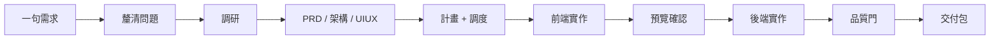
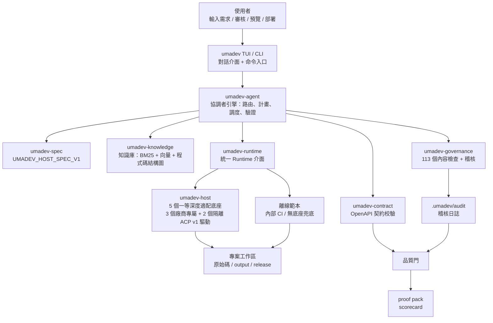
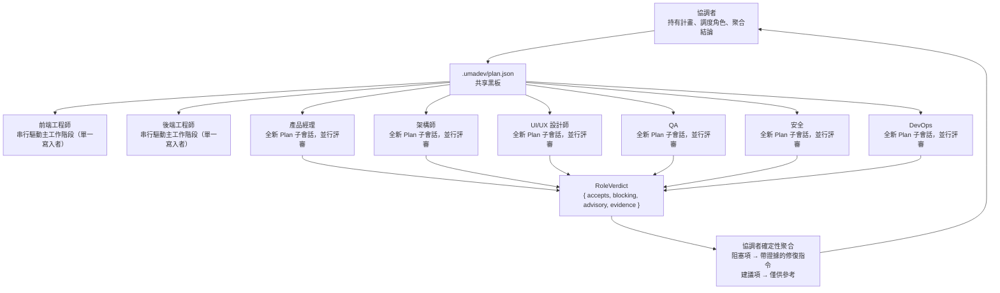
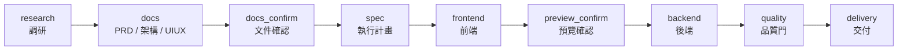
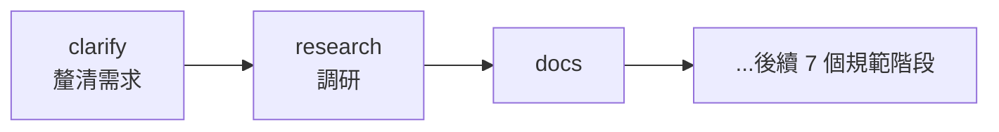
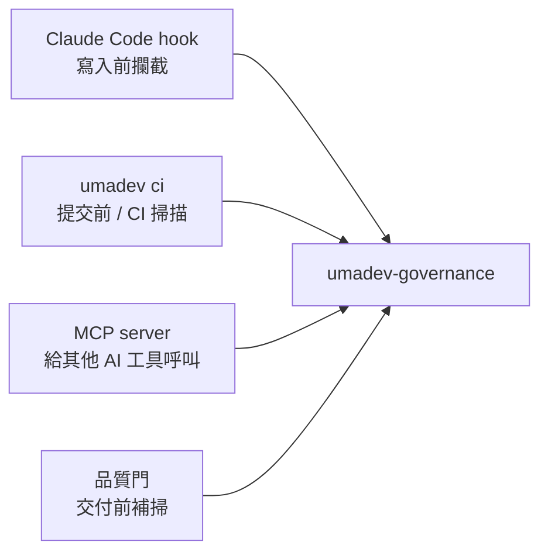
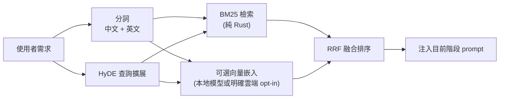
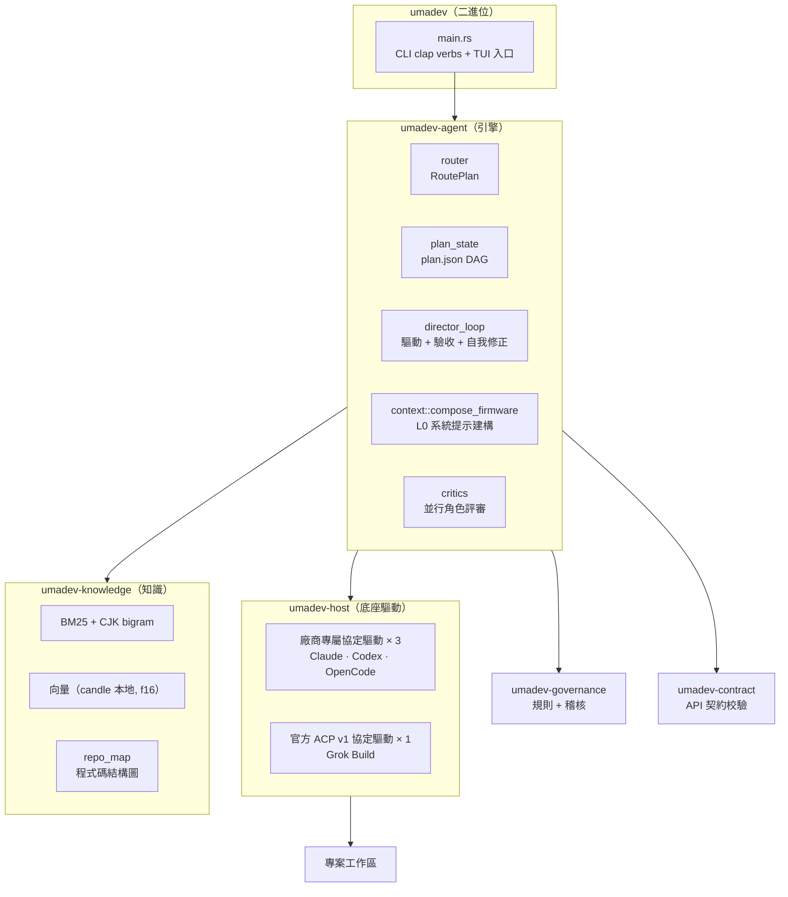

# umadev

<div align="center">


### UmaDev：一個模擬真實開發團隊工作的 Agent，指揮你已經在用的五種 AI 編碼 CLI 幹活。

**按任務深度模擬產品、架構、UI/UX、前端、後端、QA、安全、DevOps 職責；底座是大腦，協調者持有計畫與確定性驗收，失敗不會包裝成完成。**

[](LICENSE)
[](https://www.rust-lang.org/)
[](spec/UMADEV_HOST_SPEC_V1.md)
[](CHANGELOG.md)

[English](README.md) | [简体中文](README.zh-CN.md) | 繁體中文

</div>

---

<div align="center">

**官方微信群** — 掃碼加入,獲取更新 · 回報問題 · 和其他使用者交流


</div>

---

## 目錄

- [簡介](#簡介) · [專案來源](#專案來源) · [它解決什麼問題](#它解決什麼問題)
- [安裝](#安裝) · [快速上手](#快速上手) · [一個完整例子](#一個完整例子)
- [功能](#功能) · [它如何工作](#它如何工作) · [角色團隊如何協作](#角色團隊如何協作)
- [執行模式](#執行模式) · [交付流程](#交付流程) · [品質門](#品質門)
- [治理規則](#治理規則) · [知識庫](#知識庫) · [交付產物](#交付產物)
- [命令](#命令) · [設定](#設定) · [Rust 架構](#rust-架構) · [開發](#開發) · [授權](#授權)

---

## 簡介

umadev 是**一個模擬真實開發團隊來工作的 Coding Agent**。它驅動五個一等 AI 編碼底座之一——Claude Code、Codex、OpenCode、Grok Build 或 Kimi Code；它自己不持有模型端點：所選底座接入的模型，就是它的大腦。

五個都是一等支援底座，使用同一套 UmaDev 產品合約。Claude Code、Codex、OpenCode 使用廠商專屬協定；Grok Build 與 Kimi Code 使用正式 ACP v1 介面與相互隔離的能力設定。這不代表底層功能完全相同：認證、權限、恢復、附件與同輪 steer 只在廠商實際公開或即時協商到時使用，介面會誠實顯示差異。

你用自然語言描述目標，umadev 會按深度選擇產品、架構、UI/UX、前端、後端、QA、安全、DevOps 等有界角色工作階段。它們不是八個獨立的人，裁決也是 advisory；真正決定是否完成的是計畫狀態與確定性證據。小改動維持小路徑，深度任務才擴大角色與交付物；失敗或未完成不會得到商業交付結論。

一個**協調者**負責路由意圖、為 deliberate work 持有可視計畫、調度所選角色、評估 gate 並留下稽核證據；底座 CLI 才執行實際工具工作。角色透過有界黑板產物和結構化裁決溝通。這提供軟體化團隊紀律，不等於真實團隊的人類簽核或品質保證。

它是一個 Rust 單一二進位檔。npm 只是分發殼。

---

## 安裝

推薦用 npm 安裝預編譯二進位：

```bash
npm install -g umadev
```

**Linux 上不要用 sudo。** npm 預設前綴（`/usr/local`）屬主是 root，一般使用者 `npm i -g` 會 `EACCES`；而 `sudo npm i -g` 看似「解決」了，實則在 npm 前綴裡留下一棵 **root 屬主**的目錄樹——之後你以一般使用者執行的每一條 npm 全域指令（`npm update -g`、`npm i -g <任何套件>`）都會 `EACCES`，且 npm 會整體回滾，**連帶**你的其它全域套件（含底座 CLI `@anthropic-ai/claude-code`、`@openai/codex`）也再也更新不動。正確做法是換一個你自己擁有的前綴：

```bash
npm config set prefix ~/.npm-global
export PATH="$HOME/.npm-global/bin:$PATH"   # 寫進 ~/.zshrc 或 ~/.bashrc
npm install -g umadev
```

或者乾脆不做全域安裝——不改前綴、不用 sudo、不佔 PATH：

```bash
npx umadev                 # 直接從 registry 拉起來跑
npm i umadev && npx umadev # 或作為專案本地相依
```

（不帶 `-g` 的 `npm i umadev` 是能裝上的，只是 npm 按設計**不會**把本地指令掛到 PATH 上，直接敲 `umadev` 會提示 command not found——這不是裝壞了，用 `npx umadev` 執行即可。）

已經踩到 sudo 的坑？`umadev doctor` 會檢出 root 屬主的安裝目錄或 npm 快取，並印出確切的修復指令（`sudo chown -R $(whoami) ~/.npm`，然後在自有前綴下重裝）。

npm 只是分發外殼。真正執行的是 Rust 編譯出的 `umadev` 二進位。

npm tarball 不內含向量模型。第一次執行需要檢索的指令時，npm 啟動器會從同版本 GitHub Release 下載並驗證 `multilingual-e5-small`（f16，約 224MB），快取到 `~/.umadev/embed-model`；之後本地推理不需要 API key 或執行時網路。下載受限時 UmaDev 仍以 BM25 檢索，後續符合條件的啟動會重試；損壞快取不會被信任，而會重新下載。真實編碼仍需要已安裝、已認證的底座 CLI。

預編譯二進位涵蓋：

- macOS Apple Silicon
- macOS Intel
- Linux x86_64
- Linux ARM64
- Windows x86_64

也可以從原始碼建置：

```bash
git clone https://github.com/umacloud/umadev.git
cd umadev && cargo build --release --features vector-local
./target/release/umadev --version
```

> **從原始碼建置？** 模型不在儲存庫中。普通 `cargo build --release` 支援 BM25 和明確開啟的遠端向量後端，但不會編譯本地 candle 後端。本地向量需要 `--features vector-local`，且磁碟上要有彼此相容的 `config.json`、`tokenizer.json`、`model.safetensors`；可用 `UMADEV_EMBED_MODEL_DIR` 指向該目錄，或放到 `~/.umadev/embed-model`。npm 啟動器會配置同版本、已驗證的 Release 資產，原始碼二進位不會自動下載。沒有可用向量後端時，`engine = "hybrid"` 會如實降級成純 BM25。

你還需要裝好並登入一個 AI 編碼 CLI——那就是 umadev 驅動的大腦：

| 流程底座（`umadev run/quick --backend`） | 安裝 | 登入 / 認證 |
|---|---|---|
| Claude Code（`claude-code`） | `npm i -g @anthropic-ai/claude-code` | `claude auth login` |
| Codex（`codex`） | `npm i -g @openai/codex` | `codex login` |
| OpenCode（`opencode`） | `npm i -g opencode-ai` | `opencode auth login` |
| Grok Build（`grok-build`） | `curl -fsSL https://x.ai/cli/install.sh \| bash` | `grok login`；無瀏覽器 / 無頭環境可設定 `XAI_API_KEY` |
| Kimi Code（`kimi-code`） | `npm i -g @moonshot-ai/kimi-code@0.26.0`（Node.js >= 22.19） | `kimi login` |

表中的 `curl | bash/sh` 是目前驅動顯示的 Unix 安裝提示；Windows 請使用各廠商官方 Windows 安裝方式，不要把這些 Unix 指令直接貼進 PowerShell。

UmaDev 自身**不額外需要模型 API key**，但你仍要安裝並認證所選底座。帳號、訂閱、憑據、模型與第三方 / 本地路由都由底座持有；UmaDev 不會替你執行登入流程或主動開啟認證瀏覽器。它會傳送任務與治理上下文，但不會儲存或暗中替換底座憑據與模型端點。`umadev doctor` 只在有可靠探針時確認登入狀態；Grok Build 只有真實工作階段成功才能證明可用——「已安裝」不等於「已登入」。

---

## 專案來源

umadev 脫胎於原專案 [shangyankeji/super-dev](https://github.com/shangyankeji/super-dev)。

早期的 `super-dev` 更像一個 AI 編碼治理工具：主要關注「AI 生成程式碼時不能寫什麼」，例如不要用 emoji 當圖示、不要硬編碼顏色、不要寫不安全程式碼。

現在的 umadev 在這之上長成了一支完整的 AI 開發團隊：

- **從單點治理擴展到全流程治理**：不只檢查程式碼，而是把從需求到交付的每個階段都納入流程和門禁。
- **從零散腳本升級為規範驅動系統**：核心是 [UMADEV_HOST_SPEC_V1](spec/UMADEV_HOST_SPEC_V1.md)，所有實作都圍繞規範。
- **使用 Rust 重寫**：單一二進位、跨平台、啟動快、相依少，適合本地長期執行。
- **從「攔截問題」擴展到「帶著底座走完流程」**：所選底座是大腦和手，umadev 是組成整支團隊、包在外面的流程與治理軌道。

一句話概括這次演進：

> `super-dev` 關注「AI 不要寫爛程式碼」；`umadev` 關注「一支 AI 開發團隊如何把需求交付成可上線、可稽核的商業專案」。

---

## 它解決什麼問題

很多人第一次使用 AI 編碼工具時，都會遇到類似問題：

- AI 一開始就寫程式碼，沒有 PRD、沒有架構、沒有驗收標準。
- 前端做完了，後端 API 路徑對不上。
- UI 看起來像範本，顏色和字體很隨意。
- AI 寫了佔位程式碼、假資料、TODO，卻說「完成了」。
- 修改一次需求後，上下文開始混亂，前面約定被忘掉。
- 程式碼能生成，但沒有品質報告、沒有證據鏈，不知道能不能交付。
- 團隊有自己的規範和知識庫，但每次都要手動複製給 AI。

umadev 的目標是把這些問題系統化解決。它讓 AI 走一條更像真實團隊的流程：



---

## 快速上手

```bash
umadev                       # 啟動對話介面；首次執行會讓你選一個底座
```

然後告訴它你要做什麼：

```text
> 給報表頁加上 CSV 匯出
> 幫我做一個帶 Postgres 後端的待辦應用
> /goal 做一個能上線的 SaaS 著陸頁          # 持續做到目標達成
```

也可以非互動地跑一次建置：

```bash
umadev run "給報表頁加上 CSV 匯出" --backend claude-code
```

umadev 由底座自己的模型判斷工作量大小——你不用手動選擇意圖類別。對話與 `umadev run` 中被判為 Build 的請求都進入同一套 Director 合約，但計畫、角色評審、檢查和交付物會按深度縮放。乾淨的 Git worktree 可以建立衍生的 `umadev/<slug>` 隔離分支；非 Git 或已有未提交變更時會說明跳過原因並保留既有改動。umadev 不會自行合併或推送。

在對話介面裡直接描述需求就能觸發 Build——不需要切換到 CLI。被路由為 Build 後會進入和 `/run` 相同的 Director 合約；實際計畫、評審與交付證據仍按風險和深度縮放。

### 第一次啟動

第一次開啟 umadev 會讓你選擇：

1. 介面語言。
2. 使用哪個底座：從五個一等底座中選擇你已經安裝並登入的那個。

之後直接輸入需求，umadev 會組織完整流程。

### 預覽和交付

前端階段完成後：

```text
/preview
```

交付階段完成後：

```text
/deploy
```

最終交付證據會在：

```text
output/
release/
.umadev/audit/
```

---

## 一個完整例子

假設你在一個空專案裡執行：

```bash
umadev init
umadev
```

然後輸入：

```text
做一個課程預約小程式，使用者可以查看課程、選擇時間、預約、取消預約，管理員可以管理課程和預約記錄。
```

umadev 會做這些事：

1. **理清需求**：補全目標平台、是否需要支付、管理後台複雜度等合理預設假設（自動模式下自動推進；手動模式可逐條確認）。
2. **聯網調研**：當底座具備聯網能力時，搜尋同類小程式和預約系統的競品功能、定價、設計趨勢；同時檢索內建知識庫裡的預約系統、後台 CRUD、權限、表單校驗等規範。兩者合併產出調研報告 `output/<slug>-research.md`。
3. 生成 PRD，明確使用者角色、功能範圍、可測驗收標準。
4. 生成架構文件，定義資料模型、API、鑑權、部署方式。
5. 生成 UI/UX 文件，定義設計方向、顏色 token、字體、元件狀態、圖示庫。
6. 拆成執行計畫和任務（每個任務回鏈到需求 FR 編號），算繪為可調度的即時清單（`.umadev/plan.json`）。
7. 驅動底座實作前端。
8. 暫停讓你預覽。
9. 驅動底座實作後端和整合。
10. 跑品質門：文件、契約、建置、設計、安全、交付檔案全部檢查。
11. 生成交付包和成績單。

整個過程會在磁碟上留下真實檔案：文件、原始碼、品質報告、交付包。

---

## 功能

- **深度適配你已經在用的底座。** 五個全部是一等深度適配：Claude Code、Codex、OpenCode 使用廠商專屬協定驅動；Grok Build 與 Kimi Code 使用官方 ACP v1 介面、共享加固核心和隔離能力設定。協定路徑不是產品等級。
- **把工作拆成計畫，並讓你看見。** 一次建置會變成一份相依計畫（`.umadev/plan.json`），算繪成一個可用 `/plan` 調度的即時清單。`EngineEvent::PlanPosted` 和 `PlanStepStatus` 事件讓計畫進度在終端介面上實時可見。
- **按深度模擬角色團隊。** 協調者可以調度產品、架構、UI/UX、前端、後端、QA、安全與 DevOps 等有界角色。它們是隔離底座工作階段和類型化職責，不是八個獨立的人，也不保證每個小修改都召集全員。寫入角色串行驅動主工作階段；評審在全新 Plan 子工作階段讀取黑板並回傳 advisory verdict。Plan 依廠商真實權限面映射，不能宣傳成相同的硬唯讀沙箱。
- **跑品質與治理檢查。** 建置 / 測試 / lint、一項前後端契約校驗（前端呼叫是否與後端路由對得上）、一個啟動應用並探測其路由的執行時驗證（`runtime-proof.json`），以及一個會擋下 emoji 當圖示、硬編碼顏色、外洩密鑰、AI 範本痕跡的規則引擎（規範層 34 條正式 clause、實作層 113 個內容檢查）。
- **在底線通過後交付證據。** 乾淨且深度足夠的交付可包含 PRD、架構、UI/UX、成績單與證明包；小修改只做定向驗證，失敗或未完成的計畫不會拿到完成證書。
- **本地優先、失敗軟降級的檢索。** 精選語料編進二進位，BM25 始終是詞法地板；只有 Full 層級工作才加入知識和踩坑檢索。本地功能與已驗證模型可用時可跑 candle 向量、RRF 與 HyDE；否則降級 BM25。遠端向量只有專用 key 與明確上傳開關同時設定才會啟用。
- **可稽核的踩坑學習。** 具體事故先記到本地；同一精確問題在兩個獨立回合復發才形成待驗證規則，只有原驗證器在對應修復嘗試後重跑通過才會驗證。證據會被召回以降低重複犯錯，但不承諾機率型底座永不再犯；一般知識的被動召回在具備精確回合歸因前保持中性。
- **記住有證據的專案事實。** 有意義工作後，有界唯讀提取可把 JDK 路徑、真實建置/測試/lint 指令等寫入 `.umadev/memory/facts.jsonl`。安全且未過期的事實會在後續工作類回合召回，可降低重複探索；Chat 不接收此存放區，召回也不是正確性保證。
- **轉達底座已支援的追問。** 當前驅動暴露結構化提問事件時，umadev 內聯算繪問題/選項並把回答關聯回活工作階段。追問與審批事件豐富度取決於廠商協定和即時能力；不支援時會說明，而不是模擬。
- **App 執行時模型由你決定。** 借來「寫」程式碼的底座，和你「做出來」的 AI 應用執行時呼叫的模型分開：umadev 把應用的執行時 provider、model id、key 當作使用者可設定的 env，絕不把開發底座的廠商悄悄寫死進產物。
- **一個真正的終端介面。** Markdown 渲染、語法高亮程式碼、檔案改動時的即時 diff 卡片（字詞級高亮）、可折疊工具列、一張帶可點擊預覽位址的建置完成卡、貫穿全程的斜線命令，以及 `/logs` 把底座的即時建置輸出顯示出來（長命令也看得見）。
- **可稽核的治理。** 一個信任檔位（`plan` / `guarded` / `auto`）、不可逆操作在每一檔都一律確認——包含對混淆命令的失敗關閉邊界、一個把治理器暴露給其它工具的 MCP server（`umadev mcp serve`），以及合規對應（SOC 2 / ISO 27001 / EU AI Act）。

---

## 它如何工作

整體架構可以理解成五層。檢索、治理輔助與 advisory 評審可有界降級；認證、傳輸、硬門或驗證失敗則會誠實顯示為降級、阻塞、不相容或失敗，不會為了繼續而偽裝成功：



一個回合最多流經五層：

1. **L0 底座韌體。** 所有路徑共享穩定的身分與語言層；Chat 只帶身分，Explain 增加有界唯讀上下文，QuickEdit / Debug 增加工藝規範，完整 Build 才加入知識摘要、踩坑召回、專案事實、`repo_map` 與團隊心法。
2. **L1 路由。** 任何寫入者動作之前，所選底座模型會在**全新、獨立的 Plan 子工作階段**判斷 `Chat / Explain / QuickEdit / Debug / Build`、深度、寫入授權、範圍與是否要澄清。有效模型判斷可以雙向增減深度；只有子工作階段不可用、逾時或回傳無效結構時才使用保守的確定性兜底。無寫入授權、單一寫入者與不可逆操作確認始終是硬邊界，澄清也發生在寫入鎖與寫入者回合之前。Plan 的底層隔離強度依廠商能力而異，詳見「執行模式」。
3. **L2 計畫 + 調度。** 一次建置被拆成一份由 umadev 持有的相依計畫（`.umadev/plan.json`），算繪成可用 `/plan` 調度的即時清單。做程式碼的角色串行驅動主工作階段（單一寫入者）；評審角色各用全新 Plan 子工作階段並行評審，不繼承寫入者 transcript。
4. **L3 驗證與自我修正。** 每一步都在一條確定性底線上對照它的驗收（覆蓋、契約、建置 / 測試、硬門），而不是讓模型自評「差不多了」。阻塞項作為一條帶證據的修復指令回來，迴圈在做完或卡住時（有界的間距計數器和停滯計數器）乾淨退出。
5. **L4 收尾。** 適用底線乾淨之後，umadev 產出與深度相稱的交付物；只有符合門檻的事故、精確修復/驗證結果和穩定事實才可能更新證據門控記憶，任意執行片段不會自動變成 lesson。

目前 run 執行中再次輸入時，只有明確的目前任務修正會進入 steer；問題，以及下一項或含糊任務會排到後續對話，等 run 收斂後重新走一般模型路由。gate 上的提問不會被默默改寫成返工指令。

完整的交付路徑（研究 → 文件 → 規格 → 前端 → 預覽 → 後端 → 品質 → 交付）是最完整的一條路徑，在一次重型從零建置需要時才走；多數訊息會路由到更短的流程。

完整模型見 [`docs/PRODUCT_VISION_AND_ROADMAP.md`](docs/PRODUCT_VISION_AND_ROADMAP.md) 和規格 [`spec/UMADEV_HOST_SPEC_V1.md`](spec/UMADEV_HOST_SPEC_V1.md)。

---

## 角色團隊如何協作

umadev 是**一支八角色的開發團隊**，外加一個協調者統籌全程。每個角色都有自己的真實產物落到黑板上：

| 角色 | 它產出什麼（黑板上的產物） |
|---|---|
| 產品經理 | 拆需求、使用者故事、EARS 驗收標準 — `*-prd.md` |
| 架構師 | 分層、資料模型、API 契約 — `*-architecture.md` + `openapi.*` |
| UI/UX 設計師 | 設計系統：令牌、字體、元件狀態、頁面骨架 — `*-uiux.md` |
| 前端工程師 | 匯入令牌、呼叫契約 URL 的元件 / 頁面 |
| 後端工程師 | 資料模型、端點、對齊契約的業務邏輯 |
| QA | 真跑測試 + 執行時探測 — `runtime-proof.json` |
| 安全 | 威脅模型 + SAST：鑑權 / 越權 / 注入 / 密鑰 |
| DevOps | 建置、CI、部署證明 — `deploy-proof.json` |
| 協調者（技術負責人） | 路由意圖、持有計畫、調度團隊、把關每道門、留稽核證據 |

這個設計的關鍵在分工方式：



幾個關鍵設計：

- **做程式碼的角色（前端 / 後端工程師）串行驅動主工作階段**，確保工作區有單一寫入者，不會互相覆蓋。
- **評審角色（產品、架構、設計、QA、安全、DevOps）各自在全新 Plan 子工作階段上並行跑**，不載入可寫主線；底層硬唯讀能力依廠商而異。
- **角色之間只透過共享的產物檔案和各自的結論溝通**，不互相聊天。
- **協調者確定性聚合結論**：底線（覆蓋 / 契約 / 建置 / 硬門）控制迴圈；評審結論只是建議，永遠不會直接終止迴圈；阻塞項折成一條帶證據的修復指令，注回主工作階段。
- **團隊規模與任務複雜度對應**：修一個 bug 不調度任何評審團隊；一次從零建置才召集完整陣容。

---

## 執行模式

### 驅動本機 AI 編碼 CLI（推薦模式）

五個底座在產品層都維持**邏輯持續、雙向的工作階段介面**：使用者始終在 UmaDev TUI 互動，驅動按廠商真實能力傳送後續回合，並呈現已公開/已協商的追問、審批與工具事件。缺失能力會明確顯示，不會偽造。「無頭 / 非互動」只指背景機器協定子行程不顯示廠商自己的 TUI，不代表 UmaDev 產品沒有互動。

| Backend ID | 工作階段傳輸 | Plan / 審批映射 | 恢復方式 |
|---|---|---|---|
| `claude-code` | 廠商專屬 stream-json | Claude permission mode | 精確 `--resume` |
| `codex` | 廠商專屬 `codex app-server` JSON-RPC | Codex sandbox + approval policy | 精確 `thread/resume` |
| `opencode` | 廠商專屬 `opencode serve` HTTP/SSE | OpenCode permission rules | 精確持久 session id |
| `grok-build` | ACP v1 stdio | Plan 增加唯讀 sandbox、停用子 Agent、限制為唯讀工具集 | 協商到 `session/resume` 時優先使用，否則使用已宣告的 `session/load` |
| `kimi-code` | 官方 `kimi acp` v1 stdio | Plan=`plan`；Guarded/Auto 維持 `default`，由 UmaDev 審批策略與不可逆紅線掌權 | 標準 `session/resume`，並按宣告回退 `session/load`；工作區與權限身分必須一致 |

上表五個底座全部是一等適配。ACP 是 Grok Build 與 Kimi Code 正式提供的機器協定路徑，不是降級模式。Grok Build 在有效沙箱證明與原生恢復預檢尚不完整時使用新工作階段交接。Kimi Code 固定到官方原始碼審計版本，透過 ACP 只複驗既有登入，不自動執行登入命令或開啟瀏覽器，並按宣告使用標準 `session/resume` / `session/load`。評審永遠新開 Plan 子工作階段，不載入可寫主線。

附件走保序的結構化輸入，絕不會靜默退化成隱藏的 `@path` 文字。Claude Code 與 Codex 原生傳送圖片，一般檔案必須由使用者明確選擇有界 UTF-8 文字物化；OpenCode 原生傳送圖片/檔案 part；Grok Build 與 Kimi Code 只有在即時 ACP 握手宣告相應能力後才傳送圖片或資源。TUI 會逐塊顯示實際投遞方式。目前只有 Codex 的 `turn/steer` 被證明具有同輪語義；其他四個底座依真實工作階段能力排到下一輪或明確拒絕，不偽裝成交互能力完全相同。

### 底座自帶模型——umadev 不接外部 API

umadev 不自帶模型，也不接第三方模型 API。底座使用自己的帳號與模型設定；想換模型，請在底座自身設定中修改。`/status` 和 `/model` 只在底座公開設定或工作階段 metadata 時讀取並顯示，缺失值維持「未知」，不會猜測或覆寫。

umadev 讀取的來源：claude 的 `~/.claude/settings.json`（`model` / `effortLevel`）、codex 的 `~/.codex/config.toml`（`model` / `model_reasoning_effort`）、opencode 的 `opencode.json`（`model`，思考強度內建在模型變體裡）、Kimi Code 的 `$KIMI_CODE_HOME/config.toml` 或 `~/.kimi-code/config.toml`（`default_model` / `thinking` / 精確上下文）。

穩定身分層會在常駐工作階段開啟時載入，後續依路由加入有界 overlay。實際啟動延遲由底座與環境決定；UmaDev 不承諾固定省下多少秒，也不把重建工作階段描述成完整 transcript 恢復。

### `/goal` 模式

```text
/goal 做一個能上線的 SaaS 著陸頁
```

`/goal <目標>` 在五個底座上都是同一個產品入口。Claude Code、Codex、OpenCode 暴露廠商專屬 persistent-goal 能力；ACP 底座因 ACP v1 沒有統一 goal mode，由協調者持續維持目標。設 `UMADEV_NO_GOAL_MODE=1` 可退出。

### 離線範本（內部兜底，不是產品）

```text
/offline
```

離線模式不呼叫任何模型，也不存取網路。它不是一個讓你選的產品形態——產品永遠是「驅動你登入的底座」。離線範本只是沒有底座可用時的確定性兜底，適合快速看檔案結構、CI smoke test 和流程示範。第一次啟動的底座選擇器列出五個一等底座，不把離線當選項。

---

## 交付流程

規範主鏈是 9 個階段，是一次重型從零建置的最完整交付路徑（多數請求會路由到更短的流程）：



目前產品實作還在主鏈前增加了一個 `clarify` 微階段：



小任務有輕量路徑：底座的模型先判意圖，協調者據此裁剪或展開計畫——對話不進流程、bugfix 不組隊、小改動不會強行拉你走 PRD / 架構 / UIUX 全套；想強制走快路徑用 `/quick`。

### 每個階段會產出什麼

| 階段 | 可以理解成 | 主要檔案 |
|---|---|---|
| `clarify` | 先把需求問清楚 | `output/<slug>-clarify.md`、`output/<slug>-clarify-answers.md` |
| `research` | 聯網調研競品、領域、風險、設計趨勢 | `output/<slug>-research.md` |
| `docs` | 寫三份核心文件 | `output/<slug>-prd.md`、`output/<slug>-architecture.md`、`output/<slug>-uiux.md` |
| `docs_confirm` | 讓你確認文件方向 | `.umadev/workflow-state.json` |
| `spec` | 拆任務和執行計畫 | `output/<slug>-execution-plan.md`、`.umadev/changes/<id>/tasks.md`、`.umadev/plan.json` |
| `frontend` | 前端實作和預覽說明 | `output/<slug>-frontend-notes.md` |
| `preview_confirm` | 讓你看前端效果 | TUI gate 狀態 |
| `backend` | 後端實作和整合說明 | `output/<slug>-backend-notes.md` |
| `quality` | 獨立品質檢查 | `output/<slug>-quality-gate.json`、`output/<slug>-quality-gate.md` |
| `delivery` | 最終交付 | `output/<slug>-delivery-notes.md`、`release/proof-pack-*.zip`、`release/scorecard-*.html` |

---

## 品質門

品質門是 umadev 的交付前驗收。它會檢查：

- PRD 是否有目標、範圍、驗收標準。
- 架構文件是否有 API、資料模型、錯誤處理、鑑權。
- UI/UX 文件是否有設計 token、字體、圖示庫、元件狀態、暗黑模式。
- 前端呼叫的 API 和後端契約是否一致。
- 是否存在 emoji 圖示、硬編碼顏色、AI 範本痕跡。
- 是否有建置、測試、lint、typecheck 結果。
- 是否生成 Dockerfile、CI、migration、`.env.example`。
- 是否外洩 API key、密碼、連線字串。
- 是否有稽核日誌和合規對應。

輸出檔案：

```text
output/<slug>-quality-gate.json
output/<slug>-quality-gate.md
```

預設通過線是 90 分：

```toml
[quality]
threshold = 90
skip_checks = []
```

---

## 治理規則

umadev 最早來自治理工具，這部分仍然是核心能力。

這些規則是一條治理基線，不是絕對真理——每條都可以在 `.umadev/rules.toml` 裡停用、按路徑排除或調參。它們的作用是給底座的產出兜底，而不是替你做最終的工程判斷。

規範層有 34 條正式 clause，實作層有 113 個內容檢查，覆蓋 UI 品質、安全、前端架構、後端工程和多語言危險模式。

治理入口：



專案可以透過 `.umadev/rules.toml` 調整：

```toml
[disabled]
clauses = []

[exclusions]
paths = ["src/legacy/**", "**/*.test.ts"]

[extra]
blocked_domains = ["internal-bad-proxy.corp"]
```

---

## 知識庫

umadev 內建了一套給底座看的商業級 markdown 工程標準語料。知識庫編譯進二進位檔，啟動時自動解壓到 `~/.umadev/knowledge`；具體數量會隨語料演進，不作為產品協議。

它覆蓋產品、PRD、架構、前端、後端、資料庫、安全、測試、CI/CD、運維、行動端、桌面、小程式、鴻蒙、跨平台、行業知識、UI/UX、設計系統和專家方法論。

檢索方式：



**設定為 hybrid，不偽造已執行通道。** `engine = "hybrid"` 請求 BM25 與向量經 RRF 融合，並可用 HyDE 擴展。官方發布編譯本地 candle 功能；npm 啟動器在第一次符合條件的使用時下載並驗證同版本 f16 模型。原始碼建置還需明確 `vector-local` 與相容模型。只有同時設定 `OPENAI_EMBED_KEY` 和 `UMADEV_ALLOW_CLOUD_EMBED=1` 才允許遠端上傳，普通 `OPENAI_API_KEY` 不授權。模型缺失、網路失敗、空向量或維度不符都如實降級 BM25。

**保守、可驗證的踩坑學習。** 具體失敗先記到本地；同一精確問題在獨立回合復發後可形成待驗證修正規則，只有原驗證器在對應修復嘗試後重跑通過，規則才會成為已驗證。證據會被召回以減少重複犯錯，但這不是「底座永不再犯」的承諾；一般 lesson 的被動召回在具備精確記憶 ID 與回合歸因前不做寬泛獎懲。

不同記憶資產不能混成「自動進化」：

| 資產 | 真實作用域 | 寫入 / 使用門檻 |
|---|---|---|
| `/pitfalls` | 專案事故帳本：`.umadev/learned/_raw/dev-errors.jsonl` | 只計獨立 episode；重複 stderr 行不累加，泛化/未分類列隔離。 |
| `/lessons` | 可重用修正規則與安全投影 | 復發可形成 pending；精確修復後同一 verifier 通過才 validated。 |
| 學習型 skills | 專案本地：`.umadev/memory/learned-skills/skills.jsonl` | 只有非平凡且乾淨的交付可畢業；精確投遞回執及 pass/fail/unknown 才結算使用。舊 `.umadev/skills/` 只作遷移輸入，不再寫入。 |
| recipes | 專案本地：`.umadev/memory/recipes/recipes.jsonl` | 嚴格匹配 stack/kind/shape，最多召回一個，只是建議而非 gate。 |
| facts | 專案本地穩定事實 | 有意義工作後提取；有界、過濾秘密，過期/矛盾內容會降級或墓碑化。 |
| run notes | 當前 run 工作記憶：`.umadev/run-notes.md` | 僅計畫步驟有進展且通過確定性驗收後由 UmaDev 寫一條；失敗、阻塞、空評審不寫，底座不得直接寫。 |
| open decisions | 專案可見的 `docs/decisions/OPEN-DECISIONS.md` | 未決項可進入有界、不可信提示區塊；recall off 只關閉該區塊，不隱藏已提交登記表及其計數/report。 |

run notes 是後續計畫步驟可讀的有界、不可信歷史，不是完整 transcript、全域記憶、目前授權或完成證明。`umadev skill` 安裝的知識/規則/prompt 包是另一類資產，不等於學習型 procedural skills。檢索可組合內建語料、專案 `.umadev/learned/` sediment，以及 `~/.umadev/learned/` 下經隱私審查的通用安全投影；原始事故、facts、recipes 與學習型 procedural skills 不會靜默變成跨專案記憶。

`umadev memory inventory --scope all` 只顯示各葉子儲存的位置、占用與生效策略，不列印記憶內容。自動寫入與提示詞召回可以分別控制，例如 `umadev memory capture off --scope project --store facts`、`umadev memory recall off --scope project --store recipes`。開關不會刪除資料、不會把資料從 inventory/report 隱藏，也不會暫停已投遞的 recipe/踩坑回執結算、信任/失效治理或 run-note 輪轉；facts、recipes 與復發踩坑反思會在可選唯讀底座提取/蒸餾/反思呼叫前檢查 capture 策略，因此關閉後不會浪費該次呼叫。策略缺失使用預設值；策略無法讀取或 TOML 損壞時，自動寫入與提示詞召回會依隱私保守原則關閉，修復策略後再恢復。

程式碼結構圖（`repo_map`）是另一條知識管道：umadev 掃描現有程式碼、做符號排名並裁剪到 token 預算，按工作路由注入與當前意圖最相關的有界結構摘要；它不是完整程式庫 transcript。

你也可以加入自己的團隊知識：

```bash
umadev knowledge-manage add ./team-docs --name team-docs
umadev knowledge-manage search "支付 webhook 冪等"
```

---

## 交付產物

一次完整執行後，目錄大致是：

```text
your-project/
  output/
    app-clarify.md
    app-research.md
    app-prd.md
    app-architecture.md
    app-uiux.md
    app-execution-plan.md
    app-frontend-notes.md
    app-backend-notes.md
    app-quality-gate.json
    app-quality-gate.md
    app-compliance-mapping.json
    app-delivery-notes.md

  .umadev/
    plan.json
    workflow-state.json
    audit/
      tool-calls.jsonl
      frontend-api-calls.jsonl
      verify.jsonl
    reflections/

  release/
    proof-pack-app-20260620090000.zip
    proof-pack-app-20260620090000.manifest.txt
    scorecard-app-20260620090000.html
    runtime-proof.json
```

其中最重要的是：

```text
release/proof-pack-<project>-<time>.zip
release/scorecard-<project>-<time>.html
```

這兩個檔案就是給團隊、客戶或審核者看的交付證明。

---

## 命令

umadev 有兩套入口，一一對應：

- **TUI 斜線命令** —— 在 `umadev` 對話介面裡輸入 `/`，日常推薦。
- **終端 CLI 子命令** —— 指令稿 / CI 用，無需進 TUI。

> TUI 裡輸入 `/` 會彈出命令補全浮層，`Tab` 補全、`↑↓` 切換；`/help`（或 F1）列出全部命令和快捷鍵。

### TUI 斜線命令

**選擇底座與模型**

| 命令 | 作用 |
|---|---|
| `/claude` · `/codex` · `/opencode` · `/grok` · `/kimi` | 在五個一等底座間切換（存入 `~/.umadev/config.toml`；別名：`/grok-build`、`/kimi-code`） |
| `/offline` | 切到離線確定性範本（展示 / CI，完全不連網） |
| `/status` | 當前底座、它的驅動模型和思考強度（讀自底座自己的設定，umadev 不覆寫） |
| `/model` | 唯讀顯示底座公開的模型資訊；umadev 不選擇或覆寫模型 |
| `/sandbox [檔位]` | 檢視 / 切換 Codex 底座的啟動沙箱（`read-only` · `workspace-write` · `danger-full-access`） |

**驅動流程與過閘**

| 命令 | 作用 |
|---|---|
| 直接打字 | 發給底座，由底座自己的模型判斷意圖；若有確認閘開啟，則作為修改意見 |
| `/run [slug] <需求>` | 顯式開始一次完整建置 |
| `/goal <目標>` | 五個底座統一的持續目標入口（廠商暴露專屬 goal 能力時直接映射；ACP 底座由協調者維持目標；`UMADEV_NO_GOAL_MODE=1` 退出） |
| `/quick <任務>` | 強制走輕量路徑，處理瑣碎的一次性改動 |
| `/plan [skip\|add\|veto\|up\|down <id>]` | 檢視 / 步級調度當前計畫 |
| `/continue`（閘上也可直接輸 `c`） | 通過當前確認閘、進入下一階段 |
| `/revise <回饋>` | 停在當前閘，帶回饋重做本階段 |
| `/redo [階段]` | 重跑某個階段塊 |
| `/mode <plan\|guarded\|auto>` | 設定信任 / 自主檔位 |
| `/manual` · `/auto` | 切換一般 gate 的人工確認 / 自動核准；不可逆操作始終確認（`shift+Tab` 也可切換） |
| `/cancel` · `/abort` | 中止當前執行（工作區狀態保留，下次可續跑） |
| `/tasks [stop\|resume]` | 列出 / 管理背景執行 |
| `/adopt` | 接管現有（棕地）倉庫：偵測技術棧、索引原始碼、反推契約 |
| `/init` | 寫入 `umadev.yaml` manifest |
| `/diff [產物]` | 檢視某個產物（預設 `prd`，也可 `architecture` / `uiux` / …） |

**預覽與交付**

| 命令 | 作用 |
|---|---|
| `/preview` · `/stop-preview` | 啟動 / 停止 dev server 並開啟瀏覽器 |
| `/deploy` | 偵測目標並**預覽**部署命令（真正部署用 `umadev deploy --run`） |
| `/pr [create]` | 試跑 PR（評審報告 + proof-pack 作為正文）；`/pr create` 真正開 PR |
| `/export` | 匯出當前工作階段 |

**檢查點與回滾**（影子 git，不碰你自己的 `.git`）

| 命令 | 作用 |
|---|---|
| `/checkpoint [標籤]` | 給當前工作區檔案打快照 |
| `/rewind [id]` | 列出 / 回滾到某個檔案檢查點 |

**檢視產物與狀態**

| 命令 | 作用 |
|---|---|
| `/spec` | 檢視完整 `UMADEV_HOST_SPEC_V1` 規範 |
| `/verify` | 工作區合規報告 + 證據鏈 |
| `/doctor` | 自檢（二進位 / manifest / 探針） |
| `/status` | 當前階段 / 閘 / 執行狀態 |
| `/team` · `/constitution` | 即時團隊花名冊 · 團隊運作章程 |
| `/pitfalls` | 具體事故臺帳：簽名、獨立發生次數、時間、證據與修復狀態 |
| `/lessons` | 從復發事故或機械驗證結果提煉的可複用規則，不重複列事故 |
| `/knowledge` | 本次命中的知識庫條目 |
| `/usage` | token / 用量統計 |
| `/history` · `/runs` | 過去的閘快照 · 過去的執行 |
| `/sessions` · `/resume <id>` · `/compact` | 列出 · 繼續 · 壓縮持久化對話 |
| `/skill` · `/mcp` | 已安裝的 Skill / MCP server |
| `/config` | 當前生效設定 |
| `/version` · `/changelog` | 建置版本 · 更新日誌 |

**設計與專案**

| 命令 | 作用 |
|---|---|
| `/design <方向>` | 鎖定設計系統方向（`modern-minimal` / `editorial-clean` / …） |
| `/template <名字>` | 選鷹架範本 |

**通用與介面**

| 命令 | 作用 |
|---|---|
| `/help`（或 F1） | 說明浮層（含全部快捷鍵） |
| `/lang [zh-CN\|zh-TW\|en]` | 切換介面語言 |
| `/setup` | 重新走首啟底座選擇器 |
| `/logs` | 切換底座即時行程輸出的可見性（預設關） |
| `/mouse` · `/animations` · `/redraw` | 切換滑鼠捕捉 · 動畫 · 強制重繪 |
| `/bug` | 開啟預填的 bug 回報 |
| `/clear` | 清空對話 |
| `/quit`（或 Esc） | 退出（工作流狀態已保存，可續跑） |

### 終端 CLI 子命令

**工作區生命週期**

| 命令 | 作用 |
|---|---|
| `umadev init` | 鷹架工作區（寫 `umadev.yaml` + 設計系統 / 範本 / 知識庫種子） |
| `umadev`（無子命令） | 啟動對話 TUI |
| `umadev doctor` | 自檢 |
| `umadev verify` | 工作區合規 + 證據鏈狀態（加 `--runtime` 啟動應用並探測路由，寫入 `runtime-proof.json`） |
| `umadev report` | 合規對應（SOC 2 / ISO 27001 / EU AI Act）；加 `--review` 產出 PR 前的評審報告與安全掃描 |
| `umadev history` | 列出回滾快照 |
| `umadev rollback latest` | 回滾到某快照 |
| `umadev update` | 升級 umadev 到最新版（經 npm） |
| `umadev uninstall` | 完整解除安裝：確認後刪 `~/.umadev` + 本專案治理掛鉤 + 二進位（加 `--base <claude-code\|pre-commit>` 則僅卸掛鉤） |
| `umadev adopt` | 棕地專案：偵測技術棧、索引現有原始碼、反推 API 契約 |
| `umadev lessons` | 檢視由復發事故或機械驗證結果形成的可重用規則及 pending / validated / needs-revision 狀態；具體事故看 TUI `/pitfalls` |
| `umadev usage` | token 用量 + 大致成本 |

**非互動執行（指令稿 / CI）**

| 命令 | 作用 |
|---|---|
| `umadev run "<需求>" --backend <id>` | 跑一次建置，停在 `docs_confirm` 閘 |
| `umadev run --mode plan\|guarded\|auto` | 設定信任檔位（預設 `guarded`） |
| `umadev continue [--backend <id>]` | 通過當前閘（自動沿用上次的 `--backend`） |
| `umadev revise "<回饋>"` | 停在閘，記錄修改並重跑本塊 |
| `umadev quick "<任務>"` | 非互動輕量路徑 |
| `umadev spec [--clauses]` | 列印規範（`--clauses` 看條款表） |

**治理 / CI**

| 命令 | 作用 |
|---|---|
| `umadev ci [--changed-only] [--report-only]` | 對工作區每個原始檔跑治理（CI 模式） |
| `umadev install --base <claude-code\|kimi-code\|pre-commit>` | 安裝專案作用域的原生 pre/post-tool 治理掛鉤，或 git 備援 |

**平台擴充**

| 命令 | 作用 |
|---|---|
| `umadev mcp serve` | 作為 MCP server 執行——把 `govern_file` / `govern_command` 暴露給相容的 MCP 用戶端 |
| `umadev mcp-manage <install\|list\|remove>` | 管理底座的 MCP server |
| `umadev skill <install\|list\|remove>` | 管理 Skill（知識 + 規則 + 提示詞包） |
| `umadev knowledge-manage <add\|list\|search\|remove>` | 管理自訂知識庫文件 |
| `umadev pr [--create]` | 預覽 PR（預設僅試跑；加 `--create` 開啟 PR） |
| `umadev deploy [--run]` | 偵測部署目標（加 `--run` 執行部署，寫入 `deploy-proof.json`） |

**說明**

| 命令 | 作用 |
|---|---|
| `umadev examples` | 命令速查表 |
| `umadev guide` | 60 秒上手教學 |

### 常用環境變數

| 變數 | 作用 | 預設 |
|---|---|---|
| `UMADEV_CLAUDE_BIN` / `UMADEV_CODEX_BIN` / `UMADEV_OPENCODE_BIN` | 覆寫 Claude Code / Codex / OpenCode 執行檔 | `claude` / `codex` / `opencode` |
| `UMADEV_GROK_BIN` | 覆寫 Grok Build 執行檔 | `grok` |
| `UMADEV_WORKER_TIMEOUT` | 單次 worker 逾時（秒） | `300` |
| `UMADEV_VERIFY_TIMEOUT_SECS` | verify 迴圈單次逾時（秒） | `120` |
| `UMADEV_CONTINUOUS` | 設 `0`（或 `UMADEV_LEGACY_RUN=1`）退出持續單工作階段，改用每次單獨呼叫 | `1` |
| `UMADEV_NO_GOAL_MODE` | 設 `1` 停用 `/goal` 原生模式 | — |
| `UMADEV_SHOW_PROCESS_LOGS` | 預置底座即時行程日誌可見性（也可在 App 內用 `/logs` 切換） | 關 |
| `OPENAI_EMBED_KEY` | 遠端向量專用 key；沒有下面的明確上傳開關時不生效 | — |
| `UMADEV_ALLOW_CLOUD_EMBED` | 與專用 key 同時設為 `1` 才允許遠端 embedding 上傳 | 關 |
| `OPENAI_EMBED_BASE` | 遠端 embedding 服務基址；只在雙重雲端 opt-in 後讀取 | `https://api.openai.com` |
| `UMADEV_EMBED_MODEL_DIR` | 放置相容 `config.json`、`tokenizer.json`、`model.safetensors` 的本地目錄 | `~/.umadev/embed-model` |
| `XDG_CONFIG_HOME` | `config.toml` 的基目錄 | `$HOME` |

---

## 設定

使用者設定在 `~/.umadev/config.toml`：

```toml
backend = "claude-code"
lang = "zh-TW"
# umadev 不儲存或覆寫模型；請在所選底座自身設定中選擇模型。
```

專案級設定：

```text
.umadevrc
```

```toml
[quality]
threshold = 90
skip_checks = []

[pipeline]
skip_phases = []
max_review_rounds = 3
auto_approve_gates = true

[knowledge]
enabled = true
engine = "hybrid"
top_k = 6
```

`umadev run` 與 `umadev quick` 的 CLI `--mode` 預設為 `guarded`。TUI 另會相容 `.umadevrc` 的 `pipeline.auto_approve_gates` 映射：目前產生的 `true` 對應 Auto 一般 gate，`false` 對應 Guarded；`/mode` 可修改當前檔位。這個舊設定不會移除不可逆操作確認；git merge/reset、刪除、部署與連網推送在任何檔位都要確認。

---

## Rust 架構

umadev 是一個 11 crate Rust workspace。

| Crate | 普通人理解 | 技術職責 |
|---|---|---|
| `umadev` | 主程式 | CLI、TUI 入口、doctor、hook、CI、MCP / Skill / Knowledge 管理 |
| `umadev-spec` | 規則說明書 | `UMADEV_HOST_SPEC_V1` 的 Rust 資料，34 條正式 clause |
| `umadev-governance` | 品質檢查和紅線 | 113 個內容檢查、稽核、策略、合規對應 |
| `umadev-agent` | 流程編排引擎 | 路由、計畫 DAG、角色調度、驗收迴圈、自我修正、交付收尾 |
| `umadev-runtime` | 統一大腦介面 | `Runtime` trait、`OfflineRuntime`、`RuntimeKind` |
| `umadev-host` | 驅動外部 CLI | 恰好五個一等深度適配底座：Claude Code / Codex / OpenCode 使用廠商專屬協定驅動；Grok Build 與 Kimi Code 使用官方 ACP v1 介面、共享加固核心和隔離廠商設定；`BACKEND_IDS` 長度由測試鎖定為 5 |
| `umadev-contract` | API 對帳員 | OpenAPI 契約、前後端路徑校驗 |
| `umadev-knowledge` | 知識檢索 | 純 Rust BM25、chunk、tokenizer；`vector-local` 與已驗證磁碟模型可用時啟用本地向量，或在雙重 opt-in 後使用遠端向量；另有 HyDE、RRF 與 `repo_map` 程式碼結構圖 |
| `umadev-tui` | 終端介面 | ratatui 對話 UI、Markdown 渲染、diff 卡片、建置完成卡 |
| `umadev-i18n` | 多語言 | 簡體中文、繁體中文、English |
| `umadev-state` | 持久化與記憶策略 | 跨平台安全持久化原語，以及供 agent/TUI 共用的葉子儲存 capture、recall、retention 策略 schema |



---

## 開發

要求：

- Rust 1.88+
- Cargo
- 如果要測試 npm 分發，需要 Node.js 18+

常用命令：

```bash
cargo build --workspace
cargo test --workspace
cargo clippy --workspace --all-targets -- -D warnings
cargo fmt --all
```

Clippy 以 `pedantic` 層級全 workspace 執行；新程式碼必須以 `-D warnings` 通過。

推薦閱讀順序：

1. [spec/UMADEV_HOST_SPEC_V1.md](spec/UMADEV_HOST_SPEC_V1.md)
2. [crates/umadev-spec/src/lib.rs](crates/umadev-spec/src/lib.rs)
3. [crates/umadev-agent/src/router.rs](crates/umadev-agent/src/router.rs)
4. [crates/umadev-governance/src/rules.rs](crates/umadev-governance/src/rules.rs)
5. [crates/umadev/src/main.rs](crates/umadev/src/main.rs)

### 文件

- [`docs/PRODUCT_VISION_AND_ROADMAP.md`](docs/PRODUCT_VISION_AND_ROADMAP.md) — 產品方向與歷史實施路線
- [`docs/ENTERPRISE_MATURITY_AUDIT_2026-07-14.md`](docs/ENTERPRISE_MATURITY_AUDIT_2026-07-14.md) — 有日期與證據的成熟度快照
- [`spec/UMADEV_HOST_SPEC_V1.md`](spec/UMADEV_HOST_SPEC_V1.md) — 規格（條款、階段、門）
- [`CHANGELOG.md`](CHANGELOG.md) — 版本歷史
- [`CLAUDE.md`](CLAUDE.md) — 貢獻者用的儲存庫指南

---

## 授權

[MIT](LICENSE)。
